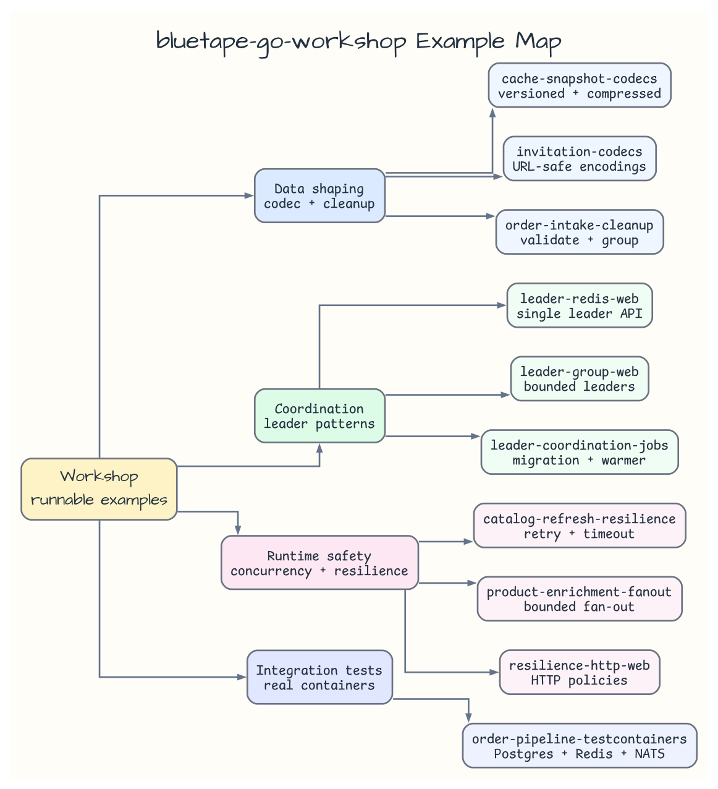

# bluetape-go-workshop

[English](README.md) | [한국어](README.ko.md)

[`bluetape-go`](https://github.com/bluetape4k/bluetape-go)를 실제 웹 애플리케이션 형태로 사용하는 예제 저장소입니다.

이 저장소는 재사용 가능한 library package와 runnable application 예제를 분리하기
위해 둡니다. Library 저장소는 안정적인 package에 집중하고, workshop 저장소는
그 package들이 HTTP service와 container-backed integration test 안에서 어떻게
동작하는지 보여줍니다.

기본 web style은 lightweight 방향으로 둡니다. Routing과 middleware가 필요할 때는
[`chi`](https://github.com/go-chi/chi)를 사용하되, handler는 `net/http`와
호환되게 유지합니다.

## Example Map



## 예제

| 예제 | English | 목적 | bluetape-go package |
|---|---|---|---|
| [`examples/cache-snapshot-codecs`](examples/cache-snapshot-codecs/README.ko.md) | [English](examples/cache-snapshot-codecs/README.md) | 안전한 serialization과 compression 선택 기준을 보여주는 versioned product cache snapshot 예제입니다. | `serialization`, `compression` |
| [`examples/order-intake-cleanup`](examples/order-intake-cleanup/README.ko.md) | [English](examples/order-intake-cleanup/README.md) | validation, default, filtering, deduplication, grouping으로 partner order feed를 정리하는 예제입니다. | `core`, `collections` |
| [`examples/invitation-codecs`](examples/invitation-codecs/README.ko.md) | [English](examples/invitation-codecs/README.md) | invitation link, callback state, partner reference를 실용적인 string codec으로 다루는 예제입니다. | `codec`, `core` |
| [`examples/catalog-refresh-resilience`](examples/catalog-refresh-resilience/README.ko.md) | [English](examples/catalog-refresh-resilience/README.md) | SKU refresh job에서 retry, attempt별 timeout, event visibility, diagram 기반 outcome을 보여주는 예제입니다. | `resilience` |
| [`examples/leader-redis-web`](examples/leader-redis-web/README.ko.md) | [English](examples/leader-redis-web/README.md) | Redis 기반 leader election을 수행하고 leader 상태를 노출하는 최소 chi 기반 HTTP service입니다. | `leader`, `leader/redis`, `testcontainers/redis` |
| [`examples/leader-coordination-jobs`](examples/leader-coordination-jobs/README.ko.md) | [English](examples/leader-coordination-jobs/README.md) | Redis leader election으로 migration gate와 cache warmer job을 조정하는 예제입니다. | `leader`, `leader/redis`, `testing/concurrency` |
| [`examples/product-enrichment-fanout`](examples/product-enrichment-fanout/README.ko.md) | [English](examples/product-enrichment-fanout/README.md) | bounded goroutine, cancellation, panic capture, stress test를 포함한 product detail fan-out 예제입니다. | `concurrency`, `testing/concurrency` |
| [`examples/order-pipeline-testcontainers`](examples/order-pipeline-testcontainers/README.ko.md) | [English](examples/order-pipeline-testcontainers/README.md) | repository Testcontainers fixture로 PostgreSQL, Redis, NATS 통합 흐름을 검증하는 예제입니다. | `testcontainers/postgres`, `testcontainers/redis`, `testcontainers/nats` |
| [`examples/resilience-http-web`](examples/resilience-http-web/README.ko.md) | [English](examples/resilience-http-web/README.md) | retry, timeout, circuit breaker, bulkhead, event hook을 조합하는 HTTP service입니다. | `resilience` |
| [`examples/leader-group-web`](examples/leader-group-web/README.ko.md) | [English](examples/leader-group-web/README.md) | Redis 기반 bounded multi-leader group election을 노출하는 HTTP service입니다. | `leader`, `leader/redis`, `testing/concurrency` |

## Leader 예제 실행

Redis를 먼저 실행한 뒤 service를 시작합니다:

```bash
export REDIS_ADDR=localhost:6379
go run ./examples/leader-redis-web
```

주요 endpoint:

```bash
curl http://localhost:8080/healthz
curl http://localhost:8080/leader
curl -X POST http://localhost:8080/campaign
curl -X POST http://localhost:8080/resign
```

## Resilience 예제 실행

Catalog service를 로컬에서 먼저 실행한 뒤 service를 시작합니다:

```bash
export CATALOG_URL=http://localhost:9090
go run ./examples/resilience-http-web
```

주요 endpoint:

```bash
curl http://localhost:8081/healthz
curl http://localhost:8081/catalog/book-1
curl -X POST 'http://localhost:8081/orders?delay=25ms'
curl http://localhost:8081/events
```

## Leader Group 예제 실행

Redis를 먼저 실행한 뒤 service를 시작합니다:

```bash
export REDIS_ADDR=localhost:6379
export MAX_LEADERS=2
go run ./examples/leader-group-web
```

주요 endpoint:

```bash
curl http://localhost:8082/healthz
curl http://localhost:8082/group
curl -X POST http://localhost:8082/campaign
curl -X POST http://localhost:8082/resign
```

## 개발

자주 쓰는 명령:

```bash
make ci
```

| 명령 | 설명 |
|---|---|
| `make fmt` | Go source를 `gofmt`로 format합니다. |
| `make fmt-check` | Go source가 `gofmt` 형식이 아니면 실패합니다. |
| `make tidy-check` | `go mod tidy` 후 `go.mod`/`go.sum` 변경이 있으면 실패합니다. |
| `make vet` | `go vet ./...`를 실행합니다. |
| `make lint` | `golangci-lint run ./...`를 실행합니다. |
| `make test` | Testcontainers 테스트가 실제 실행되도록 `go test -count=1 ./...`를 실행합니다. |
| `make race` | Testcontainers 테스트가 race detector에서도 실제 실행되도록 `go test -race -count=1 ./...`를 실행합니다. |
| `make ci` | 로컬 CI gate를 실행합니다. |

Integration test는 Testcontainers를 사용하므로 Docker가 필요합니다. 일반 CI와
Nightly workflow 모두 실제 container를 사용해 테스트합니다.

## Roadmap

| bluetape-go milestone | Workshop 예제 방향 |
|---|---|
| `0.1.0` | Redis leader election web service. |
| `0.1.1` | Quality-closure resilience primitive을 위한 focused retry/timeout 예제. |
| `0.2.0` | HTTP client/service resilience 예제와 bounded leader group coordination. |
| `0.3.0` | Near-cache와 Redis invalidation 예제. |
| `0.4.0` | State와 workflow 예제. |
| `0.5.0` | Batch processing 예제. |
