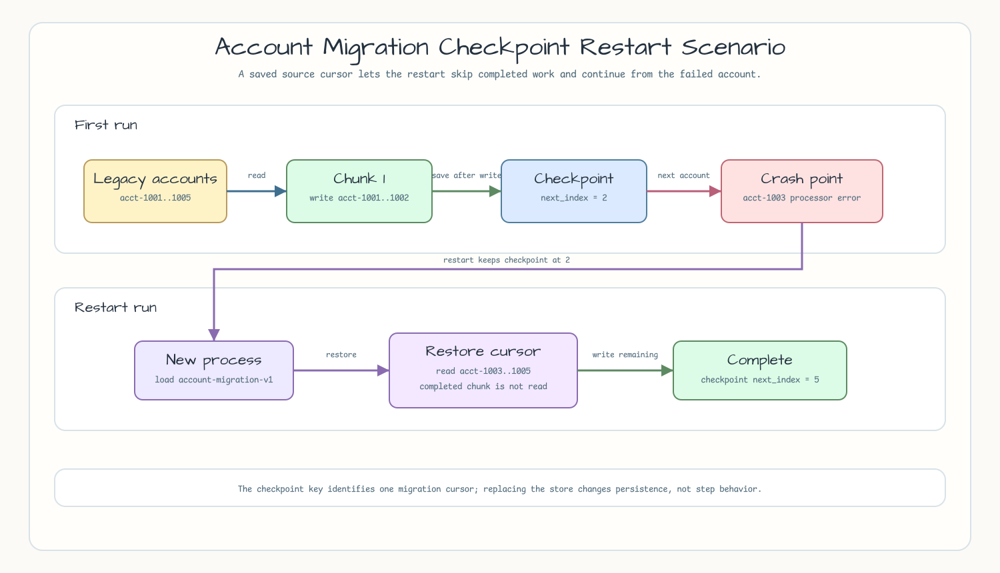
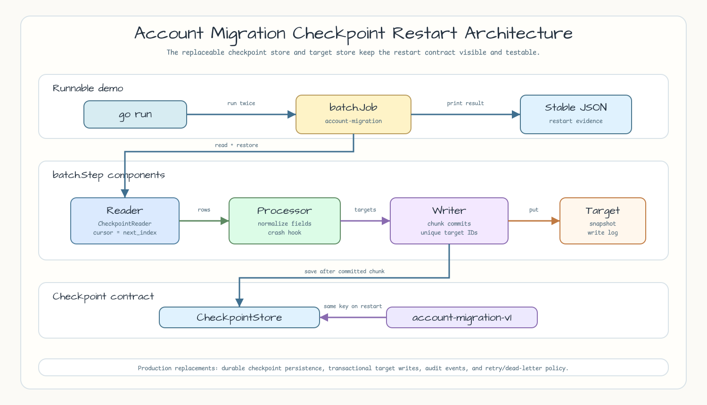
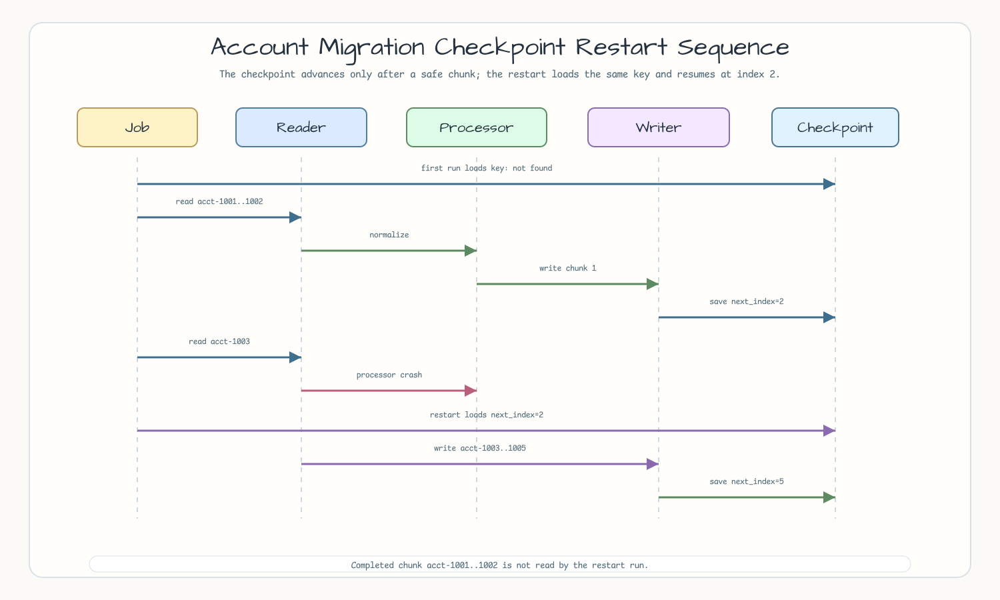

# Account Migration Checkpoint Restart

This example demonstrates a local `batch` migration that processes legacy
account rows in fixed chunks, persists a restart checkpoint, fails at a known
account, and restarts from the saved cursor without reprocessing the completed
chunk.

## Example Scenario

The fixture contains five legacy accounts. The first run writes `acct-1001` and
`acct-1002`, then stores `MigrationCheckpoint{NextIndex: 2}` under
`account-migration-v1`. The processor then fails on `acct-1003`, so the batch
report is failed and the checkpoint remains at index `2`.

The restart run uses the same checkpoint key and store. `MigrationReader`
restores `NextIndex: 2`, reads `acct-1003`, `acct-1004`, and `acct-1005`, and
completes with `NextIndex: 5`. The completed first chunk is not read again by
the restart run.



## Architecture

`RunDemo` shares one `CheckpointStore` and one `TargetAccountStore` across two
batch runs. Each run builds a `batch.Job` with a single checkpoint-aware
`batch.Step`.

`MigrationReader` implements `batch.CheckpointReader` and treats the checkpoint
as the next unread source index. `TargetAccountWriter` writes committed chunks
into `TargetAccountStore`, which keeps account IDs unique and records write
order. `RecordingCheckpointStore` is intentionally replaceable: production code
can swap it for durable storage without changing the step contract.



## Sequence Diagram

The checkpoint advances only after a successful chunk write. A processor crash
before the next chunk is committed leaves the checkpoint at the previous safe
cursor. Restart loads the same key and resumes from index `2`.



## Run

```bash
go run ./examples/account-migration-checkpoint-restart
```

The output is deterministic JSON. The important fields are:

```json
{
  "checkpoint_key": "account-migration-v1",
  "chunk_size": 2,
  "first_run": {
    "checkpoint": { "next_index": 2 },
    "read_ids": ["acct-1001", "acct-1002", "acct-1003"],
    "written_ids": ["acct-1001", "acct-1002"]
  },
  "restart_run": {
    "checkpoint": { "next_index": 5 },
    "read_ids": ["acct-1003", "acct-1004", "acct-1005"],
    "written_ids": ["acct-1003", "acct-1004", "acct-1005"]
  }
}
```

## Checkpoint Contract

- `CheckpointKey`: `account-migration-v1`
- `ChunkSize`: `2`
- Checkpoint payload: `MigrationCheckpoint{NextIndex int}`
- Save rule: save after a chunk has been written successfully
- Restart rule: restore `NextIndex` before the first read
- Store contract: any `batch.CheckpointStore` can replace the recording memory
  store

## Tests

```bash
go test -count=1 ./examples/account-migration-checkpoint-restart/...
go test -race -count=1 ./examples/account-migration-checkpoint-restart/...
go test -count=1 -run 'Stress|Concurrent' ./examples/account-migration-checkpoint-restart/internal/accountmigration
go test -race -count=1 -run 'Stress|Concurrent' ./examples/account-migration-checkpoint-restart/internal/accountmigration
```

Coverage focuses on restart correctness, invalid checkpoint handling,
cancellation, deterministic report projection, store concurrency, bounded stress,
and race detection.

## Related Examples

- [`examples/chunked-csv-import-checkpoint`](../chunked-csv-import-checkpoint)
  covers replay and duplicate handling when a writer fails after a partial
  commit.
- [`examples/retry-dead-letter-batch-worker`](../retry-dead-letter-batch-worker)
  covers retry, skip, and dead-letter policy for item-level failures.

## Production Hardening

Use a durable checkpoint store, transactional target writes, idempotent target
keys, audit events, and an explicit retry or dead-letter policy when moving this
pattern from the workshop into a service.
