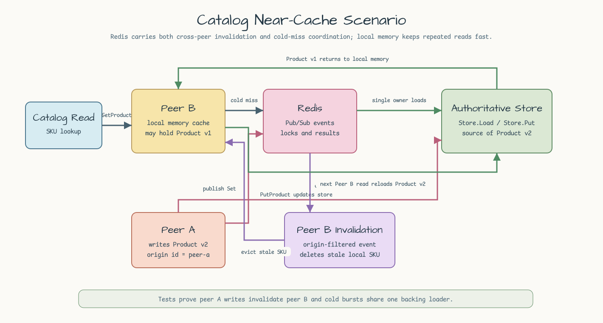
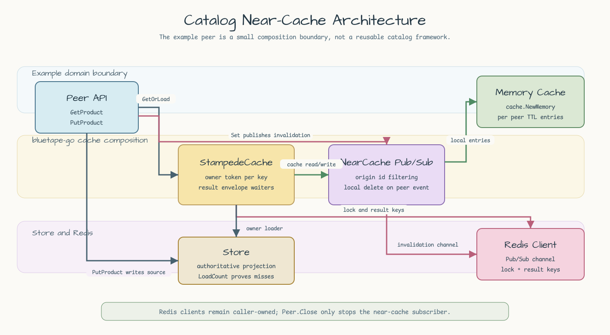
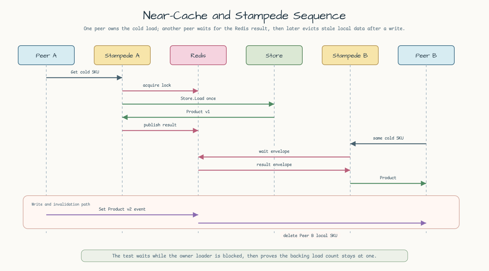

# catalog-near-cache-redis

[English](README.md) | [한국어](README.ko.md)

`bluetape-go/cache`, `cache/redisnear`, `cache/rediscoord`를 사용하는 catalog
cache 예제입니다.

이 예제는 두 catalog service peer가 process-local memory cache를 유지하면서 Redis로
cross-peer invalidation과 cold-miss stampede coordination을 공유하는 상황을
모델링합니다. 예제 경계는 의도적으로 작게 둡니다. Redis client는 caller-owned로
남기고, authoritative store는 테스트용 in-memory projection이며, `Peer.Close`는
near-cache subscriber만 멈춥니다.

## Scenario



Peer B는 이미 local memory cache에 `Product v1`을 가지고 있을 수 있습니다. Peer A가
`PutProduct`로 `Product v2`를 쓰면 authoritative store가 갱신되고 Redis near-cache
event가 publish됩니다. Peer B는 자기 origin event는 무시하지만 peer A event는
수신해 stale SKU를 local cache에서 삭제하고, 다음 read에서 store를 다시 로드합니다.

## Architecture



Peer는 bluetape-go cache 구성 요소 세 개를 조합합니다.

- `cache.NewMemory[string, Product]`는 peer별 빠른 local entry를 유지합니다.
- `redisnear.NewPubSub[Product]`는 local memory를 감싸고 Redis Pub/Sub로
  invalidation event를 publish합니다.
- `rediscoord.NewStampedeCache[Product]`는 near cache를 감싸고 Redis lock/result
  envelope로 cold burst에서 owner loader를 하나만 실행합니다.

`Store.Load`가 유일한 backing loader입니다. 테스트는 반환값만 확인하지 않고
`Store.LoadCount`를 assertion해서 실제 miss/load 동작을 증명합니다.

## Sequence



두 peer가 같은 SKU를 동시에 miss하면 한 peer만 Redis stampede lock을 얻어
`Store.Load`를 실행합니다. 다른 peer는 Redis result envelope를 polling하고 같은
product를 반환하므로 backing loader를 다시 호출하지 않습니다. 이후 `Set` event가
다른 peer의 stale local entry를 invalidate합니다.

```go
product, err := peer.GetProduct(ctx, "sku-1")
```

```go
err := peer.PutProduct(ctx, Product{
    SKU:     "sku-1",
    Name:    "Updated",
    Version: 2,
})
```

## Outcomes

| Case | Behavior | Test |
|---|---|---|
| Peer write | Peer A가 `Product v2`를 쓰면 Redis Pub/Sub가 peer B에 도달하고, peer B는 stale local data 대신 reload합니다. | `TestPeerWriteInvalidatesPeerLocalCacheAndReloadsStore` |
| Cold burst | 첫 loader가 block된 동안 두 peer가 같은 SKU를 miss해도 backing loader count는 1로 유지됩니다. | `TestColdMissBurstAcrossPeersRunsBackingLoaderOnce` |
| Missing SKU | Loader error는 cache하지 않으므로 이후 store write를 정상적으로 다시 load할 수 있습니다. | `TestMissingProductIsNotCached` |
| Invalid input | blank peer name/namespace/SKU, nil Redis client/store, negative option은 cache behavior를 숨기기 전에 실패합니다. | `TestPeerRejectsInvalidInput`, `TestStoreRespectsContextCancellation` |

## Run

테스트는 repository Testcontainers fixture로 Redis를 시작합니다.

```bash
go test -count=1 ./examples/catalog-near-cache-redis/...
```

이 예제는 concurrent cold miss를 의도적으로 실행하므로 race gate도 유용합니다.

```bash
go test -race -count=1 ./examples/catalog-near-cache-redis/...
```
