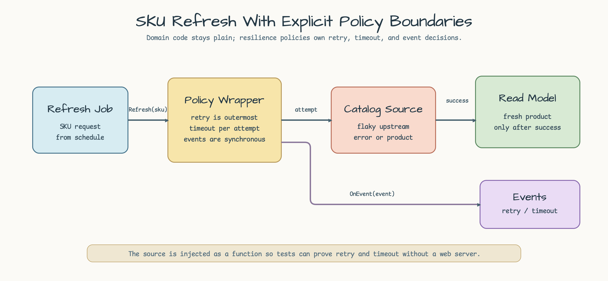
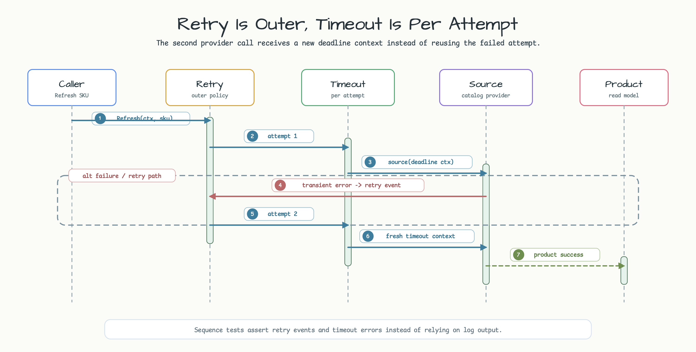
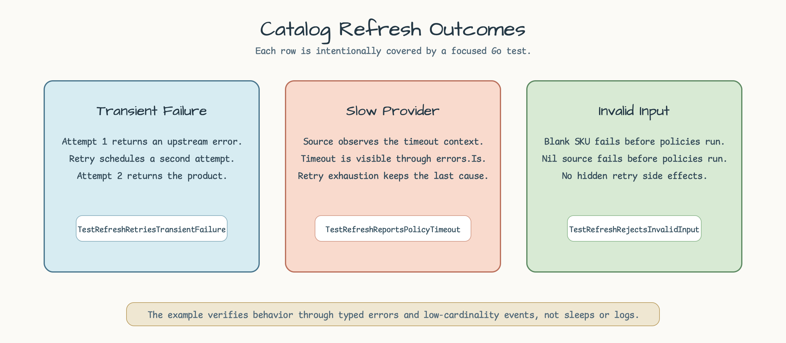

# catalog-refresh-resilience

[English](README.md) | [한국어](README.ko.md)

`bluetape-go/resilience` retry와 timeout policy를 사용하는 SKU refresh 예제입니다.

이 예제는 storefront read model을 한 SKU 단위로 갱신하는 catalog refresh worker를
모델링합니다. upstream catalog provider가 한 번 실패하거나 너무 느릴 수 있지만,
refresh worker는 policy behavior를 명시적으로 유지해야 합니다.

- transient provider error를 retry하되 final error shape을 숨기지 않습니다.
- 각 attempt에 독립적인 timeout budget을 제공합니다.
- caller가 log 또는 metrics로 연결할 수 있는 low-cardinality resilience event를
  emit합니다.
- 또 다른 HTTP service가 아니라 plain domain code로 example focus를 유지합니다.

## Scenario



worker는 하나의 SKU를 받고 provider를 호출한 뒤, protected operation이 성공한
경우에만 refreshed product projection을 씁니다. 이 예제의 dependency는 `Source`
function 하나뿐이므로 policy wiring에 집중할 수 있습니다.

## Policy Wiring



`resilience.Run(ctx, operation, retry, timeout)`은 retry를 outer policy로, timeout을
inner policy로 적용합니다. 따라서 각 retry attempt는 provider call을 감싸는 새
timeout context를 만듭니다.

```go
product, err := refresher.Refresh(ctx, "sku-1", source)
```

refresher는 test determinism을 위해 `NoBackoff`를 사용합니다. production job은
example의 domain boundary를 바꾸지 않고 constant 또는 exponential backoff를 선택할
수 있습니다.

## Outcomes



| Case | Behavior | Test |
|---|---|---|
| Transient provider failure | 첫 attempt는 retry event를 emit하고, 두 번째 attempt가 성공합니다. | `TestRefreshRetriesTransientFailure` |
| Slow provider | timeout이 provider deadline을 감싸고, retry는 configured attempt count 이후 exhaustion을 보고합니다. | `TestRefreshReportsPolicyTimeout` |
| Invalid input | blank SKU와 nil source는 policy 실행 전에 실패합니다. | `TestRefreshRejectsInvalidInput` |

## Run

```bash
go test -count=1 ./examples/catalog-refresh-resilience/...
```
