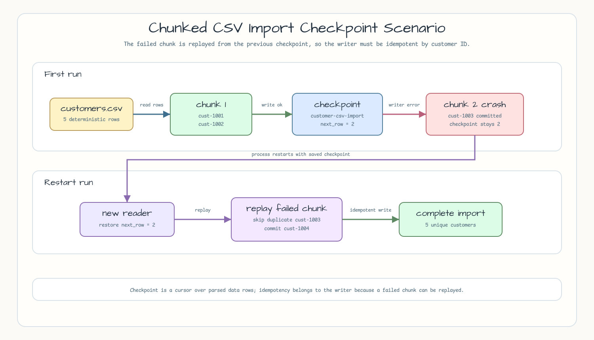
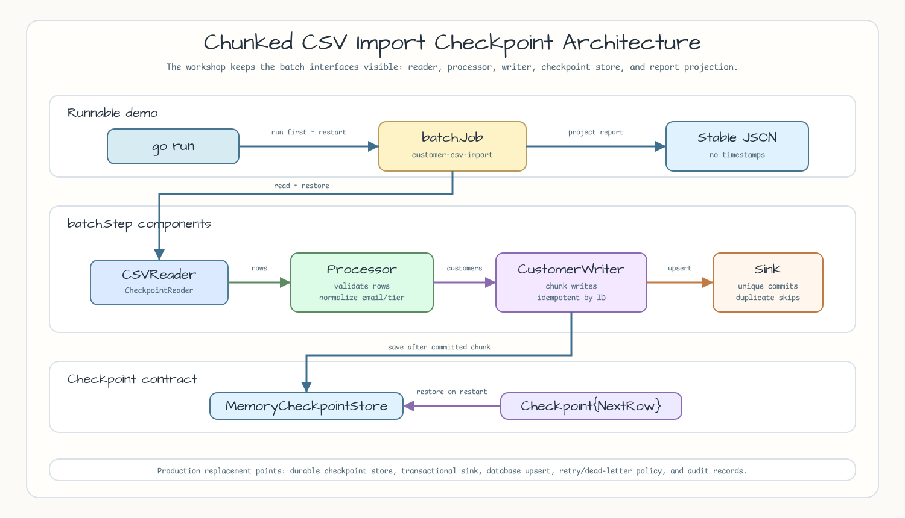
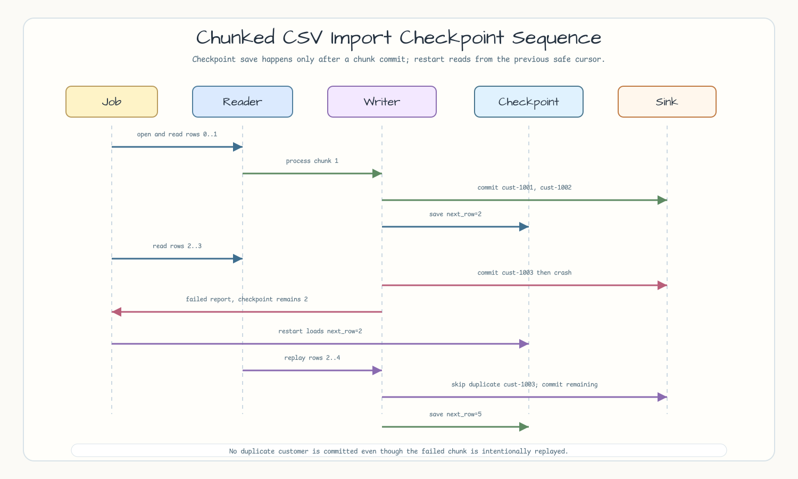

# Chunked CSV Import Checkpoint

[English](README.md) | [한국어](README.ko.md)

This example is a focused v0.5.0 batch scenario. It runs a local customer CSV
import with `batch.Job`, `batch.Step`, chunk checkpoints, and restart behavior.
It is the CSV-focused companion to the base checkpoint/restart track in
[#41](https://github.com/bluetape4k/bluetape-go-workshop/issues/41).

## Example Scenario

The job imports five deterministic customer rows from `testdata/customers.csv`
with a chunk size of `2`. The first run commits the first chunk and saves
`next_row=2`. It then starts the second chunk, commits `cust-1003`, and returns a
simulated writer crash before the chunk can be checkpointed.

The restart run creates a fresh reader, restores `next_row=2`, replays the
failed chunk, skips duplicate `cust-1003` by customer ID, commits the remaining
rows, and saves the final `next_row=5` checkpoint.



## Run

```bash
go run ./examples/chunked-csv-import-checkpoint
```

The output is stable JSON without runtime timestamps. The important fields are:

```json
{
  "checkpoint_key": "customer-csv-import",
  "chunk_size": 2,
  "first_run": {
    "report": {"status": "failed", "read_count": 4, "write_count": 2},
    "checkpoint": {"next_row": 2},
    "new_commits": 3,
    "duplicate_skips": 0
  },
  "restart_run": {
    "report": {"status": "completed", "read_count": 3, "write_count": 3},
    "checkpoint": {"next_row": 5},
    "new_commits": 5,
    "duplicate_skips": 1
  },
  "customers_imported": 5,
  "duplicate_skips": 1
}
```

`batch.Report.WriteCount` counts chunk items accepted by the writer after a
successful writer call. The domain sink also exposes `new_commits` and
`duplicate_skips` so the replay behavior is visible.

## Architecture

The runnable demo calls the same import job twice over one
`batch.MemoryCheckpointStore` and one customer sink. `CSVReader` implements
`batch.CheckpointReader`; the processor validates and normalizes rows; the
writer commits chunks idempotently by customer ID.



## Sequence Diagram

Checkpoint save happens only after a chunk write succeeds. Because the second
chunk fails after a partial side effect, restart must replay from the last safe
cursor and the writer must absorb the duplicate.



## Production Hardening

This example intentionally uses an in-memory checkpoint store and sink. A
production importer needs a durable checkpoint store, transactional writes or
database upserts, a file identity/version contract, audit records, retry and
dead-letter handling, alerting for repeated failures, and schema-evolution
handling for incoming CSV files.

## Test

```bash
go test -count=1 ./examples/chunked-csv-import-checkpoint/...
go test -race -count=1 ./examples/chunked-csv-import-checkpoint/...
```
