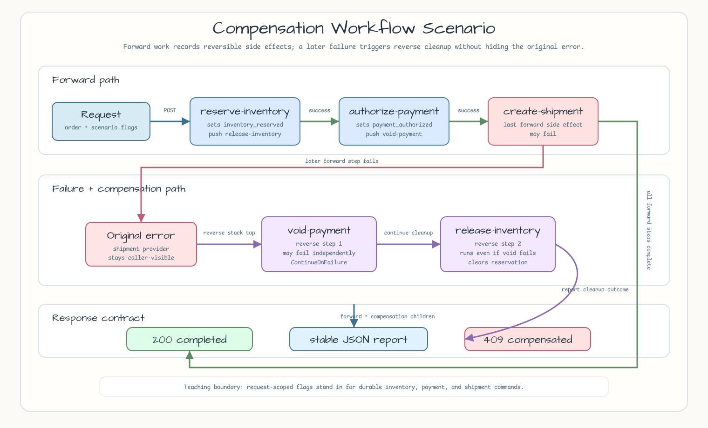
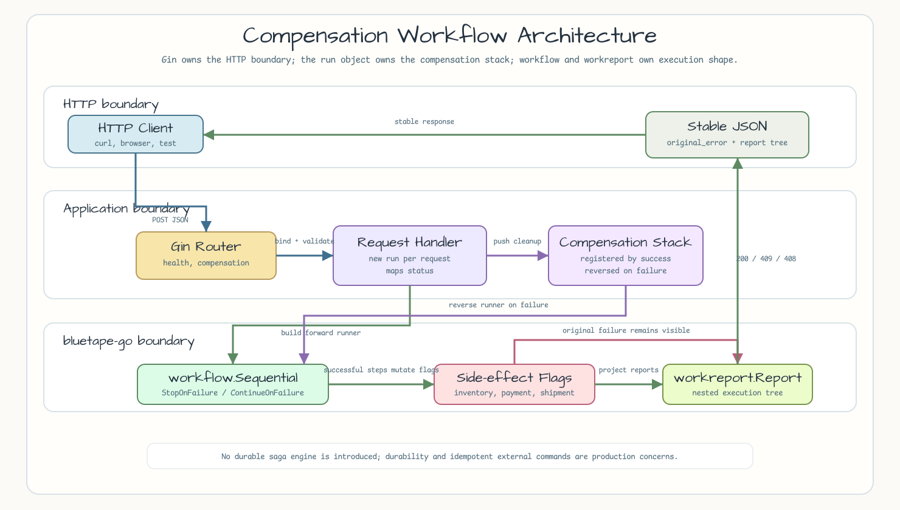
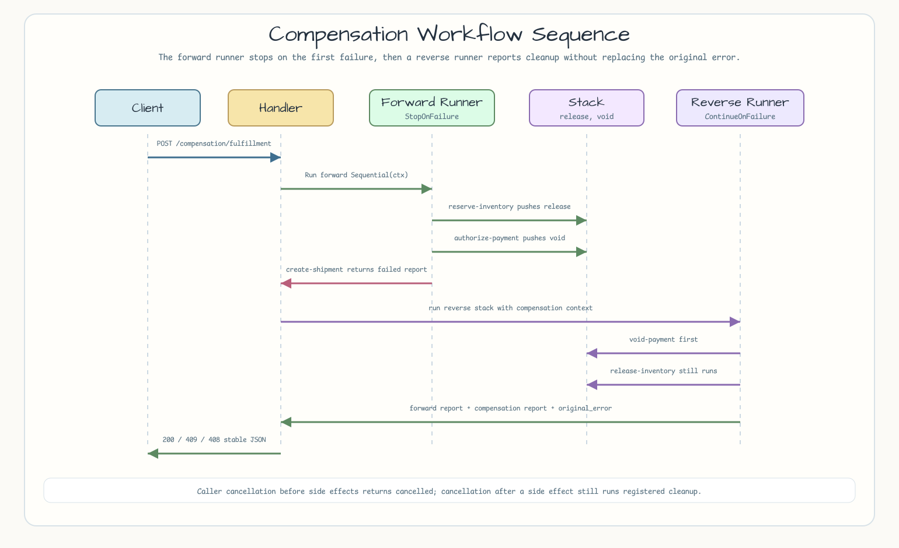

# Compensation Workflow

[English](README.md) | [한국어](README.ko.md)

이 예제는 작은 Gin HTTP API로 request-scoped fulfillment workflow를 노출합니다.
`github.com/bluetape4k/bluetape-go/workflow`로 순서가 있는 forward step을
실행하고, 뒤쪽 forward step이 실패하면 application이 소유한 compensation step을
역순으로 실행합니다.

## 예제 시나리오

API는 하나의 fulfillment request를 받습니다. Workflow는 inventory를 예약하고,
payment를 authorize한 뒤 shipment를 생성합니다. Inventory와 payment는 되돌릴 수
있는 side effect이므로, 성공한 forward step은 compensation handler를 등록합니다.
Shipment 생성이 실패하면 API는 payment를 먼저 void하고, 그 다음 inventory를
release하며, caller에게는 원래 shipment error를 그대로 반환합니다.



## Workflow 단계

| 단계 | Runner | 경계 | 실패 동작 |
|---|---|---|---|
| `reserve-inventory` | `workflow.Sequential` child | 주문 재고를 예약하고 `release-inventory`를 등록합니다. | 재고가 없으면 payment 전에 중단합니다. |
| `authorize-payment` | `workflow.Sequential` child | Payment를 authorize하고 `void-payment`를 등록합니다. | 이미 inventory가 예약되었으므로 `release-inventory`를 실행합니다. |
| `create-shipment` | `workflow.Sequential` child | Reversible step이 끝난 뒤 shipment를 생성합니다. | `void-payment`, `release-inventory` 순서로 실행합니다. |
| `compensation` | `workflow.Sequential` with `ContinueOnFailure` | 등록된 compensation handler를 역순으로 실행합니다. | 뒤 compensation step을 계속 실행하고 원래 forward error를 보존합니다. |

HTTP handler는 `workreport.Report`를 stable JSON으로 투영하고 runtime timestamp를
응답에서 제외합니다. 그래서 테스트는 timing noise 없이 forward와 compensation
execution tree를 검증할 수 있습니다.

## 실행

```bash
go run ./examples/compensation-workflow
```

선택 환경 변수:

| 변수 | 기본값 | 목적 |
|---|---:|---|
| `HTTP_ADDR` | `:8087` | Listen address입니다. |

## Endpoint

```bash
curl http://localhost:8087/healthz
curl -X POST http://localhost:8087/compensation/fulfillment \
  -H 'Content-Type: application/json' \
  -d '{
    "order_id": "order-1001",
    "stock_available": true,
    "payment_authorized": true,
    "shipment_provider_available": true
  }'
```

유용한 변형:

```bash
# Shipment 실패는 void-payment, release-inventory 순서의 compensation을 실행합니다.
curl -X POST http://localhost:8087/compensation/fulfillment \
  -H 'Content-Type: application/json' \
  -d '{"order_id":"order-1002","stock_available":true,"payment_authorized":true,"shipment_provider_available":false}'

# Compensation 실패가 있어도 원래 shipment error를 보존하고 다음 compensation을 계속 실행합니다.
curl -X POST http://localhost:8087/compensation/fulfillment \
  -H 'Content-Type: application/json' \
  -d '{"order_id":"order-1003","stock_available":true,"payment_authorized":true,"shipment_provider_available":false,"void_payment_fails":true}'
```

성공 report는 `200 OK`를 반환합니다. Forward 실패 report는 `409 Conflict`를
반환합니다. Compensation이 실행되면 응답은 `compensated=true`로 표시하고
`original_error`에는 forward workflow의 원래 오류를 보존합니다. Cancelled workflow
report는 `408 Request Timeout`을 반환합니다. Malformed JSON, 누락된 `order_id`,
blank `order_id`는 `400 Bad Request`를 반환합니다.

## Compensation vs State Transition

State machine 예제는 하나의 command가 어떤 state에서 다른 state로 합법적으로
이동할 수 있는지에 집중합니다. 이 예제는 이미 발생한 side effect에 집중합니다.
Forward workflow는 성공한 reversible side effect를 기록하고, compensation workflow는
그 stack을 사용해 역순으로 정리합니다.

이 예제는 request-scoped 학습 예제입니다. Compensation이 process restart나 service
경계를 넘어 살아남아야 한다면 durable storage, idempotent external command, retry
policy, outbox 또는 workflow engine을 사용해야 합니다.

## Architecture

Gin은 routing, JSON binding, HTTP status mapping을 담당합니다. Request handler는
매 요청마다 새 run object를 만들어 side-effect flag와 compensation stack을 독립적으로
소유하게 합니다. `workflow` package는 실행 순서를 담당하고, `workreport`는 forward와
compensation result tree를 담당합니다.



## Sequence Diagram

Main request path는 synchronous입니다. Handler는 forward workflow를 실행합니다.
Forward report가 실패하면 reverse compensation workflow를 실행하고, response mapper는
원본 오류를 보존한 채 두 tree를 함께 반환합니다.



## 테스트

```bash
go test -count=1 ./examples/compensation-workflow/...
go test -race -count=1 ./examples/compensation-workflow/...
```
