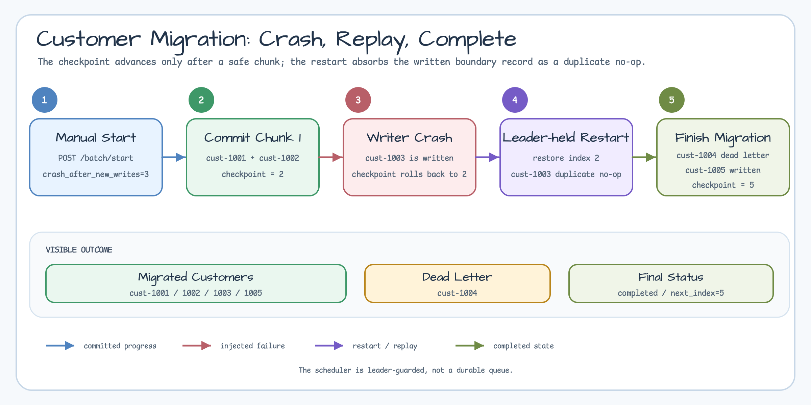
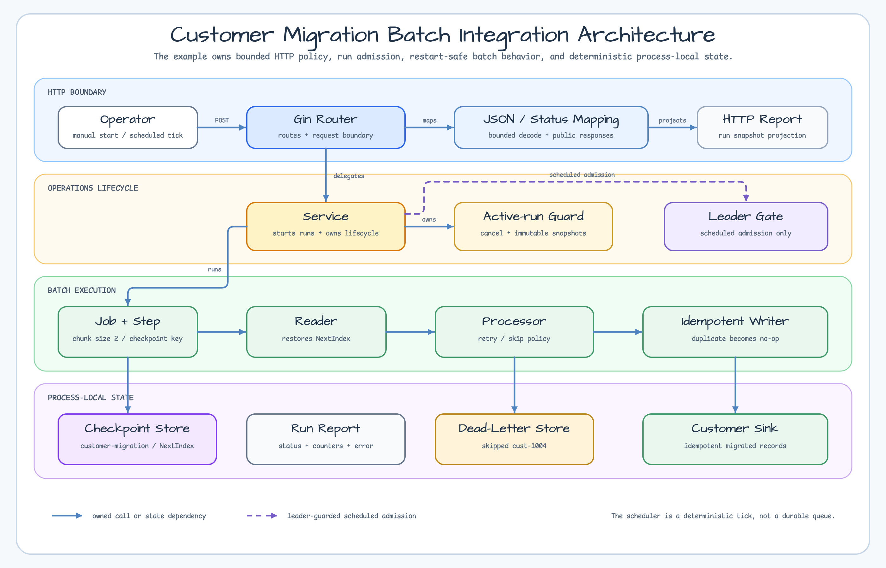
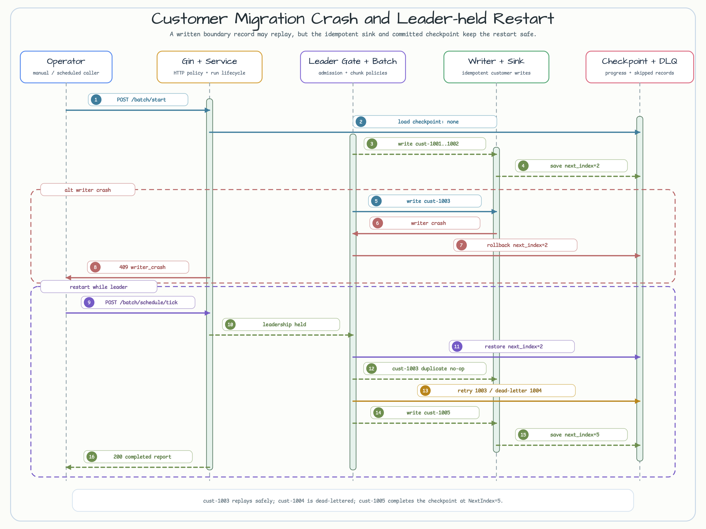

# Customer Migration Batch Integration

[English](README.md) | [한국어](README.ko.md)

이 예제는 v0.5.0 milestone 통합 시나리오입니다. Local Gin operations API 하나에서
customer migration batch의 checkpoint restart, retry/dead-letter 처리,
leader-guarded scheduling, status/report 조회, active-run cancellation을 함께
보여줍니다.

## 시나리오

Migration은 결정적인 customer record 5개를 `ChunkSize: 2`와 checkpoint key
`customer-migration`으로 처리합니다.

| Customer | 동작 |
|---|---|
| `cust-1001` | 첫 chunk에서 성공합니다. |
| `cust-1002` | 첫 chunk에서 성공합니다. |
| `cust-1003` | transient failure가 한 번 발생하고 retry 후 성공합니다. |
| `cust-1004` | permanent failure로 dead letter 하나를 기록하고 skip됩니다. |
| `cust-1005` | restart run에서 성공합니다. |

Walkthrough는 `crash_after_new_writes=3`인 manual run으로 시작합니다. 첫 chunk는
`NextIndex=2`로 checkpoint되고, `cust-1003`이 write된 뒤 simulated writer crash가
checkpoint를 직전 성공 chunk로 되돌립니다. Leader를 보유한 scheduled tick은 그
checkpoint에서 재시작하고, replay된 `cust-1003`을 duplicate no-op으로 받아들이며,
`cust-1004`를 dead-letter로 기록하고, `cust-1005`를 write한 뒤 `NextIndex=5`에서
완료됩니다.



## 작은 0.5.0 예제들의 통합 위치

| 원본 예제 | 이 예제에서의 역할 |
|---|---|
| [`account-migration-checkpoint-restart`](../account-migration-checkpoint-restart/README.ko.md) | 마지막으로 성공한 checkpoint chunk부터 재시작합니다. |
| [`chunked-csv-import-checkpoint`](../chunked-csv-import-checkpoint/README.ko.md) | Writer crash 이후 boundary record replay를 idempotent하게 처리합니다. |
| [`retry-dead-letter-batch-worker`](../retry-dead-letter-batch-worker/README.ko.md) | Transient record는 retry하고 permanent record는 dead letter로 남깁니다. |
| [`operations-report-policy`](../operations-report-policy/README.ko.md) | Timestamp 없는 report projection과 stable error code를 제공합니다. |
| [`leader-coordination-jobs`](../leader-coordination-jobs/README.ko.md) | Durable queue semantics 없이 leader-guarded scheduled work를 보여줍니다. |

## 실행

```bash
go run ./examples/customer-migration-batch-integration
```

선택 환경 변수:

| 변수 | 기본값 | 목적 |
|---|---:|---|
| `HTTP_ADDR` | `127.0.0.1:8095` | Loopback listen 주소입니다. API가 unauthenticated이므로 non-loopback bind는 거부합니다. |
| `LEADER_MODE` | `held` | `held`면 scheduled tick을 실행하고, `missing`이면 `/batch/schedule/tick`이 `not_leader`를 반환합니다. |

`/healthz`는 process liveness 전용입니다. Operator diagnosis에는 `/batch/status`를
사용합니다. 이 endpoint는 active run 상태, leader 상태, latest rejection code,
checkpoint, migrated ID, dead letter를 보여줍니다.

## Endpoints

```bash
curl http://127.0.0.1:8095/healthz

curl -X POST http://127.0.0.1:8095/batch/start \
  -H 'Content-Type: application/json' \
  -d '{"run_id":"manual-001","crash_after_new_writes":3}'

curl http://127.0.0.1:8095/batch/status

curl -X POST http://127.0.0.1:8095/batch/schedule/tick \
  -H 'Content-Type: application/json' \
  -d '{"run_id":"scheduled-001"}'

curl http://127.0.0.1:8095/batch/report
```

유용한 failure/operator 변형:

```bash
# Active run을 cancel합니다. 빠른 local run은 이미 끝났을 수 있고 이 경우 no_active_run을 반환합니다.
curl -X POST http://127.0.0.1:8095/batch/cancel \
  -H 'Content-Type: application/json' \
  -d '{"reason":"operator requested stop"}'

# 다른 terminal에서 missing-leader scheduled tick을 재현합니다.
LEADER_MODE=missing go run ./examples/customer-migration-batch-integration
curl -X POST http://127.0.0.1:8095/batch/schedule/tick \
  -H 'Content-Type: application/json' \
  -d '{"run_id":"scheduled-missing"}'

# Malformed JSON.
curl -X POST http://127.0.0.1:8095/batch/start \
  -H 'Content-Type: application/json' \
  -d '{'

# Blank run ID.
curl -X POST http://127.0.0.1:8095/batch/start \
  -H 'Content-Type: application/json' \
  -d '{"run_id":"   "}'

# Oversized body.
python3 - <<'PY' | curl -X POST http://127.0.0.1:8095/batch/start \
  -H 'Content-Type: application/json' \
  --data-binary @-
import json
print(json.dumps({"run_id": "manual-big", "padding": "x" * 9000}))
PY
```

Completed run은 `200 OK`를 반환합니다. Simulated writer crash는 `409 Conflict`와
`writer_crash`를 반환합니다. Leadership이 없으면 `409 Conflict`와 `not_leader`를
반환합니다. Caller cancellation은 `408 Request Timeout`과 `request_cancelled`를
반환합니다. Malformed JSON, invalid `run_id`, invalid `crash_after_new_writes`,
oversized body, missing report, idle cancel request는 stable error code를 반환합니다.

## Architecture

네 개 layer는 HTTP boundary, operational run lifecycle, batch policy,
process-local state의 소유권을 분리합니다. 실선 화살표는 소유한 호출 또는 state
dependency이고, 점선 경로는 leader가 보호하는 scheduled admission 경로입니다.



## Operations Contract

Gin은 routing, bounded JSON body decoding, HTTP status mapping을 담당합니다. Batch
engine은 `batch.Step`, `batch.Job`, checkpoint restore/save, retry policy, skip
policy, idempotent write를 담당합니다. Service는 active-run guard, cancellation,
defensive snapshot, leader gate, latest status projection을 담당합니다.

작은 scheduler loop는 durable queue가 아닙니다. Leadership을 보유한 동안
leader-guarded tick을 실행하고 context cancellation에서 멈춥니다. Test는 manual
tick으로 loop를 구동해 예제가 deterministic하게 유지되도록 합니다.

HTTP response는 customer ID와 count만 공개합니다. Fixture email 값은 internal
sink 안에만 있고 public status, report, error response에는 나오지 않습니다.

## Crash 및 Restart Sequence

Manual run은 injected writer crash 전에 `cust-1003`을 write하지만 checkpoint는
`NextIndex=2`로 rollback합니다. Leader를 보유한 scheduled run은 그 checkpoint를
restore하고 replay를 duplicate no-op으로 흡수한 뒤 `NextIndex=5`에서 완료됩니다.



## Runbook Notes

- Ctrl-C로 server를 중지합니다. Server는 bounded graceful shutdown을 사용합니다.
- `8095` port가 사용 중이면 `HTTP_ADDR=127.0.0.1:8096`처럼 다른 loopback 주소를
  사용합니다.
- Process를 재시작하면 in-memory checkpoint, migrated sink, dead letter, latest
  report가 초기화됩니다.
- Bind address를 넓히려면 trusted-network 또는 authentication boundary가 먼저
  필요합니다. 이 workshop API는 인증을 제공하지 않습니다.

## Production Hardening

Production migration service라면 durable checkpoint storage, database upsert,
idempotency key, 실제 scheduler 또는 queue, persistent dead-letter replay,
authentication, metric, structured run lifecycle log, process restart 이후에도
살아남아야 하는 작업의 recovery가 필요합니다.

## 테스트

```bash
go test -count=1 ./examples/customer-migration-batch-integration/...
go test -race -count=1 ./examples/customer-migration-batch-integration/...
```
