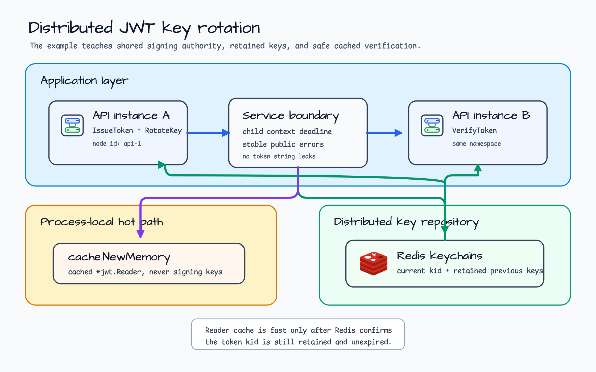
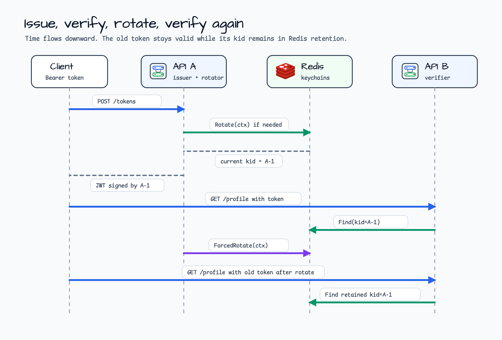
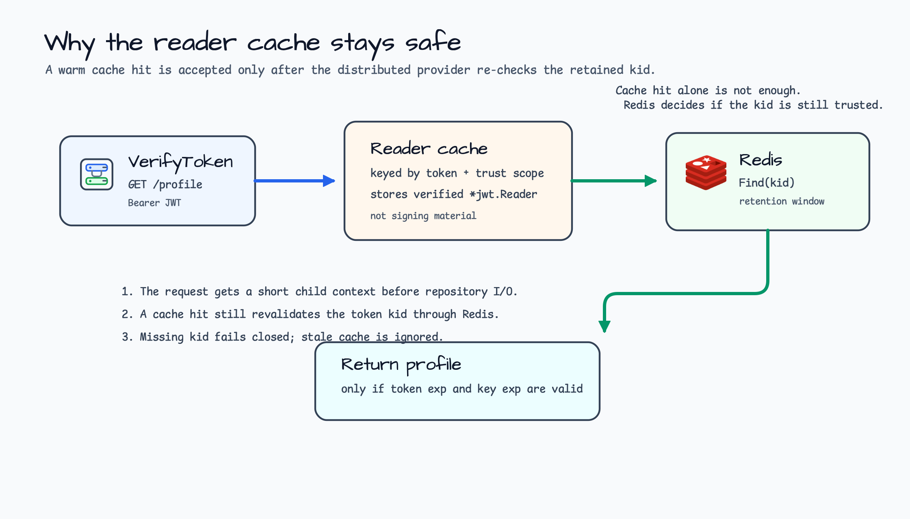

# distributed-jwt-key-rotation

[English](README.md) | [한국어](README.ko.md)

이 예제는 여러 API instance가 Redis를 통해 JWT signing key를 공유할 때 token을
어떻게 발급하고 검증하는지 보여줍니다. `bluetape-go/jwt`, `jwt/redis`, `cache`를
함께 사용해 key rotation, retained key, reader cache, request-scoped Redis timeout의
운영 형태를 작은 애플리케이션으로 확인할 수 있습니다.

핵심은 단순히 "key를 Redis에 둔다"가 아닙니다. 새 instance가 다른 instance에서
발급한 token을 검증할 수 있어야 하고, rotation 뒤에도 retained key window 안의 기존
token은 계속 유효해야 하며, local cache가 있어도 더 이상 신뢰하지 않는 `kid`는 반드시
실패해야 합니다.

## 이 예제에서 배우는 것

- `jwt/redis.New`로 repository-backed `jwt.DistributedHMACProvider`를 구성합니다.
- Current `kid`를 rotate해도 retained key로 서명된 기존 token은 유지합니다.
- Hot verification path를 위해 local `cache.Memory[string,*jwt.Reader]`를 붙입니다.
- Local reader cache가 warm 상태여도 token `kid`를 Redis에 다시 확인합니다.
- Redis 호출 전에 짧은 child `context.Context`를 만들어 caller cancellation과 deadline을
  그대로 드러냅니다.

## Scenario

Load balancer 뒤에 두 API instance가 있다고 가정합니다. `api-a`가 token을 발급하고,
다음 요청은 `api-b`가 같은 token으로 받습니다. 두 instance는 같은 Redis namespace를
사용하므로 current key와 retained key set을 공유합니다.



이 예제는 signing material을 Redis에 두고, local process cache에는 검증된 reader만
보관합니다. 이 구분이 중요합니다. Cache는 반복 검증을 빠르게 만들지만, 어떤 `kid`를
아직 신뢰할지는 Redis가 계속 결정합니다.

## 요청 흐름

Service는 세 endpoint를 노출합니다.

| Endpoint | 역할 |
|---|---|
| `POST /tokens` | Repository-backed current HMAC key로 access token을 발급합니다. |
| `GET /profile` | Bearer token을 검증하고 token의 subject/scopes를 반환합니다. |
| `POST /keys/rotate` | 새 current key를 Redis에 저장하고 이전 key는 TTL window 동안 retained key로 유지합니다. |



`Service.IssueToken`은 current `kid`로 서명합니다. `Service.RotateKey`는 새 `kid`를
current로 만들지만, 이전 key는 이미 발급된 token이 동작할 만큼 repository에 남겨둡니다.
`Service.VerifyToken`은 `NewCachedDistributedProvider`를 통해 token을 parse하므로 반복
검증은 빠르게 처리하면서도 stale key state를 그대로 신뢰하지 않습니다.

## Cached verification이 안전한 이유

Reader cache는 signing key가 아니라 parse reader를 저장합니다. Cache hit가 나도
distributed provider가 token의 `kid`가 Redis에 아직 존재하는지 확인한 뒤에만 검증을
인정합니다.



이 구조 덕분에 hot path는 같은 reader를 반복 생성하지 않아도 됩니다. 동시에 retained
key가 삭제되거나 만료되면, local cache가 남아 있어도 verification은 실패합니다.

## 코드 읽는 순서

| File or type | 읽을 내용 |
|---|---|
| `main.go` | Redis client, `NODE_ID`, `HTTP_ADDR`, HTTP server wiring입니다. |
| `internal/distributedjwt/service.go` | Provider 구성, issue/verify/rotate operation, endpoint handler입니다. |
| `Service.operationContext` | Repository I/O 전에 만드는 짧은 child context입니다. |
| `Service.VerifyToken` | Cached distributed verification과 public error mapping입니다. |
| `internal/distributedjwt/service_test.go` | Cross-instance sharing, rotation retention, stale token rejection, cancellation, cache revalidation 테스트입니다. |

## Outcomes

| Case | Behavior | Test |
|---|---|---|
| Shared keys | 같은 namespace로 구성한 두 service가 서로의 token을 검증합니다. | `TestServiceSharesRotatedKeysAcrossInstances` |
| Rotation retention | Forced rotation은 current `kid`를 바꾸지만 이전 token은 retained key window 안에서 계속 유효합니다. | `TestServiceSharesRotatedKeysAcrossInstances` |
| Unknown or stale tokens | 다른 namespace에서 서명된 token과 만료 token은 안정적인 public error로 매핑됩니다. | `TestServiceRejectsUnknownKIDAndExpiredToken` |
| Context budget | Cancelled context는 Redis I/O가 caller cancellation을 숨기기 전에 실패합니다. | `TestServiceHonorsCancelledContextBeforeRepositoryIO` |
| Cached verification | Warm verification은 rotation 뒤에도 retained key를 재검증하므로 안정적으로 동작합니다. | `TestRouterUsesCachedProviderWithKeyRevalidation` |

## 실행

Redis를 로컬에서 먼저 실행한 뒤 service instance 하나를 시작합니다.

```bash
export REDIS_ADDR=localhost:6379
go run ./examples/distributed-jwt-key-rotation
```

Distributed 형태를 더 분명히 보고 싶다면, 두 터미널에서 instance 두 개를 실행합니다.

```bash
NODE_ID=api-a HTTP_ADDR=127.0.0.1:8099 go run ./examples/distributed-jwt-key-rotation
NODE_ID=api-b HTTP_ADDR=127.0.0.1:8100 go run ./examples/distributed-jwt-key-rotation
```

`api-a`에서 token을 발급하고, `api-b`에서 검증한 뒤, key를 rotate하고 retained key가
유효한 동안 원래 token이 계속 검증되는지 확인합니다.

```bash
TOKEN=$(curl -s http://127.0.0.1:8099/tokens \
  -H 'Content-Type: application/json' \
  -d '{"subject":"customer-42","scopes":["orders:read"],"ttl_seconds":300}' |
  jq -r .access_token)

curl -H "Authorization: Bearer $TOKEN" http://127.0.0.1:8100/profile
curl -X POST http://127.0.0.1:8099/keys/rotate
curl -H "Authorization: Bearer $TOKEN" http://127.0.0.1:8100/profile
```

테스트는 repository Testcontainers fixture로 Redis를 시작합니다.

```bash
go test -count=1 ./examples/distributed-jwt-key-rotation/...
go test -race -count=1 ./examples/distributed-jwt-key-rotation/...
```
