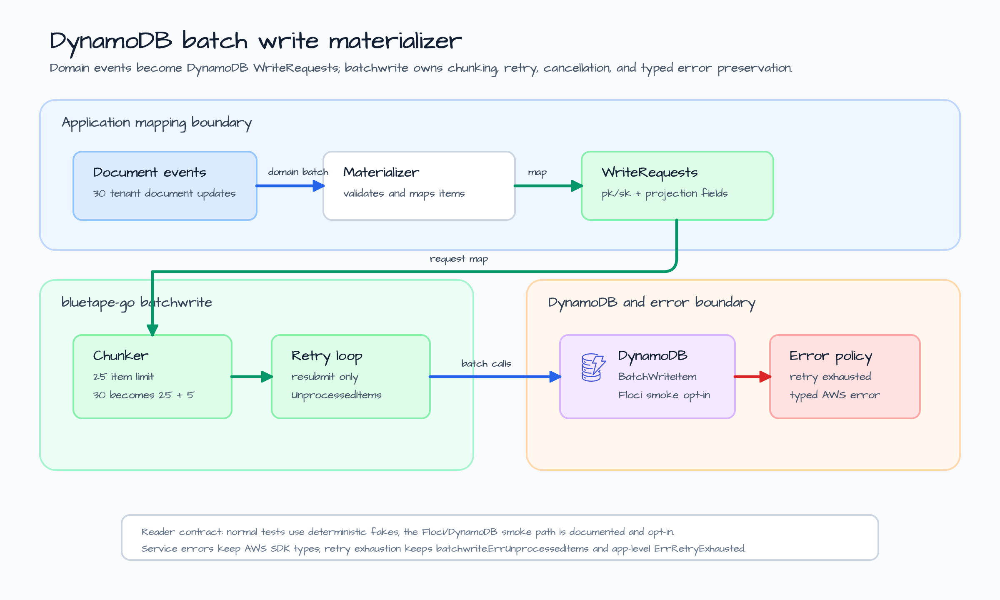
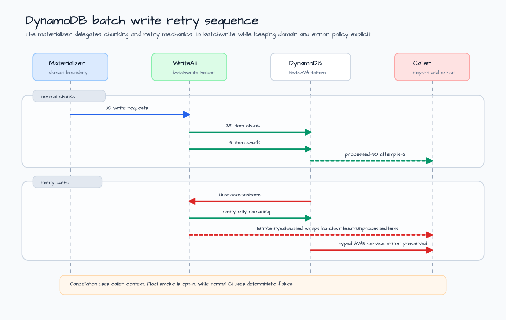

# dynamodb-batchwrite-materializer

[English](README.md) | [한국어](README.ko.md)

Document index materializer example for `dynamodb/batchwrite`.

The example models a common application boundary: a document service emits many
domain events, and a projection worker writes those events into a DynamoDB index
table. DynamoDB `BatchWriteItem` accepts at most 25 write requests per call and
may return `UnprocessedItems` when capacity is temporarily unavailable. The
worker should not hide those rules inside business code.

This example keeps the domain mapping in the application and delegates the
wire-level batch behavior to bluetape-go:

- the application maps `DocumentEvent` values to AWS SDK v2
  `types.WriteRequest` values;
- `batchwrite.WriteAll` owns 25-item chunking and retries only returned
  `UnprocessedItems`;
- retry exhaustion is reported as an application error that still preserves the
  bluetape-go `batchwrite.UnprocessedItemsError`;
- typed AWS service errors and context cancellation stay visible to callers.

## Scenario

The sample input contains 30 document events for one tenant. The materializer
creates one DynamoDB `PutRequest` per event, so the request must be split into
two DynamoDB calls: 25 items in the first chunk and 5 items in the second.

The materializer writes index rows with this shape:

| Attribute | Example | Reason |
|---|---|---|
| `pk` | `TENANT#tenant-alpha` | Groups documents by tenant. |
| `sk` | `DOC#doc-001#v000001` | Keeps document versions sortable. |
| `document_id` | `doc-001` | Preserves the domain identifier. |
| `tenant_id` | `tenant-alpha` | Keeps tenant metadata inspectable. |
| `version` | `1` | Stores the projection version as a DynamoDB number. |
| `title` | `Document 001` | Demonstrates ordinary string attributes. |
| `body_hash` | `sha256:...0001` | Demonstrates immutable content metadata. |

## Architecture



The architecture keeps three concerns separate:

1. The domain worker owns event validation and the mapping from document events
   to DynamoDB write requests.
2. `dynamodb/batchwrite` owns AWS batch mechanics: max 25 items per request,
   retry budget, backoff, and the `UnprocessedItems` loop.
3. Production infrastructure owns table capacity, alarms, dead-letter policy,
   and replay scheduling.

That split is the main lesson. The application can review the item shape and
error policy without reimplementing DynamoDB's batch-write retry loop.

## Retry Sequence



`BatchWriteItem` has two different failure categories:

| Result | Example behavior | Caller sees |
|---|---|---|
| Partial success | DynamoDB returns `UnprocessedItems` for a subset of items. | `batchwrite.WriteAll` retries only those items. |
| Retry exhaustion | DynamoDB still returns `UnprocessedItems` after the configured attempts. | `ErrRetryExhausted`, while `batchwrite.ErrUnprocessedItems` and `UnprocessedItemsError` remain discoverable with `errors.Is` / `errors.As`. |
| Service error | AWS returns a typed error such as `ProvisionedThroughputExceededException`. | The typed AWS SDK error is preserved and is not converted into retry exhaustion. |
| Cancellation | The caller cancels the context before the retry can continue. | `context.Canceled` or `context.DeadlineExceeded` is preserved. |

This distinction matters in production. Retry exhaustion is a replay/dead-letter
decision. A typed AWS service error is usually an infrastructure or capacity
signal. Context cancellation is an ownership signal from the caller.

## What It Demonstrates

- `batchwrite.WriteAll` chunking 30 requests into DynamoDB-safe batches.
- Retrying only `UnprocessedItems`, not the whole original request.
- Separating retry exhaustion from AWS SDK service errors.
- Preserving context cancellation through the batch helper.
- Deterministic fake clients for retry and error behavior.
- An opt-in Floci DynamoDB smoke test for the real AWS SDK v2 client path.

## Run

Print the local preview:

```bash
go run ./examples/dynamodb-batchwrite-materializer
```

The output is JSON and does not contact DynamoDB:

```json
{
  "table": "document-index",
  "event_count": 30,
  "request_count": 30,
  "chunk_count": 2,
  "chunk_limit": 25,
  "retry_budget": 3
}
```

The real output also includes boundary notes, the smoke-test command, and an
example document ID. The preview is intentionally local so readers can inspect
the batch-write boundary before starting Docker or AWS-compatible services.

## Test

Run the deterministic tests:

```bash
go test -count=1 ./examples/dynamodb-batchwrite-materializer/...
go test -race -count=1 ./examples/dynamodb-batchwrite-materializer/...
```

The targeted tests prove:

- 30 events become two DynamoDB calls, `25 + 5`;
- retry calls contain only the returned `UnprocessedItems`;
- retry exhaustion returns `ErrRetryExhausted` and preserves
  `batchwrite.UnprocessedItemsError`;
- context cancellation is propagated;
- typed AWS service errors remain discoverable with `errors.As`;
- invalid events fail before the DynamoDB client is called.

## Optional Floci Smoke Test

The Floci-backed smoke test is opt-in because it starts Docker-backed AWS
service emulation and should run serially with other container-backed suites.

```bash
BLUETAPE_DYNAMODB_BATCHWRITE_SMOKE=1 go test -run TestFlociSmoke -count=1 ./examples/dynamodb-batchwrite-materializer/...
```

The smoke test creates a DynamoDB table, runs the same materializer through the
real AWS SDK v2 client, and scans the table to confirm that all 30 index rows
were written.

## Boundary Notes

- Keep item-shape mapping in application code. The helper should not decide
  domain keys or attribute names.
- Tune retry budget and backoff at the worker boundary. Table capacity and
  replay policy belong to production operations, not a generic helper.
- Do not treat every DynamoDB error as retry exhaustion. Preserve typed AWS SDK
  errors so capacity, permission, and validation failures stay diagnosable.
- Keep container-backed smoke tests opt-in when deterministic fakes can prove
  chunking, retry, cancellation, and wrapping behavior locally.
