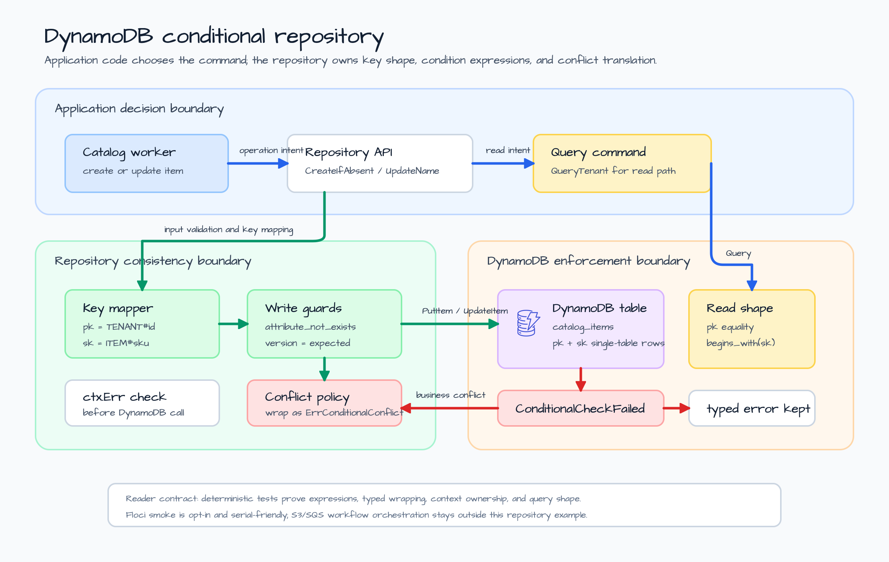
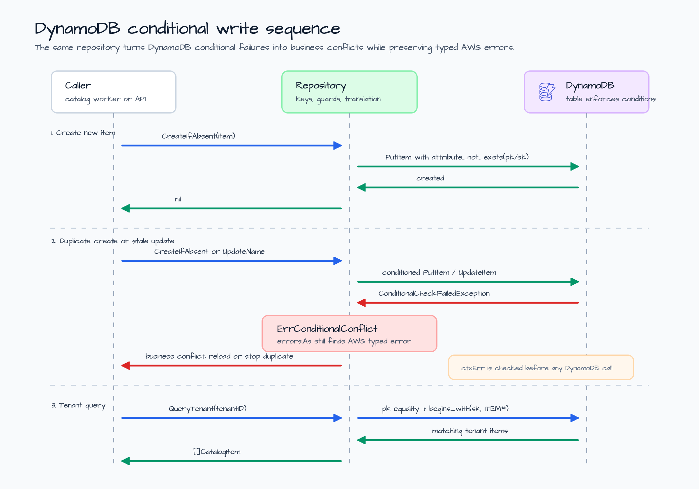

# dynamodb-conditional-repository

[English](README.md) | [한국어](README.ko.md)

Local DynamoDB repository example for conditional writes.

This example models a catalog repository that stores tenant-scoped items in a
single DynamoDB table. The repository is deliberately small, but it teaches the
part of DynamoDB that tends to leak into application code: conditional write
expressions and the meaning of a conditional conflict.

The example covers three repository operations:

- `CreateIfAbsent` writes a catalog item only when the `pk` / `sk` pair does not
  already exist.
- `UpdateName` performs an optimistic update only when the stored `version`
  matches the caller's expected version.
- `QueryTenant` reads a tenant partition with a `begins_with(sk, ITEM#)` key
  condition.

It stays separate from S3 and SQS on purpose. Conditional writes are the
repository consistency lesson. The larger document workflow belongs in a later
integration example.

## Scenario

A tenant catalog worker receives curated item changes from upstream product
systems. The worker must create new items, reject duplicate creates, update an
item only when the caller has the current version, and query all items for one
tenant.

The table uses a simple single-table key shape:

| Attribute | Example | Reason |
|---|---|---|
| `pk` | `TENANT#tenant-alpha` | Keeps each tenant's catalog in one partition for the example. |
| `sk` | `ITEM#sku-1001` | Keeps item rows queryable with `begins_with`. |
| `tenant_id` | `tenant-alpha` | Preserves the domain identifier. |
| `sku` | `sku-1001` | Preserves the item identifier. |
| `name` | `Road bike` | Demonstrates an updatable attribute. |
| `version` | `1` | Drives optimistic write conflicts. |
| `updated_by` | `seed` | Shows audit metadata that changes with updates. |

## Architecture



The architecture keeps the consistency boundary explicit:

1. The application service decides whether it is creating or updating a catalog
   item.
2. The repository owns DynamoDB key mapping, condition expressions, and typed
   conflict translation.
3. DynamoDB enforces the create-if-absent and expected-version predicates.
4. The caller sees `ErrConditionalConflict` for business conflicts while the
   original AWS SDK `ConditionalCheckFailedException` remains available with
   `errors.As`.

## Conditional Write Sequence



The repository treats conditional conflicts differently from transport or AWS
service errors.

| Operation | Condition | Conflict means |
|---|---|---|
| Create item | `attribute_not_exists(pk) AND attribute_not_exists(sk)` | The item already exists; the caller should not create a duplicate. |
| Update item | `version = expectedVersion` | The caller is stale and should reload before retrying. |
| Query tenant | `pk = TENANT#... AND begins_with(sk, ITEM#)` | No conflict path; query shape is a read contract. |

The repository checks `ctx.Err()` before calling DynamoDB so caller-owned
cancellation is not converted into a DynamoDB error. Tests also verify that
typed conditional errors are preserved after wrapping.

## What It Demonstrates

- AWS SDK v2 `PutItem`, `UpdateItem`, and `Query` request shapes without hiding
  key design behind an ORM.
- Create-if-absent writes with `attribute_not_exists`.
- Optimistic updates with explicit version comparison.
- Querying a tenant partition with a sort-key prefix.
- `ErrConditionalConflict` as the application-level conflict signal.
- Typed AWS SDK error preservation with `errors.As`.
- Deterministic fake-client tests plus an opt-in Floci DynamoDB smoke test.

## Run

Print the local preview:

```bash
go run ./examples/dynamodb-conditional-repository
```

The output is JSON and does not contact DynamoDB:

```json
{
  "table": "catalog_items",
  "item_count": 3,
  "partition_key": "TENANT#<tenant_id>",
  "sort_key_prefix": "ITEM#<sku>"
}
```

The real output also lists the repository operations, conflict rules, and the
optional smoke-test command.

## Test

Run the deterministic tests:

```bash
go test -count=1 ./examples/dynamodb-conditional-repository/...
go test -race -count=1 ./examples/dynamodb-conditional-repository/...
```

The targeted tests prove:

- create calls include the `attribute_not_exists` condition;
- duplicate creates become `ErrConditionalConflict`;
- optimistic updates use the caller's expected version and return the updated
  item;
- stale updates become `ErrConditionalConflict`;
- tenant queries use the partition key and item sort-key prefix;
- canceled contexts return before DynamoDB is called;
- invalid item shapes fail before the client boundary.

## Optional Floci Smoke Test

The Floci-backed smoke test is opt-in because it starts Docker-backed AWS
service emulation and should run serially with other container-backed suites.

```bash
BLUETAPE_DYNAMODB_CONDITIONAL_SMOKE=1 go test -run TestFlociSmoke -count=1 ./examples/dynamodb-conditional-repository/...
```

The smoke test creates a DynamoDB table, writes one item, verifies a duplicate
create conflict, updates the item from version 1 to version 2, verifies a stale
version conflict, and queries the tenant partition.

## Boundary Notes

- Keep key shape and condition expressions in the repository. Callers should
  choose the operation, not assemble DynamoDB expressions.
- Treat conditional conflicts as business consistency conflicts, not generic
  infrastructure failures.
- Preserve typed AWS SDK errors so operations can still diagnose capacity,
  validation, permission, and transport problems separately.
- Keep this example focused on repository consistency. S3/SQS document workflow
  orchestration should compose this boundary later instead of living here.
