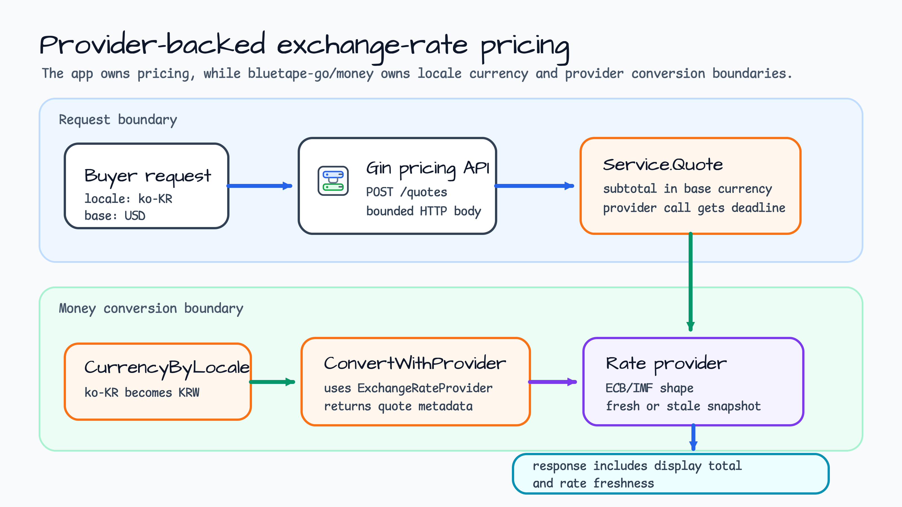
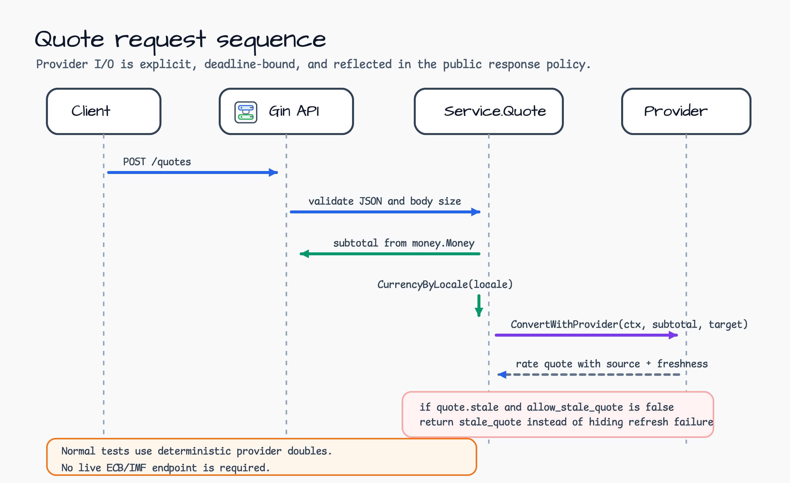
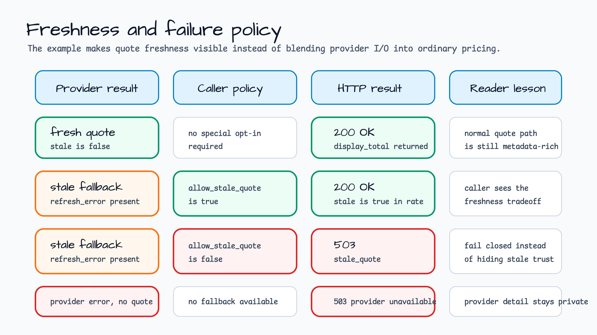

# exchange-rate-pricing

[English](README.md) | [한국어](README.ko.md)

Provider-backed `money` conversion을 보여주는 Gin display-pricing 예제입니다.

이 예제는 하나의 base currency로 가격 계산된 cart에서 시작합니다. Buyer locale로
display currency를 고르고, `ExchangeRateProvider`에서 rate를 받은 뒤, base subtotal과
converted display total을 함께 반환합니다. 목표는 live exchange-rate service 호출이
아니라 `money.ConvertWithProvider` 주변의 application boundary를 명확히 보여주는
것입니다.

## 시나리오

Pricing API가 한국 buyer의 quote request를 받습니다. Cart는 `USD`로 가격이 매겨져
있지만 buyer locale은 `ko-KR`이므로 response에는 `KRW` display total이 필요합니다.
Service는 original subtotal을 계속 노출하고, display-pricing boundary에서만
conversion을 수행하며, 어떤 source와 freshness policy가 total에 반영되었는지 알 수
있도록 rate metadata를 반환합니다.



## 보여주는 것

- `money.CurrencyByLocale`로 locale에서 display currency 선택.
- `money.ConvertWithProvider`를 사용한 provider-backed conversion.
- `float64` 대신 string money input/output.
- HTTP request context 아래에서 provider I/O 전용 deadline 생성.
- Rate source, observed time, fetched time, expiry, stale status를 public
  response metadata로 노출.
- 명시적인 stale quote policy: caller가 `allow_stale_quote`를 설정한 경우에만
  stale fallback 허용.
- Live ECB/IMF endpoint 대신 deterministic provider test double 사용.

## Request Flow

`POST /quotes`는 작게 유지합니다. HTTP handler는 JSON과 body size를 검증하고,
service는 money field 검증, base subtotal 계산, locale-to-currency mapping,
provider-backed conversion을 수행합니다.



Provider I/O는 conversion call 한 곳으로 모읍니다:

1. `CurrencyByLocale("ko-KR")`가 `KRW`를 선택합니다.
2. `subtotalLines`가 mixed line currency를 provider I/O 전에 reject합니다.
3. `operationContext`가 request context 아래에 더 짧은 provider deadline을 겁니다.
4. `ConvertWithProvider(ctx, subtotal, target, provider)`가 converted money와 그
   conversion에 사용된 quote metadata를 반환합니다.
5. Response는 `subtotal`과 `display_total`을 모두 보관하므로 downstream code가 무엇이
   conversion 되었는지 추론하지 않아도 됩니다.

## Freshness Policy

이 예제는 provider availability와 일반 pricing validity를 분리합니다. Cart 자체가
valid해도 provider가 허용 가능한 quote를 반환하지 못하면 실패할 수 있습니다.



| Provider result | Caller policy | HTTP result | 이유 |
|---|---|---|---|
| Fresh quote | 별도 opt-in 불필요 | `200 OK` | 정상 경로도 source와 freshness metadata를 포함합니다. |
| Stale fallback | `allow_stale_quote=true` | `200 OK` | Caller가 freshness tradeoff를 받아들이고 `rate.stale=true`를 봅니다. |
| Stale fallback | 기본 policy | `503 stale_quote` | Stale trust를 숨기지 않고 fail closed 합니다. |
| Provider error, no quote | 어떤 policy든 동일 | `503 exchange_rate_unavailable` | Raw provider detail은 public error 밖으로 노출하지 않습니다. |

## Code Map

- `main.go`는 loopback-only Gin server와 deterministic demo provider를 연결합니다.
  Demo provider는 static `USD/KRW`, `USD/EUR`, `EUR/KRW`, `EUR/USD` rate와
  `ECB demo snapshot` metadata를 반환합니다.
- `internal/exchangepricing/service.go`는 request validation, base subtotal 계산,
  locale currency 선택, provider conversion, stale policy, public HTTP error mapping을
  소유합니다.
- `internal/exchangepricing/service_test.go`는 fresh quote, stale quote opt-in, stale
  quote rejection, provider failure mapping, unsupported locale, currency mismatch
  rejection, provider deadline propagation을 검증합니다.
- `internal/exchangepricing/http_test.go`는 public router response와 stable public
  error code를 검증합니다.

## 실행

```bash
go run ./examples/exchange-rate-pricing
```

Service는 기본적으로 `127.0.0.1:8101`에서 실행됩니다. `HTTP_ADDR`로 주소를 바꿀 수
있지만, 이 예제는 loopback address만 허용합니다.

```bash
curl http://127.0.0.1:8101/healthz
```

한국 buyer용 USD cart를 quote합니다:

```bash
curl -s -X POST http://127.0.0.1:8101/quotes \
  -H 'Content-Type: application/json' \
  -d '{
    "quote_id":"quote-1001",
    "base_currency":"USD",
    "locale":"ko-KR",
    "items":[
      {"sku":"pro-plan","unit_price":"19.995","currency":"USD","quantity":2},
      {"sku":"support","unit_price":"5.00","currency":"USD","quantity":1}
    ]
  }' | jq
```

주요 예상 값:

```json
{
  "base_currency": "USD",
  "display_currency": "KRW",
  "subtotal": {"amount": "44.99", "currency": "USD"},
  "display_total": {"amount": "58487", "currency": "KRW"},
  "rate": {
    "source": "ECB demo snapshot",
    "rate": "1300",
    "stale": false
  },
  "conversion_applied": true
}
```

Unsupported locale을 확인합니다:

```bash
curl -s -X POST http://127.0.0.1:8101/quotes \
  -H 'Content-Type: application/json' \
  -d '{
    "quote_id":"quote-1002",
    "base_currency":"USD",
    "locale":"en",
    "items":[{"sku":"pro-plan","unit_price":"10.00","currency":"USD","quantity":1}]
  }'
```

예상 public error code는 `invalid_locale`입니다.

Currency mismatch를 확인합니다:

```bash
curl -s -X POST http://127.0.0.1:8101/quotes \
  -H 'Content-Type: application/json' \
  -d '{
    "quote_id":"quote-1003",
    "base_currency":"USD",
    "locale":"ko-KR",
    "items":[{"sku":"pro-plan","unit_price":"10.00","currency":"EUR","quantity":1}]
  }'
```

예상 public error code는 `currency_mismatch`입니다. 이 request에서는 provider를
호출하지 않습니다.

## Boundary Notes

- Runtime demo provider는 deterministic하며 live ECB/IMF endpoint를 호출하지
  않습니다. Live provider integration은 같은 `ExchangeRateProvider` interface 뒤에
  두면 됩니다.
- `CurrencyByLocale`은 `ko-KR`, `en-US`처럼 명시적인 supported region이 있는 locale을
  요구합니다. Language-only tag는 reject합니다.
- API는 allowed stale quote를 성공으로 반환할 때만 `refresh_error`를 노출합니다.
  Public HTTP error는 raw provider detail 대신 stable code를 사용합니다.
- 이 예제는 display용 final subtotal만 convert합니다. 각 line을 서로 다른 currency로
  가격 계산하지 않습니다.

## 테스트

```bash
go test -count=1 ./examples/exchange-rate-pricing/...
go test -race -count=1 ./examples/exchange-rate-pricing/...
```
