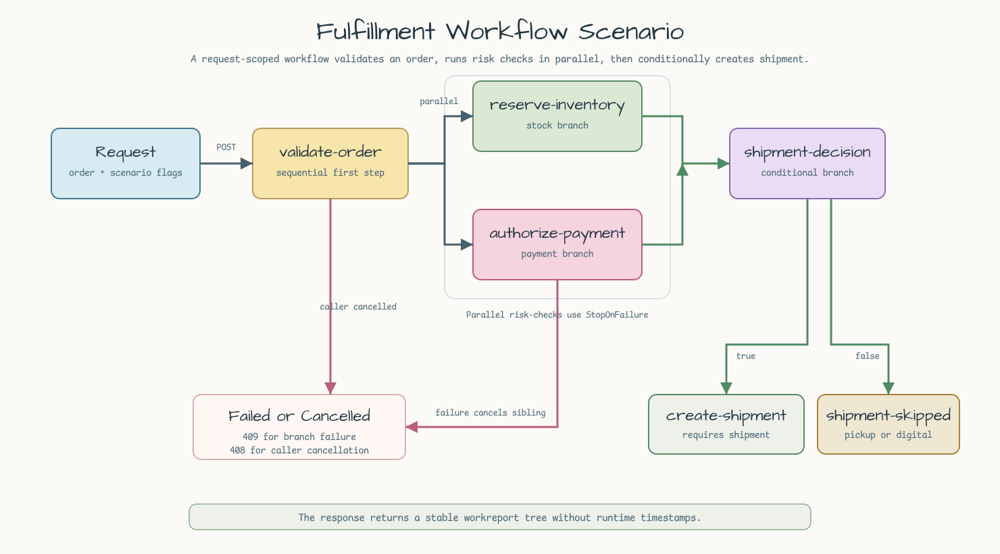
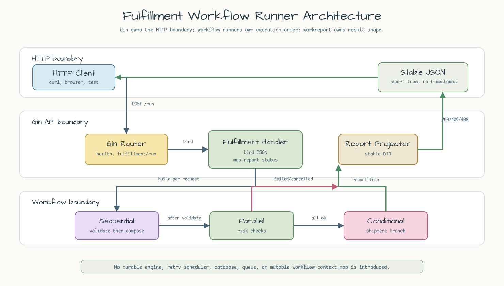
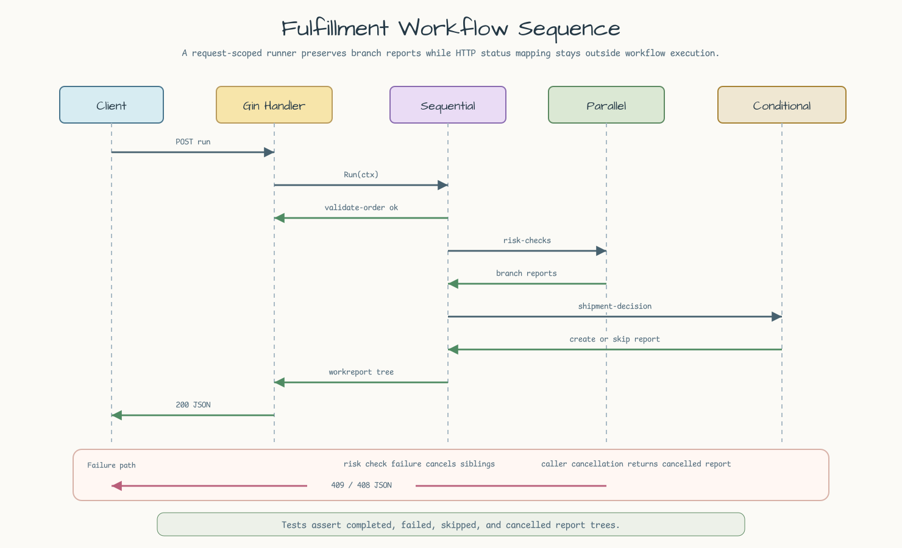

# Fulfillment Workflow Runner

[English](README.md) | [한국어](README.ko.md)

This example exposes a request-scoped fulfillment workflow through a small Gin
HTTP API. It uses `github.com/bluetape4k/bluetape-go/workflow` to compose
sequential, parallel, and conditional runners, and uses `workreport` to return a
stable execution tree to callers.

## Example Scenario

The API accepts one fulfillment request. The workflow validates the order first,
then reserves inventory and authorizes payment in parallel. If both risk checks
complete, a conditional step either creates a shipment or records that shipment
was skipped for pickup or digital delivery. A failed risk check stops the
workflow and cancels slow siblings. Caller cancellation returns a cancelled
report.



## Workflow Steps

| Step | Runner | Boundary | Failure behavior |
|---|---|---|---|
| `validate-order` | `workflow.Sequential` child | Validates the request before fan-out. | Stops the workflow before risk checks. |
| `risk-checks` | `workflow.Parallel` | Runs `reserve-inventory` and `authorize-payment` with `StopOnFailure`. | Returns `409 Conflict` and cancels unfinished siblings. |
| `shipment-decision` | `workflow.Conditional` | Chooses `create-shipment` or `shipment-skipped`. | Does not run when risk checks fail or context is cancelled. |

The HTTP handler projects `workreport.Report` into stable JSON and deliberately
omits runtime timestamps, so tests can assert the execution tree without timing
noise.

## Run

```bash
go run ./examples/fulfillment-workflow-runner
```

Optional environment variables:

| Variable | Default | Purpose |
|---|---:|---|
| `HTTP_ADDR` | `:8084` | Listening address. |

## Endpoints

```bash
curl http://localhost:8084/healthz
curl -X POST http://localhost:8084/fulfillment/run \
  -H 'Content-Type: application/json' \
  -d '{
    "order_id": "order-1001",
    "stock_available": true,
    "payment_authorized": true,
    "requires_shipment": true
  }'
```

Useful variants:

```bash
# Conditional skip path.
curl -X POST http://localhost:8084/fulfillment/run \
  -H 'Content-Type: application/json' \
  -d '{"order_id":"pickup-1001","stock_available":true,"payment_authorized":true,"requires_shipment":false}'

# Risk-check failure path.
curl -X POST http://localhost:8084/fulfillment/run \
  -H 'Content-Type: application/json' \
  -d '{"order_id":"order-1002","stock_available":false,"payment_authorized":true,"requires_shipment":true}'
```

Successful reports return `200 OK`. Failed or partial workflow reports return
`409 Conflict`. Cancelled workflow reports return `408 Request Timeout`.
Malformed JSON, missing `order_id`, blank `order_id`, and out-of-range
`inventory_delay_ms` values return `400 Bad Request`.

## When This Is Enough

This pattern is enough when one HTTP request can own the whole workflow, all
steps are synchronous, and the caller only needs an execution report. It is a
good fit for boundary examples, validation/risk fan-out, and simple command
orchestration.

Use a durable workflow engine or persistent job system instead when the process
must survive service restarts, wait for human approval, retry across long
windows, compensate previously committed side effects, or resume from stored
state.

## Architecture

Gin owns routing, JSON binding, and HTTP status mapping. The request handler
builds a fresh workflow runner per request so each run keeps its own flags and
context cancellation. The workflow package owns execution order, while
`workreport` owns the result tree.



## Sequence Diagram

The main request path is synchronous. The handler runs the sequential workflow,
the workflow runs risk checks in parallel, and the conditional step records the
shipment branch only when the risk checks complete successfully.



## Test

```bash
go test -count=1 ./examples/fulfillment-workflow-runner/...
go test -race -count=1 ./examples/fulfillment-workflow-runner/...
```
