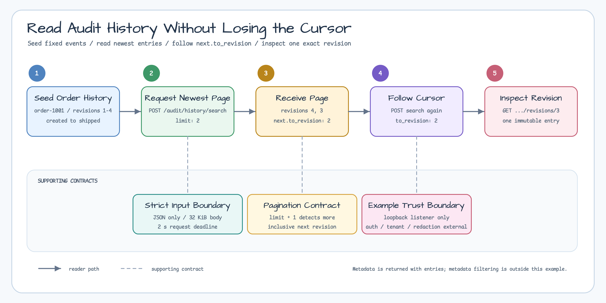
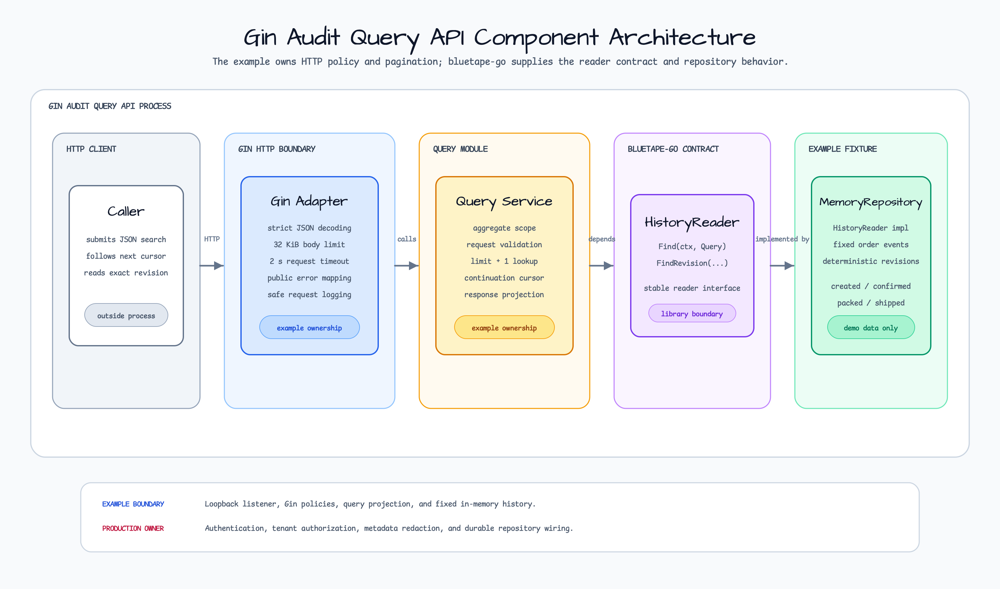
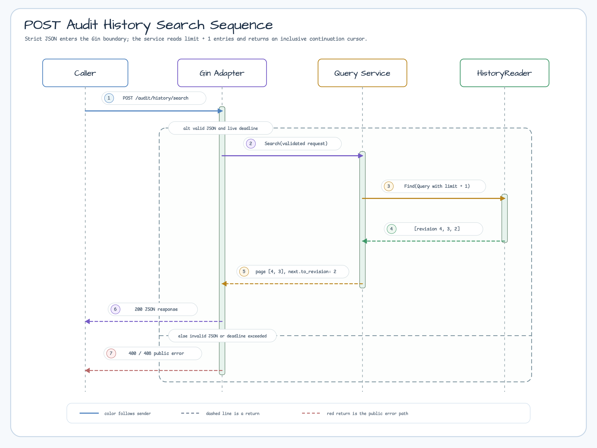

# gin-audit-query-api

[English](README.md) | 한국어

bluetape-go `audit` 이력을 Gin API로 조회하는 application-shaped 예제입니다.
검색 조건은 URL query string 대신 POST JSON body로 받습니다. Revision 범위와
시간 범위가 늘어나도 URL 길이에 기대지 않고, 요청 계약을 구조적으로 확장할 수
있습니다.

## Reader Scenario



고정된 `order-1001` 이력을 사용하므로 pagination 요청을 같은 결과로 반복할 수
있습니다. 첫 page는 revision 4와 3을 반환하고, `next.to_revision: 2`로 다음
inclusive page를 시작합니다. Exact-revision route도 같은 fixture를 독립적으로
조회합니다.

## Package Lesson

| Component | Owns |
|---|---|
| `audit.HistoryReader` | 저장 방식과 분리된 audit entry 조회 계약. |
| Query service | Aggregate 범위, revision/time filter, limit, 정렬, 다음 page 경계. |
| Gin adapter | Strict JSON, body limit/close, request timeout, HTTP status, 안전한 log. |
| Application | 인증/인가, tenant scope, payload/metadata redaction, retention, rate limit. |

Service는 하나의 aggregate만 조회합니다. `audit.Query`에 `limit + 1`을 넘겨
다음 entry가 있는지 확인하고, 응답에는 요청한 개수만 담습니다. 남은 entry가
있으면 아직 반환하지 않은 첫 revision을 inclusive continuation으로 돌려줍니다.
이 방식은 page 사이에서 revision을 중복하거나 건너뛰지 않습니다.

## Architecture



Gin adapter와 query service는 application이 소유합니다. 두 component는 저장
방식과 분리된 `audit.HistoryReader` 계약에 의존하며, 이 실행 예제는 결과가
일정한 demo storage로만 `MemoryRepository`를 연결합니다.

## Search Sequence



성공 경로는 `limit + 1`개 entry를 읽은 뒤 요청한 page와 cursor를 만듭니다.
잘못된 JSON과 deadline 초과는 Gin 경계에서 멈추고, raw input이나 repository
세부 정보 없이 public error를 반환합니다.

## Run

```bash
go run ./examples/gin-audit-query-api
```

기본 주소는 `127.0.0.1:8080`입니다.

```bash
curl -sS http://127.0.0.1:8080/healthz
```

## POST JSON Search

최신 entry부터 두 건을 조회합니다.

```bash
curl -sS -X POST http://127.0.0.1:8080/audit/history/search \
  -H 'Content-Type: application/json' \
  --data '{
    "aggregate": {"type": "order", "id": "order-1001"},
    "from_recorded_at": "2026-07-13T09:00:00Z",
    "newest_first": true,
    "limit": 2
  }'
```

응답의 `entries`에는 전체 `audit.Entry` JSON이 들어갑니다. 아래 예시는 page
계약을 보기 쉽도록 entry 일부를 줄였습니다.

```json
{
  "entries": [
    {"revision": 4, "event": {"event_type": "order.shipped"}},
    {"revision": 3, "event": {"event_type": "order.packed"}}
  ],
  "page": {
    "limit": 2,
    "has_more": true,
    "next": {"to_revision": 2}
  }
}
```

다음 newest-first page에서는 원래 조건을 그대로 보내고 `to_revision`만 응답
값으로 바꿉니다.

```bash
curl -sS -X POST http://127.0.0.1:8080/audit/history/search \
  -H 'Content-Type: application/json' \
  --data '{
    "aggregate": {"type": "order", "id": "order-1001"},
    "from_recorded_at": "2026-07-13T09:00:00Z",
    "to_revision": 2,
    "newest_first": true,
    "limit": 2
  }'
```

Ascending 조회는 같은 규칙으로 `next.from_revision`을 사용합니다. Revision과
recorded-at 범위는 모두 inclusive입니다. 일치하는 entry가 없으면 404가 아니라
`200`과 빈 `entries: []`를 반환합니다.

## Event Detail

현재 `HistoryReader`에는 event ID 전용 lookup이 없습니다. 그래서 detail
identity는 aggregate와 revision 조합을 사용합니다.

```bash
curl -sS \
  http://127.0.0.1:8080/audit/aggregates/order/order-1001/revisions/3
```

없는 revision은 `404 audit_entry_not_found`입니다.

## Strict Boundary

- Search는 `application/json`과 UTF-8만 받으며 body는 최대 32 KiB입니다.
- Unknown field, 중복 JSON key, trailing JSON, 압축 body를 거절합니다.
- Aggregate type/ID는 URL path에 안전한 ASCII 식별자로 제한합니다.
- Request deadline은 2초이며 server도 header/read/write/idle timeout을 소유합니다.
- Log에는 route template, method, status, code, elapsed만 남깁니다. Aggregate ID,
  payload, metadata, request body, raw error는 기록하지 않습니다.

## Metadata Scope

저장된 event metadata는 `audit.Entry` 응답에 그대로 포함됩니다. 반면 v0.18.0
`audit.Query`에는 metadata predicate가 없습니다. Repository가 limit을 적용한 뒤
application에서 metadata를 거르면 page가 빠지거나 불완전해질 수 있으므로 이
예제는 metadata filter를 제공하지 않습니다.

## Production Boundaries

- 이 서버는 인증, 인가, tenant isolation을 구현하지 않습니다. 그래서 기본값은
  loopback bind입니다. Remote bind는 위험을 이해한 경우에만
  `ALLOW_UNAUTHENTICATED_REMOTE=1`로 명시해야 합니다.
- Production code는 인증된 server context에서 tenant와 aggregate scope를
  결정해야 합니다. Client JSON을 권한 근거로 사용하면 안 됩니다.
- Audit payload와 metadata에는 PII나 credential이 들어갈 수 있습니다. 저장과
  응답 전에 분류, 최소화, field-level redaction 정책을 적용해야 합니다.
- `MemoryRepository`는 process가 끝나면 모든 entry를 잃습니다. `/healthz`는
  process availability만 보여주며 durability/readiness를 증명하지 않습니다.
- 실제 repository는 retention/deletion, encryption, per-entry 및 전체 response
  byte budget, storage-backed pagination, rate limit을 소유해야 합니다.
- 이 예제는 audit 조회를 설명합니다. Event sourcing, recovery, global audit
  search, exactly-once delivery 계약이 아닙니다.

Remote bind 예시:

```bash
HTTP_ADDR=0.0.0.0:8080 ALLOW_UNAUTHENTICATED_REMOTE=1 \
  go run ./examples/gin-audit-query-api
```

## Test

```bash
go test -count=1 ./examples/gin-audit-query-api/...
go test -race -count=1 ./examples/gin-audit-query-api/...
```

Test는 filter와 양방향 pagination, detail not-found, typed audit error,
cancellation, strict JSON, body close, timeout, log redaction, loopback policy,
graceful/forced shutdown, listener join을 검증합니다.
