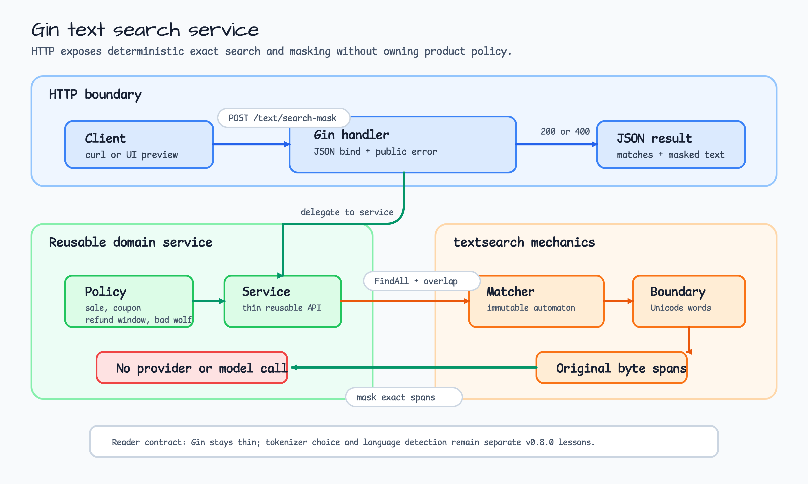
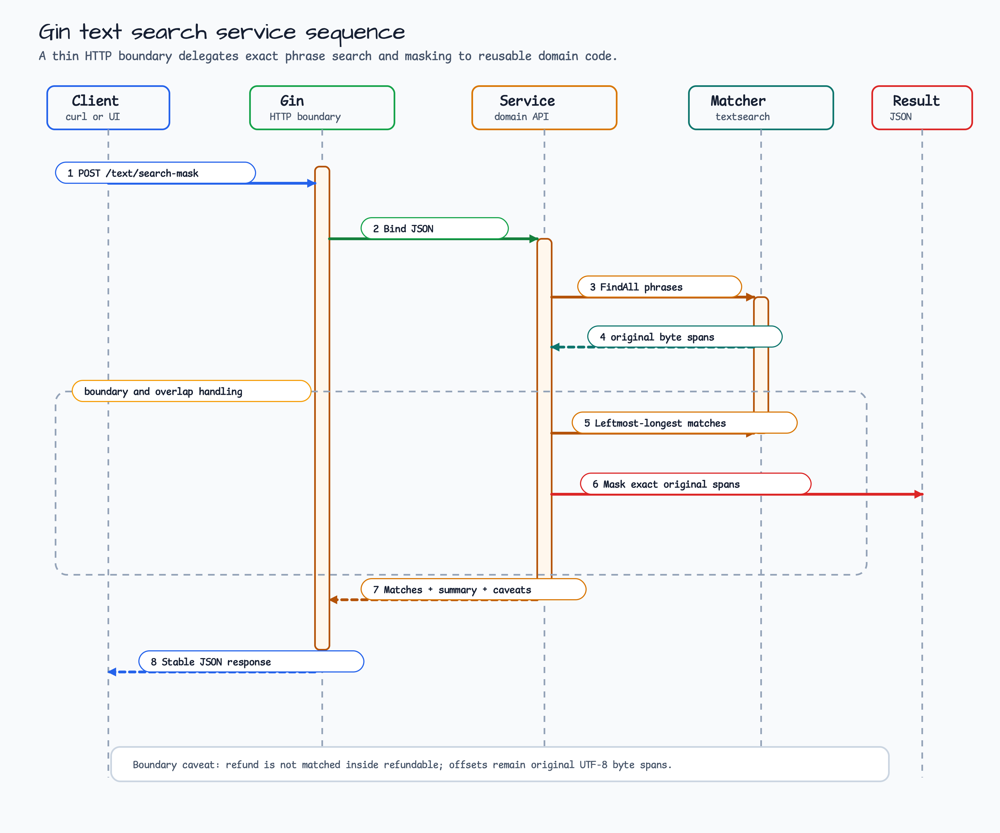

# Gin Text Search Service Example

[English](README.md) | [한국어](README.ko.md)

This example exposes deterministic `textsearch` behavior through a small Gin
API. It builds on the local moderation masking lesson, but changes the reader's
question from "how does exact matching work?" to "how should an HTTP service
expose search and masking without putting policy into handlers?"

Gin owns JSON binding, status codes, and the public error shape. The reusable
domain `Service` owns policy compilation, Unicode boundary matching,
leftmost-longest overlap handling, and exact-span masking.

## Scenario

A content operations tool needs a local endpoint that previews which policy
phrases would be highlighted or masked before the larger moderation workflow is
introduced. The service keeps the dictionary static and deterministic:

1. `POST /text/search-mask` accepts one text payload and optional mask rune.
2. The handler validates JSON and delegates to `Service.SearchMask`.
3. The service searches configured phrases with NFC normalization and Unicode
   word-boundary filtering.
4. The response returns byte spans, matched policy IDs, a masked projection, and
   Unicode caveats for UI clients.

## Architecture



| Layer | Owns | Does not own |
| --- | --- | --- |
| Gin handler | JSON binding, route shape, HTTP status, public error response. | Dictionary compilation, matching, masking, tokenizer selection. |
| `Service` | Policy loading, exact search, leftmost-longest overlap handling, exact-span masking. | HTTP routing, auth, persistence, external moderation provider. |
| `textsearch` | Immutable matcher, NFC normalization, Unicode boundary checks, original byte spans. | Product policy, language detection, language-specific tokenization. |

## Processing Sequence



The endpoint deliberately exposes exact search, not tokenization. For example,
`refund` is not matched inside `refundable`, and `sale` is not matched inside
`presale` when `BoundaryUnicodeWord` is enabled. Offsets are byte spans in the
original UTF-8 string, so UI clients should map them carefully before slicing by
display columns.

## Run

Print the no-server preview:

```bash
go run ./examples/gin-text-search-service
```

Run the Gin service:

```bash
SERVE_HTTP=1 go run ./examples/gin-text-search-service
```

The service listens on `127.0.0.1:8098` by default. Override it with
`HTTP_ADDR=127.0.0.1:8099`.

## Try The API

Search and mask mixed English/Korean text:

```bash
curl -s -X POST http://127.0.0.1:8098/text/search-mask \
  -H 'Content-Type: application/json' \
  -d '{"request_id":"search-1001","text":"sale 쿠폰 refundable refund window bad wolf"}' | jq
```

Use a custom mask rune:

```bash
curl -s -X POST http://127.0.0.1:8098/text/search-mask \
  -H 'Content-Type: application/json' \
  -d '{"request_id":"search-1002","text":"presale refund refundable 쿠폰","mask":"#"}' | jq
```

Try a stable validation error:

```bash
curl -s -X POST http://127.0.0.1:8098/text/search-mask \
  -H 'Content-Type: application/json' \
  -d '{"request_id":"","text":"sale"}' | jq
```

Expected error code: `invalid_request`.

## Endpoint

| Method | Path | Success | Purpose |
| --- | --- | --- | --- |
| `GET` | `/healthz` | `200` | Process liveness only. |
| `POST` | `/text/search-mask` | `200` | Search configured phrases and return a masked projection. |

## What The Tests Prove

Run the focused tests:

```bash
go test -count=1 ./examples/gin-text-search-service/...
go test -race -count=1 ./examples/gin-text-search-service/...
```

The tests prove:

- Gin response shapes stay stable while handlers remain thin.
- Domain search handles Korean text, overlapping phrases, and Unicode word
  boundaries.
- Custom mask runes apply to exact original match spans.
- Public validation errors use stable response codes.
- The preview documents curl examples and Unicode caveats.

## Unicode Caveats

- `BoundaryUnicodeWord` reduces substring false positives; it is not a security
  boundary.
- Response offsets are byte spans in the original UTF-8 string, not rune indexes
  or display columns.
- NFC normalization is enabled, but language detection and tokenizer choice are
  separate v0.8.0 lessons.
- The example has no network, model, or container dependency.
