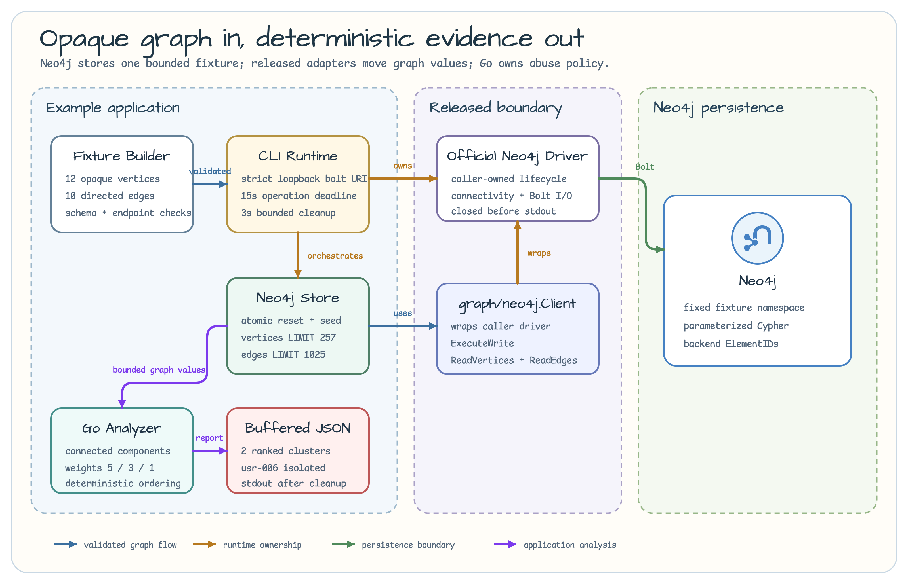
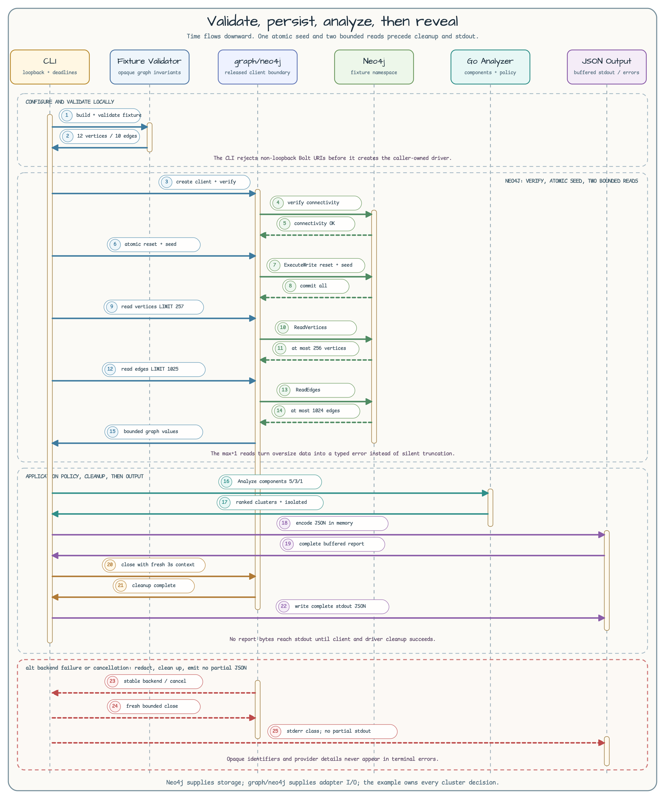

# Neo4j Graph Abuse Cluster

English | [한국어](README.ko.md)

This CLI example stores synthetic user-to-identifier relationships in Neo4j,
reads them back as `bluetape-go` `graph` values through the `graph/neo4j`
adapter, and calculates connected components in Go. Neo4j does not calculate
the cluster score. It owns only the bounded persistence boundary; the example
code owns schema validation, clustering, scoring, and ordering.



## Package lesson

| Component | Responsibility |
| --- | --- |
| Fixture builder | Build 12 vertices and 10 edges with synthetic opaque IDs, then validate schema, endpoints, and duplicates before persistence. |
| `abusecluster.Store` | Reset and seed one fixture namespace with one fixed parameterized Cypher statement. Reads request limit+1 to enforce accepted limits of 256 vertices and 1024 edges. |
| `graph/neo4j` | Use the caller-owned Neo4j driver for a managed write and `graph.Vertex`/`graph.Edge` adaptation. |
| Go analyzer | Walk User and Identifier components, calculate shared-identifier evidence and risk scores, then sort the report deterministically. |
| CLI | Own strict loopback URI validation, a 15-second operation deadline, three-second cleanup, JSON buffering, and stdout after cleanup. |



## Graph schema

| Graph value | Label/type | Properties | Relationship |
| --- | --- | --- | --- |
| User vertex | `User` | `opaque_id`, `fixture_id` | Start of `USES_IDENTIFIER` |
| Identifier vertex | `Identifier` | `opaque_id`, `fixture_id`, `kind` | End of `USES_IDENTIFIER` |
| Relationship edge | `USES_IDENTIFIER` | `opaque_id`, `fixture_id` | Only `User -> Identifier` is valid |

The allowed `kind` values are `device`, `ip`, and `payment_token`. Every ID is
a synthetic opaque ID created for this lesson; it contains no real user data
or raw identifier. The example validates both the fixture before persistence
and the graph after loading. More than 256 vertices or 1024 edges fails the
whole analysis without printing a partial report.

## Clusters and scores

Users that share an identifier belong to the same connected component. Users
can also belong to the same cluster through a transitive user-to-identifier
path. Only identifiers shared by at least two users become evidence. Each
shared identifier contributes its weight once.

| Identifier kind | Weight |
| --- | ---: |
| `payment_token` | 5 |
| `device` | 3 |
| `ip` | 1 |

The risk score is illustrative; it is not a production fraud decision. The
analyzer sorts clusters by descending risk score, descending user count, and
then ascending smallest user ID. It sorts evidence by kind and opaque ID.

## Run

### Terminal 1: start Neo4j

This foreground command disables authentication and publishes the Bolt port
only on IPv4 loopback. Leave this terminal running.

```bash
docker run --rm --name graph-abuse-cluster-neo4j \
  -e NEO4J_AUTH=none \
  -p 127.0.0.1:7687:7687 \
  neo4j:5.26.0
```

### Terminal 2: run the CLI and tests

The CLI accepts only a `bolt://` URI whose host is `localhost`, an address in
`127.0.0.0/8`, or `::1`. A numeric port is required. Credentials, paths,
queries, fragments, and remote hosts are rejected before driver creation.

```bash
NEO4J_URI=bolt://127.0.0.1:7687 \
  go run ./examples/graph-abuse-cluster

go test -count=1 ./examples/graph-abuse-cluster/...
go test -p 1 -race -count=1 ./examples/graph-abuse-cluster/...
```

The Neo4j Testcontainers integration test starts `neo4j:5.26.0` and verifies
real connectivity, two idempotent replacements, cancellation, and namespace
cleanup. The race command uses `-p 1` because container-backed suites share
Docker resources.

## Expected JSON

The checked-in fixture always prints this JSON:

```json
{
  "clusters": [
    {
      "cluster_id": "cluster:usr-001",
      "users": [
        "usr-001",
        "usr-002",
        "usr-003"
      ],
      "evidence": [
        {
          "kind": "device",
          "opaque_id": "dev-001",
          "user_count": 2,
          "weight": 3
        },
        {
          "kind": "ip",
          "opaque_id": "ip-001",
          "user_count": 2,
          "weight": 1
        }
      ],
      "risk_score": 4
    },
    {
      "cluster_id": "cluster:usr-004",
      "users": [
        "usr-004",
        "usr-005"
      ],
      "evidence": [
        {
          "kind": "device",
          "opaque_id": "dev-002",
          "user_count": 2,
          "weight": 3
        },
        {
          "kind": "ip",
          "opaque_id": "ip-002",
          "user_count": 2,
          "weight": 1
        }
      ],
      "risk_score": 4
    }
  ],
  "isolated_users": [
    "usr-006"
  ]
}
```

## Transaction and execution boundary

`ReplaceFixture` deletes existing nodes in the `graph-abuse-cluster-v1`
namespace and creates the new fixture with one fixed Cypher statement in one
Neo4j managed write transaction. Reset and seed commit together or roll back
together. The CLI is a teaching process that handles this fixed namespace once
and exits. Concurrent CLI runs against the same namespace are unsupported.

This atomic reset and seed does not provide message delivery or a distributed
transaction. Outbox, retry, consumer deduplication, and at-least-once or
exactly-once delivery do not apply to this example.

`NEO4J_AUTH=none` and `NoAuth` belong only inside this loopback-isolated local
workshop trust boundary. The example does not implement production
authentication, TLS, authorization, secret loading, routing, tenant isolation,
retention, audit logging, migrations, backups, high availability, or general
Neo4j deployment. Raw identifier collection and hashing, production fraud
policy, automated enforcement, and manual review workflows are also out of
scope.

This is a Neo4j-only CLI example. It does not add Memgraph, an HTTP API, a
reusable graph repository, an algorithm library, a schema DSL, a query builder,
or a provider abstraction. Reusable capabilities belong in a separate
`bluetape-go` issue.
