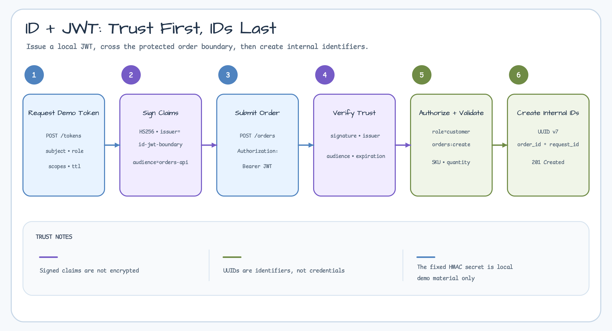
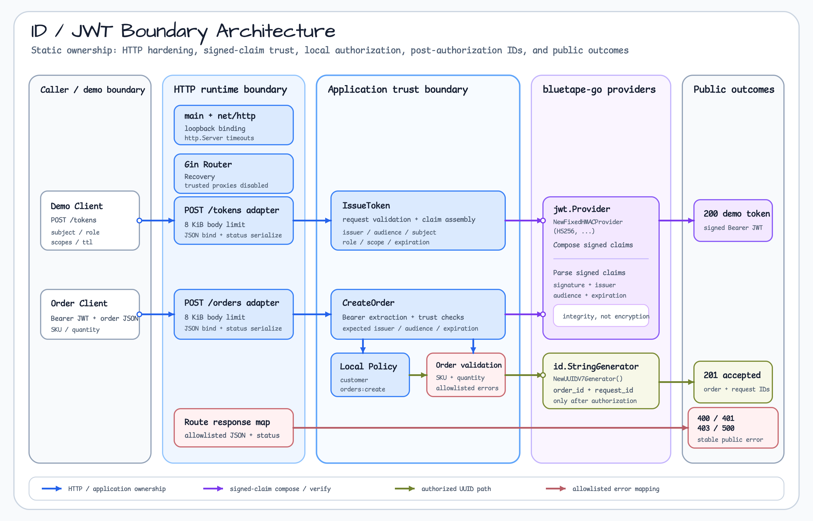
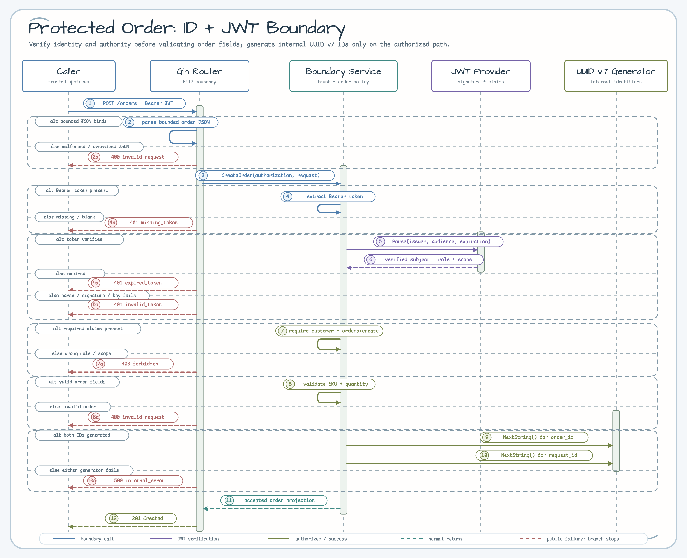

# id-jwt-boundary

[English](README.md) | [한국어](README.ko.md)

`id`와 `jwt`를 함께 사용하는 Gin order intake 예제입니다.

이 예제는 짧게 살아 있는 local demo JWT를 발급하고, HTTP boundary에서 검증한 뒤
내부 UUID v7 order identifier를 생성합니다. Identifier와 bearer token은 의도적으로
분리합니다. 생성된 ID는 secret이 아니고, JWT claim은 integrity 검증을 위해 서명된
것이지 암호화된 값이 아닙니다.

## Scenario

신뢰된 upstream gateway가 내부 order intake service로 주문 요청을 보냅니다.
Gateway는 `subject`, `role`, `scope` claim이 들어 있는 signed JWT로 요청 맥락을
전달합니다. Order service는 issuer, audience, expiration, role, scope를 검증한 뒤
내부 order ID와 request ID를 생성합니다.



이 scenario는 local demo issuer와 보호된 API boundary를 분리해서 보여줍니다.
`POST /tokens`는 fixed-HMAC demo token을 발급해 예제를 바로 실행할 수 있게 하는
편의 endpoint입니다. 보호된 boundary인 `POST /orders`는 token을 검증하고,
`customer`와 `orders:create` local policy를 적용하고, 주문을 검증한 뒤에만 내부
ID를 생성합니다.

이 예제는 완전한 auth system이 아닙니다. 검증된 token에서 무엇을 신뢰하고,
application이 자체 workflow를 위해 무엇을 새로 생성해야 하는지 보여주는 boundary
예제입니다.

## Architecture



Runtime의 책임은 계층별로 분명하게 나뉩니다. `main`과 `net/http`는 loopback
listener와 server timeout을 소유하고, Gin은 routing, recovery, trusted proxy 비활성
설정을 담당합니다. Route adapter는 8 KiB body limit, JSON 처리, public status
mapping을 소유합니다. Boundary service는 claim 조립, trust 검증, local
authorization, 주문 검증을 소유합니다. `bluetape-go/jwt` provider는 claim을
서명하고 parse하며, `bluetape-go/id` generator는 보호된 요청의 authorization과
validation이 모두 끝난 뒤에만 UUID v7 값을 생성합니다.

## What It Demonstrates

- `bluetape-go/id`의 UUID v7 order/request ID.
- `bluetape-go/jwt`의 fixed-HMAC local demo token 발급/검증 흐름.
- missing, invalid, expired, forbidden token에 대한 stable public error.
- Raw token, secret, parser diagnostic을 노출하지 않는 error response.
- Signed claim과 encrypted data의 경계 문서화.

## Run

```bash
go run ./examples/id-jwt-boundary
```

Service는 기본적으로 `127.0.0.1:8096`에서 listen합니다.

```bash
curl http://127.0.0.1:8096/healthz
```

Local demo token을 발급합니다:

```bash
TOKEN=$(
  curl -s -X POST http://127.0.0.1:8096/tokens \
    -H 'Content-Type: application/json' \
    -d '{"subject":"customer-1001","role":"customer","scopes":["orders:create"],"ttl_seconds":900}' \
  | jq -r '.token'
)
```

검증된 token으로 주문을 생성합니다:

```bash
curl -X POST http://127.0.0.1:8096/orders \
  -H 'Content-Type: application/json' \
  -H "Authorization: Bearer ${TOKEN}" \
  -d '{"sku":"sku-blue-tape","quantity":2}'
```

Boundary failure를 재현합니다:

```bash
curl -X POST http://127.0.0.1:8096/orders \
  -H 'Content-Type: application/json' \
  -d '{"sku":"sku-blue-tape","quantity":1}'

curl -X POST http://127.0.0.1:8096/orders \
  -H 'Content-Type: application/json' \
  -H 'Authorization: Bearer not-a-jwt' \
  -d '{"sku":"sku-blue-tape","quantity":1}'

READ_TOKEN=$(
  curl -s -X POST http://127.0.0.1:8096/tokens \
    -H 'Content-Type: application/json' \
    -d '{"subject":"customer-1001","role":"customer","scopes":["orders:read"],"ttl_seconds":900}' \
  | jq -r '.token'
)
curl -X POST http://127.0.0.1:8096/orders \
  -H 'Content-Type: application/json' \
  -H "Authorization: Bearer ${READ_TOKEN}" \
  -d '{"sku":"sku-blue-tape","quantity":1}'

SHORT_TOKEN=$(
  curl -s -X POST http://127.0.0.1:8096/tokens \
    -H 'Content-Type: application/json' \
    -d '{"subject":"customer-1001","role":"customer","scopes":["orders:create"],"ttl_seconds":1}' \
  | jq -r '.token'
)
sleep 2
curl -X POST http://127.0.0.1:8096/orders \
  -H 'Content-Type: application/json' \
  -H "Authorization: Bearer ${SHORT_TOKEN}" \
  -d '{"sku":"sku-blue-tape","quantity":1}'
```

예상 public error code는 `missing_token`, `invalid_token`, `forbidden`,
`expired_token`입니다.

## Endpoints

| Method | Path | 목적 |
|---|---|---|
| `GET` | `/healthz` | Process liveness 전용입니다. |
| `POST` | `/tokens` | Local fixed-HMAC demo token을 발급합니다. |
| `POST` | `/orders` | Bearer token을 검증하고 내부 ID를 생성합니다. |

## Protected Order Sequence



보호된 요청은 JSON parse, trust 검증, local policy, 주문 검증을 UUID 생성보다
먼저 수행합니다. 따라서 missing, invalid, expired, forbidden token은 내부 ID를
요청하기 전에 boundary를 빠져나갑니다. 잘못된 주문 입력도 UUID v7 generator를
호출하기 전에 종료됩니다.

## Boundary Notes

- UUID v7 값은 정렬 가능한 identifier로 유용합니다. Authorization credential이
  아니며 unguessable secret처럼 다루면 안 됩니다.
- JWT signature는 claim integrity와 signing key 보유를 검증합니다. Token
  소유자에게 claim 값을 숨기지는 않습니다.
- 이 예제의 fixed HMAC secret은 demo를 deterministic하고 runnable하게 만들기 위해
  commit되어 있습니다. 실제 service는 secret manager나 environment에서 secret을
  읽고, key rotation, TLS, log scrubbing을 설계해야 합니다.
- 여기의 role/scope check는 작은 local policy hook입니다. 재사용 auth framework가
  아닙니다.

## Test

```bash
go test -count=1 ./examples/id-jwt-boundary/...
go test -race -count=1 ./examples/id-jwt-boundary/...
```
