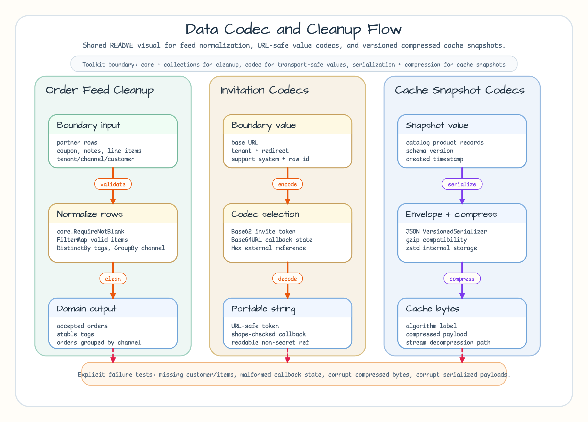

# invitation-codecs

[English](README.md) | [한국어](README.ko.md)

Invitation link and partner reference examples for `codec`.

The example uses Base62 for short URL-friendly invitation tokens, Base64URL for
callback state, and Hex for support-facing diagnostic references. These are
encodings, not encryption; do not put secrets in encoded values without a
separate security design.

## Scenario



Use this example when values must cross URL, callback, or support boundaries
without becoming unreadable. Each codec has a narrow job: Base62 for compact
tokens, Base64URL for callback state, and Hex for diagnostic references. In the
shared flow, this example owns the middle column: boundary values become
portable non-secret strings.

## What It Demonstrates

- URL-safe invitation links without `+`, `/`, or padding characters.
- Callback state round trip through Base64URL.
- Shape validation after decoding callback state.
- Support-facing external references that avoid exposing raw IDs directly.
- The boundary between encoding and security.

## Run

```bash
go test -count=1 ./examples/invitation-codecs/...
```
