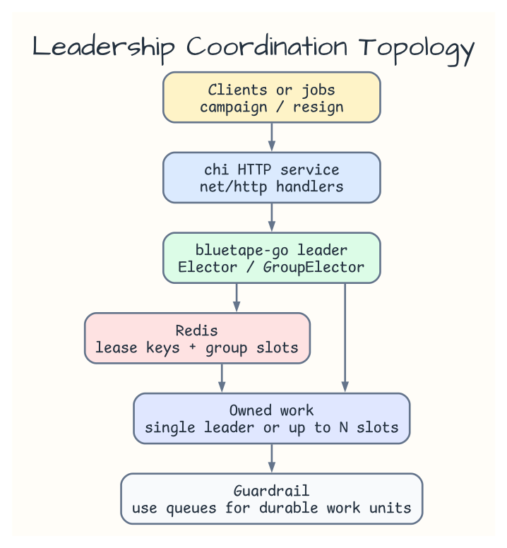

# leader-coordination-jobs

[English](README.md)

Redis leader election으로 deployment migration gate와 periodic cache warmer를
조정하는 예제입니다.

leader election은 여러 instance 중 정확히 하나의 healthy instance만
coordination task를 실행해야 할 때 유용합니다. 모든 job이 durable하게 처리되고
개별 retry가 필요하다면 queue, scheduler, workflow engine을 우선 고려해야
합니다.

## Scenario



여러 replica가 실행 중이지만 하나의 instance만 coordination job을 소유해야 하는
상황을 보여줍니다. migration gate는 leadership을 보유한 동안 한 번 실행되고,
cache warmer는 같은 instance가 leader인 동안에만 반복 실행됩니다.

## What It Demonstrates

- Redis 기반 `leader.Elector` coordination.
- `Campaign`과 `Resign`으로 보호되는 one-shot migration gate.
- cancellation 또는 leadership 상실 시 중지되는 periodic cache warmer.
- 실제 coordination behavior를 검증하는 Testcontainers Redis fixture.
- async job validation을 위한 `testing/concurrency` helper.

## Run

```bash
go test -count=1 ./examples/leader-coordination-jobs/...
```
