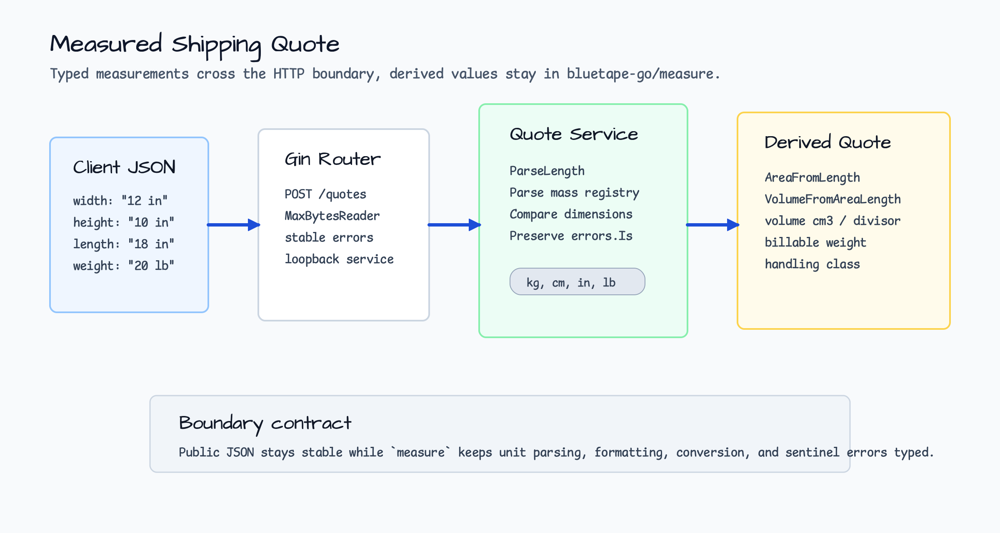
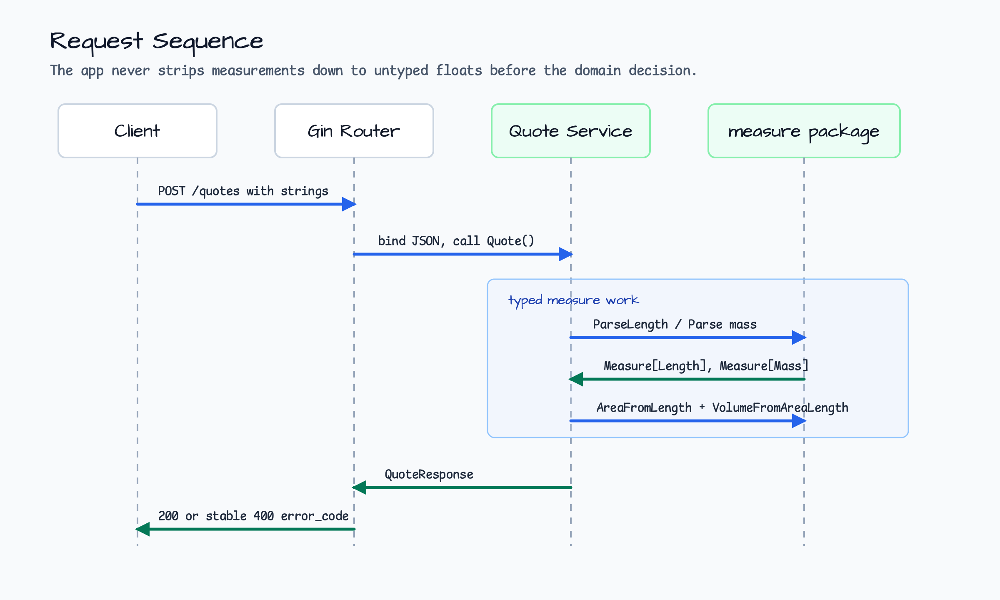
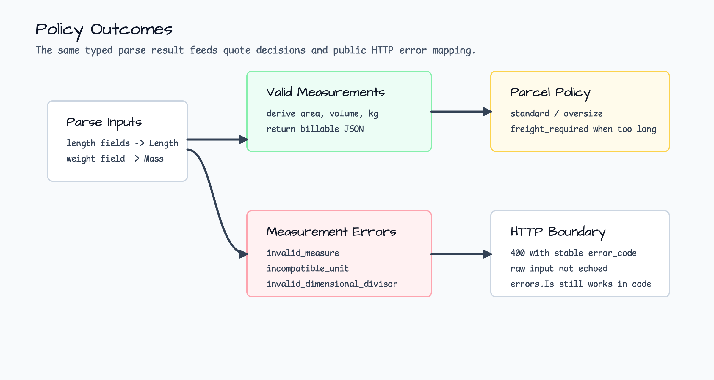

# measured-shipping-quote

[English](README.md) | [한국어](README.ko.md)

Gin shipping quote example for `measure` typed values.

This example accepts parcel dimensions and weight exactly as a caller would type
them: `"40 cm"`, `"12 in"`, `"3.2 kg"`, or `"20 lb"`. The service parses those
strings into `measure.Measure[T]` values, derives area and volume with the
`measure` compound helpers, converts volume into dimensional weight, and returns
a stable JSON quote projection.

The point is not carrier pricing. The point is the boundary: units should become
typed measurements before the application starts comparing, multiplying, or
formatting them.

## Scenario

A warehouse API needs a quote-like measurement decision before it sends a parcel
to a carrier adapter. The caller knows box dimensions and actual weight, but the
values may arrive in a mix of metric and imperial units:

- a domestic workflow sends `width="40 cm"`, `height="30 cm"`,
  `length="20 cm"`, `weight="3.2 kg"`;
- an imported catalog sends `width="12 in"`, `height="10 in"`,
  `length="18 in"`, `weight="20 lb"`.

The application converts both into the same measured domain model. It derives
floor area, volume, dimensional weight, billable weight, and a simple handling
class. Invalid numbers, incompatible dimensions, and invalid dimensional
divisors keep their typed error causes for `errors.Is` while the HTTP response
stays stable.

## Architecture



The router owns the HTTP boundary: JSON body size, request binding, and public
error codes. The service owns the measurement boundary: parsing, conversion,
derived values, and policy decisions. That split keeps low-level parse text out
of the public response while still preserving typed errors in Go code.

## Request Sequence



1. The client posts measurement strings to `/quotes`.
2. The router validates the JSON envelope and calls `Service.Quote`.
3. The service parses length fields with built-in length units and parses mass
   with a shipping registry that includes built-in `g`, `kg`, `ton` plus a local
   `lb` unit for imperial catalog data.
4. `measure.AreaFromLength` and `measure.VolumeFromAreaLength` derive typed area
   and volume values.
5. Volume is formatted as `cm^3`, converted to dimensional kilograms through the
   configured divisor, and compared with actual weight.
6. The response returns parsed dimensions, derived values, billable weight,
   billable rule, and handling policy.

## Error Policy



| Boundary | Status | Error code |
|---|---|---|
| Malformed JSON or missing required fields | `400` | `invalid_request` |
| Non-numeric measurement text such as `"many cm"` | `400` | `invalid_measure` |
| Dimension mismatch such as `width="2 kg"` | `400` | `incompatible_unit` |
| `dimensional_divisor` is zero, negative, NaN, or infinite | `400` | `invalid_dimensional_divisor` |
| Declared max side is smaller than parsed dimensions | `400` | `invalid_request` |

The service wraps `measure.ErrInvalidParse`, `measure.ErrInvalidUnit`, and
`measure.ErrDivideByZero` so tests and higher layers can still use
`errors.Is`. HTTP clients get short, stable `error_code` values and never see
the raw invalid measurement echoed back.

## What It Demonstrates

- `measure.ParseLength` for built-in metric and imperial length units.
- A small mass registry that keeps built-in `g`, `kg`, and `ton`, then adds
  `lb` for realistic shipping input.
- `measure.AreaFromLength` and `measure.VolumeFromAreaLength` for derived
  values.
- `Measure.Format` and `Measure.In` for stable JSON output.
- `Measure.Compare` for actual-vs-dimensional billable weight selection.
- `Measure.DivScalar` preserving `measure.ErrDivideByZero`.
- Stable Gin error mapping for invalid parse, incompatible unit, invalid
  divisor, and request validation failures.

## Run

Run the local measured quote API:

```bash
go run ./examples/measured-shipping-quote
```

The service listens on `127.0.0.1:8104` by default.

```bash
curl http://127.0.0.1:8104/healthz
curl -s -X POST http://127.0.0.1:8104/quotes \
  -H 'Content-Type: application/json' \
  -d '{
    "quote_id":"ship-1001",
    "destination_zone":"kr-seoul",
    "width":"40 cm",
    "height":"30 cm",
    "length":"20 cm",
    "weight":"3.2 kg"
  }' | jq
```

Expected response: `200 OK`, `billable_rule="dimensional_weight"`, volume
`24000 cm^3`, dimensional weight `4.8 kg`, and handling class `parcel`.

Imperial dimensions can request inch display while still returning mass in
kilograms:

```bash
curl -s -X POST http://127.0.0.1:8104/quotes \
  -H 'Content-Type: application/json' \
  -d '{
    "quote_id":"ship-1002",
    "destination_zone":"us-west",
    "width":"12 in",
    "height":"10 in",
    "length":"18 in",
    "weight":"20 lb",
    "dimensional_divisor":6000,
    "declared_max_side":"2 ft",
    "preferred_length_unit":"in"
  }' | jq
```

Useful environment variable:

| Variable | Default | Purpose |
|---|---|---|
| `HTTP_ADDR` | `127.0.0.1:8104` | Loopback HTTP bind address. Non-loopback binds are rejected. |

## Endpoints

| Method | Path | Purpose |
|---|---|---|
| `GET` | `/healthz` | Process liveness only. |
| `POST` | `/quotes` | Parse measurements and return a derived shipping quote. |

## Boundary Notes

- Parse units once at the application boundary, then pass typed values through
  the rest of the calculation.
- Do not mix dimensional math with currency math. This example intentionally
  returns billable measurements, not money totals.
- Keep public error codes stable and short. Detailed parse causes belong in
  server logs, tests, and typed error chains.
- Unit registries are part of your product contract. Adding `lb` is deliberate
  here because carrier and warehouse data often arrives in pounds.
- Dimensional-weight divisors vary by carrier. Treat the divisor as a policy
  input and reject zero before a divide operation can silently corrupt a quote.

## Test

```bash
go test -count=1 ./examples/measured-shipping-quote/...
go test -race -count=1 ./examples/measured-shipping-quote/...
```
