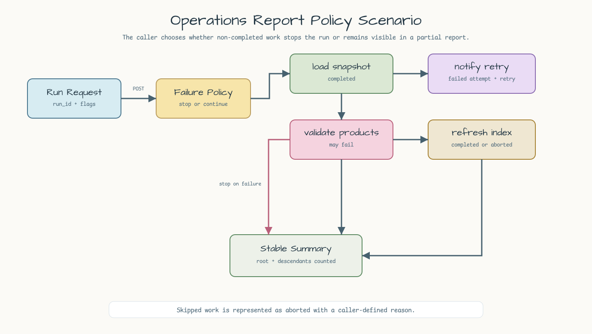
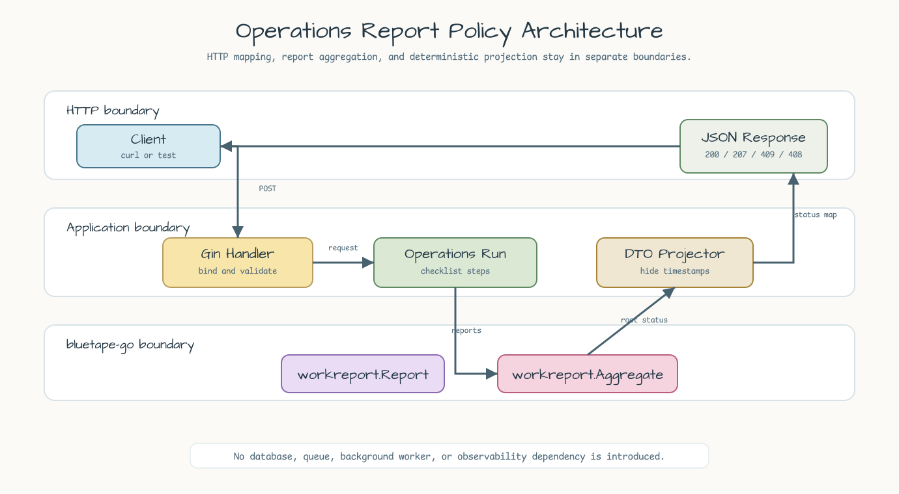
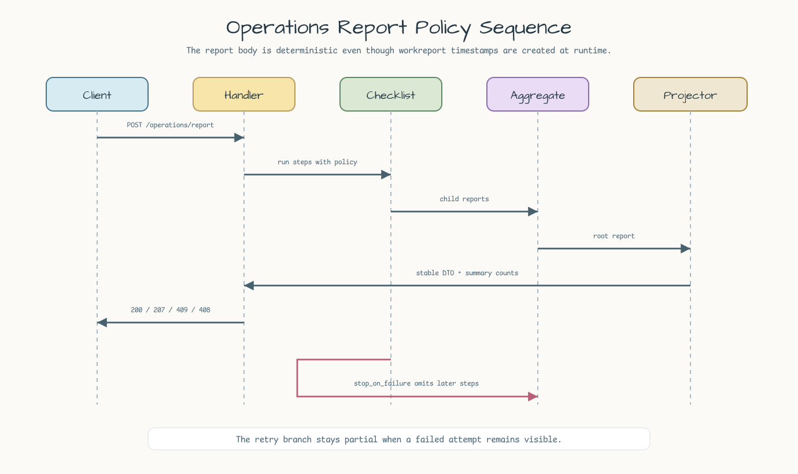

# Operations Report Policy

[English](README.md) | [한국어](README.ko.md)

이 예제는 `workreport.Report` 값을 deterministic response JSON으로 투영하는 작은
Gin HTTP API입니다. 핵심은
`github.com/bluetape4k/bluetape-go/workreport` aggregation이며,
`StopOnFailure`와 `ContinueOnFailure`가 operations run 결과 모양을 어떻게
바꾸는지 보여줍니다.

## 예제 시나리오

API는 하나의 operations checklist run을 받습니다. Run은 catalog snapshot을
로드하고, product data를 검증하고, 필요하면 partner notification retry 기록을
남기고, search index를 refresh하고, 마지막 run summary를 기록합니다. 호출자는
첫 non-completed report에서 멈출지, 끝까지 실행해 모든 child report를 보존할지
선택합니다.



## Report 필드

| 필드 | 목적 |
|---|---|
| `name` | log, dashboard, test에서 사용할 stable operation name입니다. |
| `status` | `completed`, `failed`, `partial`, `aborted`, `cancelled` 중 하나입니다. |
| `error` | failed 또는 cancelled report의 error message입니다. |
| `reason` | aborted report의 caller-defined reason입니다. 이 예제에서는 skipped work를 표현합니다. |
| `success` | `completed`일 때만 true입니다. |
| `failure` | `failed`, `partial`, `aborted`, `cancelled`일 때 true입니다. |
| `partial` | non-completed child를 하나 이상 보존한 aggregate report일 때 true입니다. |
| `children` | 중첩 operation outcome입니다. |

Response는 `workreport.Report`의 `StartedAt`, `EndedAt`을 의도적으로 제외합니다.
이 timestamp들은 runtime fact라서 API contract와 test를 deterministic하게
유지하려면 숨기는 편이 낫습니다.

## Failure Policy

| Policy | 동작 |
|---|---|
| `stop_on_failure` | 첫 non-completed report 이후 checklist 실행을 멈추고 실제 실행된 report만 반환합니다. |
| `continue_on_failure` | 남은 checklist step을 실행하고, non-completed child가 하나라도 있으면 root report를 `partial`로 반환합니다. |

Retry evidence는 중첩된 `notify-partner` report로 표현합니다. 첫 attempt 실패와
두 번째 retry 성공이 함께 보존되면 aggregate는 `partial`로 남습니다. 이 예제는
보존된 실패 attempt를 full success로 포장하지 않습니다. Caller가 search index
작업을 skip한 경우에는 `workreport`에 별도 `skipped` status가 없으므로
`aborted`와 reason `skipped by request`로 표현합니다.

## 실행

```bash
go run ./examples/operations-report-policy
```

선택 환경 변수:

| 변수 | 기본값 | 목적 |
|---|---:|---|
| `HTTP_ADDR` | `:8085` | Listen address입니다. |

## Endpoints

```bash
curl http://localhost:8085/healthz
curl -X POST http://localhost:8085/operations/report \
  -H 'Content-Type: application/json' \
  -d '{
    "run_id": "release-1001",
    "policy": "continue_on_failure",
    "products_valid": true
  }'
```

유용한 변형:

```bash
# Validation failure, retry evidence, skipped work, final summary를 모두 보존합니다.
curl -X POST http://localhost:8085/operations/report \
  -H 'Content-Type: application/json' \
  -d '{
    "run_id": "release-partial",
    "policy": "continue_on_failure",
    "products_valid": false,
    "retry_partner_notification": true,
    "skip_search_index": true
  }'

# validate-products 뒤에서 fail fast 합니다.
curl -X POST http://localhost:8085/operations/report \
  -H 'Content-Type: application/json' \
  -d '{
    "run_id": "release-stop",
    "policy": "stop_on_failure",
    "products_valid": false,
    "retry_partner_notification": true,
    "skip_search_index": true
  }'
```

Completed report는 `200 OK`를 반환합니다. Partial report는
`207 Multi-Status`를 반환합니다. Failed 또는 aborted report는 `409 Conflict`를
반환합니다. Cancelled report는 `408 Request Timeout`을 반환합니다. 잘못된 JSON,
blank `run_id`, 누락된 `products_valid`, 알 수 없는 policy 값은
`400 Bad Request`를 반환합니다.

## 이 정도면 충분한 경우

하나의 HTTP request가 run 전체를 소유할 수 있고, service가 deterministic report
tree만 공개하면 되며, partial outcome을 caller가 해석할 수 있다면 이 패턴으로
충분합니다.

Report가 service restart 이후에도 남아야 하거나, retry가 request boundary를
넘거나, operator가 나중에 작업을 resume해야 한다면 durable job system을 사용해야
합니다. Production operations에 쓰기 전에는 실제 operation ID, correlation ID,
log, metric, trace, persistent audit storage를 추가해야 합니다.

## Architecture

Gin은 JSON binding과 HTTP status mapping을 담당합니다. Operations layer는
checklist와 policy selection을 담당합니다. `workreport.Aggregate`는 parent status와
child 보존 semantics를 담당합니다. Response mapper는 report를 stable JSON으로
투영하고 root report와 모든 descendant를 summary count로 집계합니다.



## Sequence Diagram

Handler는 input을 검증하고, failure policy를 선택하고, checklist step을 실행한 뒤
child report를 aggregate하고 stable report projection을 반환합니다.



## 테스트

```bash
go test -count=1 ./examples/operations-report-policy/...
go test -race -count=1 ./examples/operations-report-policy/...
```
