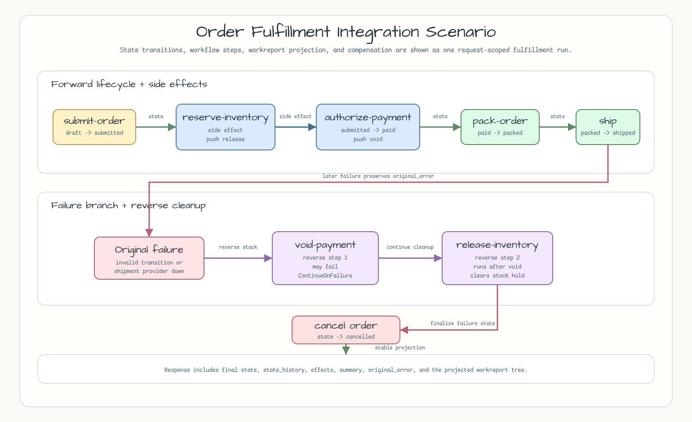
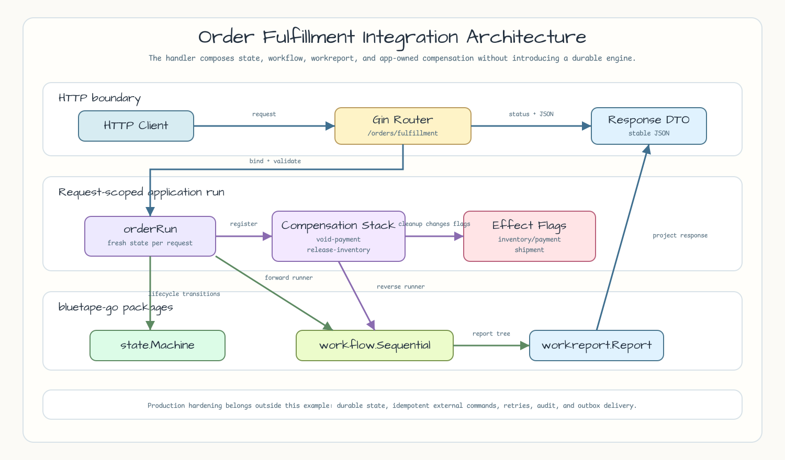
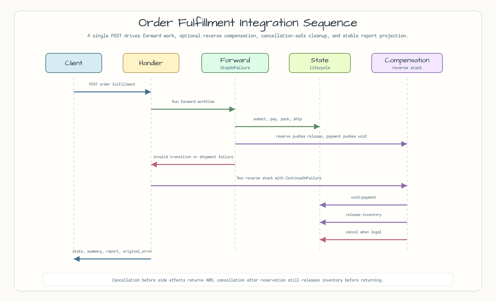

# Order Fulfillment Integration

[English](README.md) | [한국어](README.ko.md)

This example is the v0.4.0 milestone integration scenario. It exposes a Gin HTTP
API that combines `state`, `workflow`, and `workreport` into one request-scoped
order fulfillment flow with application-owned compensation.

## Example Scenario

The API accepts one order fulfillment request. The forward workflow submits the
order, reserves inventory, authorizes payment, packs the order, and creates a
shipment. The lifecycle state machine records `draft -> submitted -> paid ->
packed -> shipped` on success.

Inventory reservation and payment authorization are reversible side effects. If
a later step fails, the example runs compensation in reverse order, preserves
the original forward error, and moves the order to `cancelled` when the state
machine allows it.



## Built From the Smaller 0.4.0 Examples

| Source example | Integrated here as |
|---|---|
| [`order-lifecycle-state-api`](../order-lifecycle-state-api) | The order lifecycle state machine and legal transition checks. |
| [`payment-authorization-state`](../payment-authorization-state) | Payment authorization as an application-level stateful side effect. |
| [`fulfillment-workflow-runner`](../fulfillment-workflow-runner) | A sequential fulfillment workflow that stops on the first failure. |
| [`operations-report-policy`](../operations-report-policy) | Stable report projection and summary counts without timestamp noise. |
| [`compensation-workflow`](../compensation-workflow) | Reverse-order cleanup with original error preservation. |

## Run

```bash
go run ./examples/order-fulfillment-integration
```

Optional environment variables:

| Variable | Default | Purpose |
|---|---:|---|
| `HTTP_ADDR` | `:8088` | Listening address. |

## Endpoints

```bash
curl http://localhost:8088/healthz
curl -X POST http://localhost:8088/orders/fulfillment \
  -H 'Content-Type: application/json' \
  -d '{
    "order_id": "order-1001",
    "total_cents": 2599,
    "stock_available": true,
    "payment_authorized": true,
    "shipment_provider_available": true
  }'
```

Useful variants:

```bash
# Shipment failure triggers void-payment, release-inventory, then cancellation.
curl -X POST http://localhost:8088/orders/fulfillment \
  -H 'Content-Type: application/json' \
  -d '{"order_id":"order-1002","total_cents":2599,"stock_available":true,"payment_authorized":true,"shipment_provider_available":false}'

# Invalid transition inside the workflow also compensates completed side effects.
curl -X POST http://localhost:8088/orders/fulfillment \
  -H 'Content-Type: application/json' \
  -d '{"order_id":"order-1003","total_cents":2599,"stock_available":true,"payment_authorized":true,"shipment_provider_available":true,"force_invalid_transition":true}'

# Compensation failure keeps the original shipment error visible.
curl -X POST http://localhost:8088/orders/fulfillment \
  -H 'Content-Type: application/json' \
  -d '{"order_id":"order-1004","total_cents":2599,"stock_available":true,"payment_authorized":true,"shipment_provider_available":false,"void_payment_fails":true}'
```

Successful fulfillment returns `200 OK`. Domain failures and compensated
failures return `409 Conflict`. Caller cancellation returns `408 Request
Timeout`. Malformed JSON, blank `order_id`, and non-positive `total_cents`
return `400 Bad Request`.

The response includes the final state, lifecycle history, side-effect flags,
stable report summary, `original_error`, and a timestamp-free report tree.

## Architecture

Gin owns routing, JSON binding, and HTTP status mapping. Each request creates a
fresh `orderRun` with its own `state.Machine`, state history, side-effect flags,
and compensation stack. `workflow.Sequential` runs the forward steps with
`StopOnFailure`. When a reversible side effect exists and a later step fails, a
second `workflow.Sequential` runs the compensation stack with
`ContinueOnFailure`.



## Sequence Diagram

The request path is synchronous. The handler runs the forward workflow, receives
either a success or failed report, optionally runs reverse compensation with a
cleanup context, and returns a stable response projection.



## Production Hardening

This example is intentionally request-scoped. A production fulfillment service
would need durable order state, idempotent inventory/payment/shipping commands,
retry and timeout policies, audit records, an outbox or queue, and recovery for
cleanup that must survive process restarts.

## Test

```bash
go test -count=1 ./examples/order-fulfillment-integration/...
go test -race -count=1 ./examples/order-fulfillment-integration/...
```
