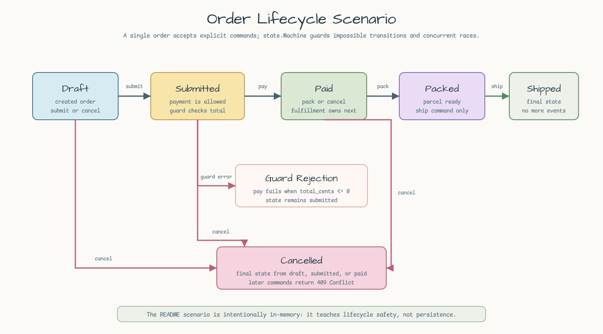
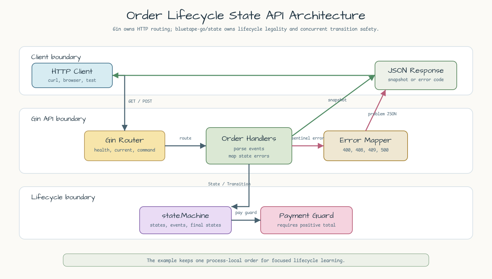
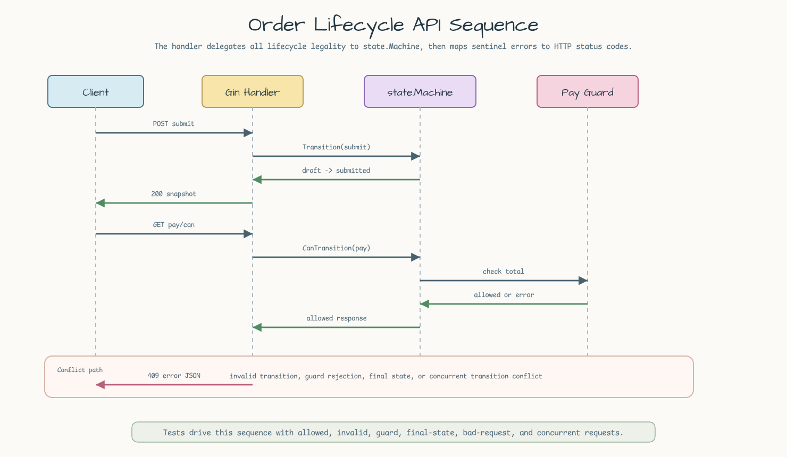

# Order Lifecycle State API

[English](README.md) | [한국어](README.ko.md)

이 예제는 하나의 in-memory 주문 lifecycle을 작은 Gin HTTP API로 노출합니다.
Lifecycle 규칙은 `github.com/bluetape4k/bluetape-go/state`로 표현하며, 허용된
주문 전이를 명시적이고 concurrency-safe하게 유지합니다.

## 예제 시나리오

API는 하나의 `draft` 주문으로 시작합니다. Client는 주문을 제출하고, 주문 금액이
양수라는 guard가 통과하면 결제하고, 포장한 뒤 배송해 final state로 만들 수
있습니다. 주문이 아직 `draft`, `submitted`, `paid` 상태라면 취소할 수도 있습니다.
유효하지 않은 command는 `409 Conflict`를 반환하고 현재 state를 변경하지 않습니다.



## State Model

| From | Event | To | 규칙 |
|---|---|---|---|
| `draft` | `submit` | `submitted` | 주문을 결제 가능한 상태로 올립니다. |
| `submitted` | `pay` | `paid` | 주문 금액이 양수여야 합니다. |
| `paid` | `pack` | `packed` | Fulfillment가 포장을 준비할 수 있습니다. |
| `packed` | `ship` | `shipped` | `shipped`는 final state입니다. |
| `draft`, `submitted`, `paid` | `cancel` | `cancelled` | `cancelled`는 final state입니다. |

`allowed_events`는 현재 state에서 등록된 event를 반환합니다. Guard는 평가하지
않습니다. 결제 금액 양수 조건처럼 guard까지 평가해야 하면
`/orders/current/transitions/:event/can`을 사용합니다.

## 실행

```bash
go run ./examples/order-lifecycle-state-api
```

선택 환경 변수:

| 변수 | 기본값 | 목적 |
|---|---:|---|
| `HTTP_ADDR` | `:8083` | Listen 주소입니다. |
| `ORDER_ID` | `order-1001` | 예제 주문 식별자입니다. |
| `ORDER_TOTAL_CENTS` | `12900` | 결제 guard가 사용하는 예제 주문 금액입니다. |

## Endpoints

```bash
curl http://localhost:8083/healthz
curl http://localhost:8083/orders/current
curl http://localhost:8083/orders/current/transitions/pay/can
curl -X POST http://localhost:8083/orders/current/transitions \
  -H 'Content-Type: application/json' \
  -d '{"event":"submit"}'
```

Transition command는 현재 state에서 event가 유효하지 않거나, final state가 추가
전이를 거부하거나, guard가 event를 거부하거나, concurrent request가 state-change
race에서 졌을 때 `409 Conflict`를 반환합니다. 잘못된 JSON과 알 수 없는 event는
`400 Bad Request`를 반환합니다.

## 언제 이 정도면 충분한가

Finite state machine은 process가 짧고, state change가 동기적으로 끝나며, 다음으로
허용되는 command를 현재 state만으로 판단할 수 있을 때 충분합니다. 이 예제의 API는
제출 전 결제나 배송 후 취소처럼 불가능한 주문 command를 막는 것이 핵심입니다.

Service restart를 넘어가는 durable timer, human approval, 재시도, 보상 처리,
장시간 multi-service orchestration이 필요하면 workflow runner를 선택하는 편이
낫습니다.

이 예제는 의도적으로 in-memory입니다. Production persistence가 아니라 lifecycle
규칙과 HTTP error mapping을 보여줍니다.

## Architecture

Gin은 HTTP routing과 JSON binding을 맡습니다. Order handler는 route input을
`state.Machine` 호출로 바꾸고, `state.Machine`은 lifecycle legality, guard 평가,
final-state rejection, concurrent transition conflict를 담당합니다. Handler는
package sentinel error를 안정적인 HTTP response로 매핑합니다.



## Sequence Diagram

주요 request path는 의도적으로 동기적입니다. Handler는 event를 파싱하고, state
machine에 transition 실행 또는 transition 가능 여부 확인을 요청한 뒤 snapshot
response나 structured error response를 씁니다.



## 테스트

```bash
go test -count=1 ./examples/order-lifecycle-state-api/...
go test -race -count=1 ./examples/order-lifecycle-state-api/...
```
