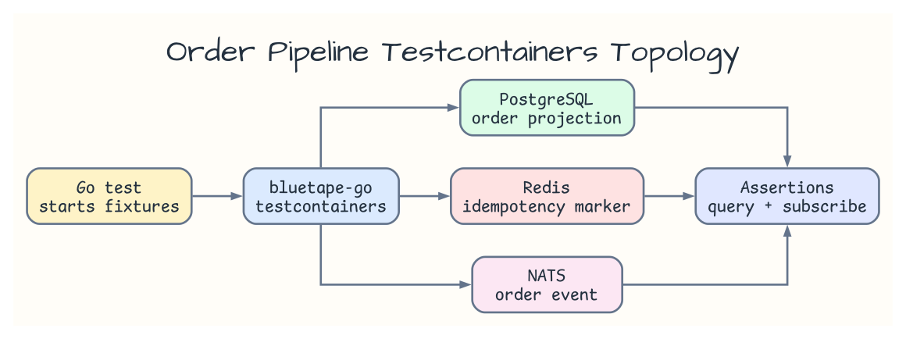

# order-pipeline-testcontainers

[한국어](README.ko.md)

Order pipeline integration example for `testcontainers`.

The test starts PostgreSQL, Redis, and NATS through `bluetape-go` fixtures,
uses returned connection strings instead of hard-coded ports, writes a small
order projection, stores an idempotency marker, and publishes a lightweight
event. Docker is required for this example.

## Scenario



Use this example when an integration test must prove the wiring across multiple
real services. The test keeps the application behavior small, but it validates
the operational contract that matters: database projection, Redis idempotency,
and NATS publication all use fixture-provided connection details.

## What It Demonstrates

- PostgreSQL, Redis, and NATS Testcontainers fixtures in one test.
- Returned connection strings instead of hard-coded ports.
- Order projection write through `database/sql`.
- Redis idempotency marker.
- NATS event publication and subscription assertion.

## Run

Docker is required.

```bash
go test -count=1 ./examples/order-pipeline-testcontainers/...
```
