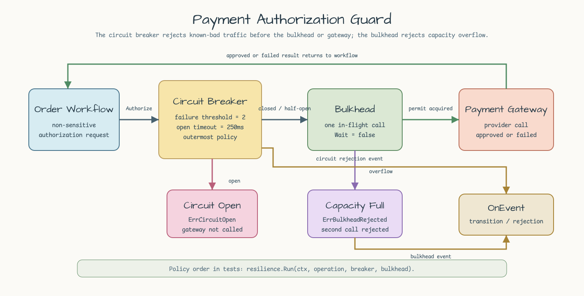

# payment-authorization-guard

[English](README.md) | [한국어](README.ko.md)

`bluetape-go/resilience` circuit breaker, bulkhead, synchronous event hook을
사용하는 payment authorization 예제입니다.

이 예제는 order workflow가 payment gateway를 호출하는 상황을 모델링합니다. Gateway가
반복 실패하거나 concurrent call로 포화될 수 있지만, domain code는 resilience
behavior를 명시적으로 유지합니다.

- circuit breaker로 known-bad traffic을 gateway 호출 전에 거절합니다.
- non-waiting bulkhead로 overflow를 즉시 거절합니다.
- transition/rejection event를 low-cardinality 형태로 synchronous emit합니다.
- card number, token, customer identity 같은 payment secret을 저장하거나 모델링하지
  않습니다.

## Scenario



Order workflow는 non-sensitive order metadata를 `Authorizer`에 전달합니다.
Authorizer는 circuit breaker와 bulkhead를 소유하고, gateway는 caller가 제공하는 plain
function으로 남깁니다. 그래서 test는 dependency injection infrastructure가 아니라
policy behavior에 집중할 수 있습니다.

## Policy Wiring

`resilience.Run(ctx, operation, breaker, bulkhead)`는 circuit breaker를 outer
policy로, bulkhead를 inner policy로 적용합니다. 이 순서에서는 open circuit이
bulkhead permit을 얻거나 gateway를 호출하기 전에 요청을 거절합니다.

```go
authorization, err := authorizer.Authorize(ctx, request, gateway)
```

이 예제는 zero-value friendly default를 사용합니다.

| Option | Default | 이유 |
|---|---:|---|
| `FailureThreshold` | `2` | 두 번의 gateway failure로 circuit open을 deterministic하게 검증합니다. |
| `OpenTimeout` | `250ms` | open-state assertion에 sleep을 쓰지 않아도 실제 timeout 값을 가집니다. |
| `MaxConcurrent` | `1` | 첫 호출을 block하면 overflow behavior를 deterministic하게 만들 수 있습니다. |

## Outcomes

| Case | Behavior | Test |
|---|---|---|
| Gateway succeeds | Gateway response를 반환하고, 비어 있는 response `OrderID`는 request 값으로 채웁니다. | `TestAuthorizeApprovesPaymentWithDefaults` |
| Repeated gateway failures | configured failure threshold 이후 circuit이 open 상태로 transition합니다. | `TestAuthorizeRepeatedFailuresOpenCircuitBeforeGateway` |
| Circuit already open | `resilience.ErrCircuitOpen`을 반환하고 gateway를 호출하지 않습니다. | `TestAuthorizeRepeatedFailuresOpenCircuitBeforeGateway` |
| Bulkhead full | concurrent overflow call은 두 번째 gateway를 호출하지 않고 `resilience.ErrBulkheadRejected`를 반환합니다. | `TestAuthorizeBulkheadOverflowRejectsConcurrentCall` |
| Invalid input | invalid request field, nil gateway, nil authorizer, negative option은 policy behavior를 숨기기 전에 실패합니다. | `TestAuthorizeRejectsInvalidInput`, `TestNewRejectsNegativeOptions` |

## Events

동일한 `OnEvent` handler를 두 policy에 전달합니다. Test는 event 개수만 세지 않고
구체적인 event kind를 assertion합니다.

- `EventCircuitStateTransition`
- `EventCircuitRejected`
- `EventBulkheadAccepted`
- `EventBulkheadRejected`

## Run

```bash
go test -count=1 ./examples/payment-authorization-guard/...
```
