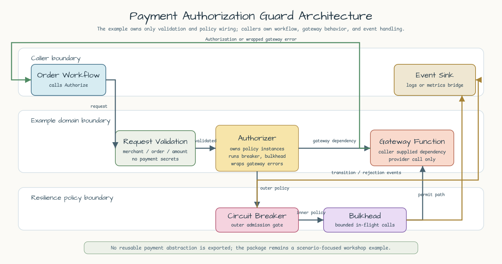
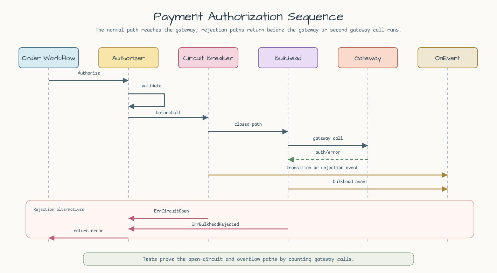

# payment-authorization-guard

[English](README.md) | [한국어](README.ko.md)

Payment authorization example for `bluetape-go/resilience` circuit breaker,
bulkhead, and synchronous event hooks.

This example models an order workflow that calls a payment gateway. The gateway
can fail repeatedly or be saturated by concurrent calls, but the domain code
keeps the resilience behavior explicit:

- reject known-bad traffic with a circuit breaker before calling the gateway;
- reject overflow immediately with a non-waiting bulkhead;
- emit low-cardinality transition and rejection events synchronously;
- avoid storing or modeling card numbers, tokens, customer identity, or other
  payment secrets.

## Scenario


The order workflow passes non-sensitive order metadata to an `Authorizer`. The
authorizer owns the circuit breaker and bulkhead, while the gateway remains a
plain function supplied by the caller. That keeps tests focused on policy
behavior instead of dependency injection infrastructure.

## Architecture



The example boundary is intentionally narrow. `Authorizer` owns request
validation and the two resilience policy instances. The caller still owns the
order workflow, gateway function, and event sink, so the example does not grow a
reusable payment abstraction.

## Policy Wiring

`resilience.Run(ctx, operation, breaker, bulkhead)` applies the circuit breaker
as the outer policy and the bulkhead as the inner policy. With that order, an
open circuit rejects before acquiring a bulkhead permit and before invoking the
gateway.

## Sequence



The normal path validates the request, admits through the circuit breaker, takes
a bulkhead permit, and calls the gateway. The rejection paths are deliberately
shorter: an open circuit returns `ErrCircuitOpen`, while a full bulkhead returns
`ErrBulkheadRejected` before the overflow gateway function runs.

```go
authorization, err := authorizer.Authorize(ctx, request, gateway)
```

The example uses zero-value friendly defaults:

| Option | Default | Why |
|---|---:|---|
| `FailureThreshold` | `2` | Two repeated gateway failures open the circuit in tests. |
| `OpenTimeout` | `250ms` | The circuit has a real timeout without requiring sleeps for open-state assertions. |
| `MaxConcurrent` | `1` | One blocked call makes overflow behavior deterministic. |

## Outcomes

| Case | Behavior | Test |
|---|---|---|
| Gateway succeeds | The gateway response is returned and an empty response `OrderID` is filled from the request. | `TestAuthorizeApprovesPaymentWithDefaults` |
| Repeated gateway failures | The circuit transitions to open after the configured failure threshold. | `TestAuthorizeRepeatedFailuresOpenCircuitBeforeGateway` |
| Circuit already open | The call returns `resilience.ErrCircuitOpen` and does not invoke the gateway. | `TestAuthorizeRepeatedFailuresOpenCircuitBeforeGateway` |
| Bulkhead full | A concurrent overflow call returns `resilience.ErrBulkheadRejected` without invoking the second gateway. | `TestAuthorizeBulkheadOverflowRejectsConcurrentCall` |
| Invalid input | Invalid request fields, nil gateway, nil authorizer, and negative options fail before policy behavior is hidden. | `TestAuthorizeRejectsInvalidInput`, `TestNewRejectsNegativeOptions` |

## Events

The same `OnEvent` handler is passed to both policies. Tests assert concrete
event kinds instead of only counting events:

- `EventCircuitStateTransition`
- `EventCircuitRejected`
- `EventBulkheadAccepted`
- `EventBulkheadRejected`

## Run

```bash
go test -count=1 ./examples/payment-authorization-guard/...
```
