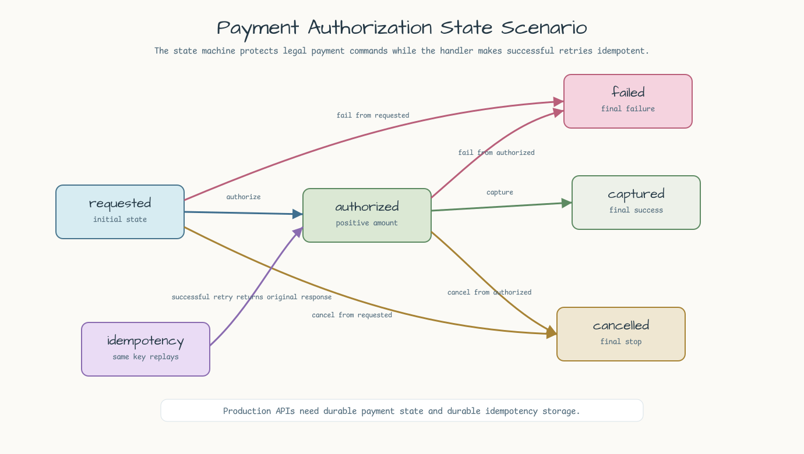
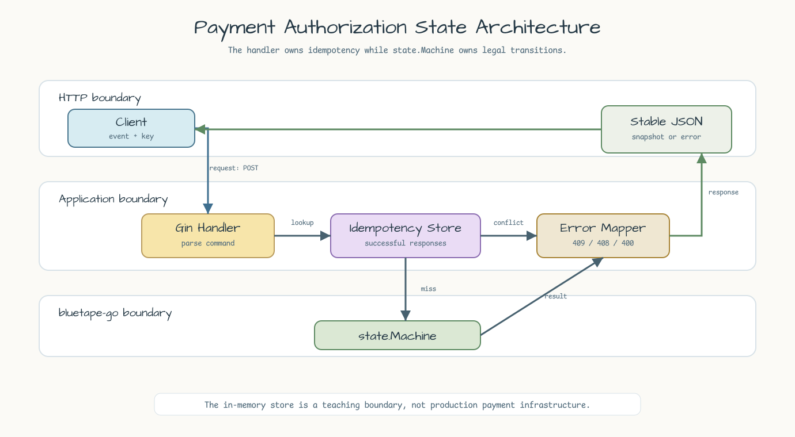
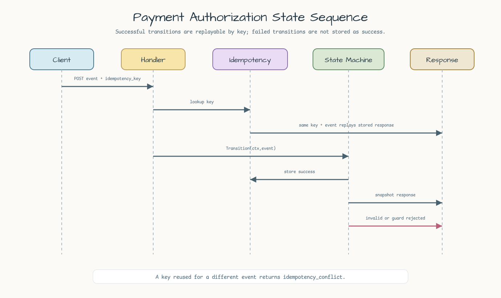

# Payment Authorization State

[English](README.md) | [한국어](README.ko.md)

이 예제는 하나의 in-memory payment authorization을 작은 Gin HTTP API로 노출합니다.
더 넓은
[`order-lifecycle-state-api`](../order-lifecycle-state-api) 예제를 전제로 하며,
payment-specific state transition과 application-layer idempotent retry 동작에
초점을 둡니다.

## 예제 시나리오

Payment는 `requested`에서 시작합니다. API는 금액이 양수일 때 authorize하고,
authorized payment를 capture하고, requested 또는 authorized payment를 fail하거나
cancel할 수 있습니다. `captured`, `failed`, `cancelled`는 final state입니다.
Transition command는 `idempotency_key`를 요구하므로 caller가 성공한 command를
안전하게 재시도해도 state가 다시 변경되지 않습니다.



## State Model

| From | Event | To | Rule |
|---|---|---|---|
| `requested` | `authorize` | `authorized` | `amount_cents`는 양수여야 합니다. |
| `authorized` | `capture` | `captured` | `captured`는 final state입니다. |
| `requested`, `authorized` | `fail` | `failed` | `failed`는 final state입니다. |
| `requested`, `authorized` | `cancel` | `cancelled` | `cancelled`는 final state입니다. |

`allowed_events`는 현재 state에서 등록된 event를 반환합니다. Guard는 평가하지
않습니다. Positive-amount authorization rule 같은 guard를 평가해야 하면
`/payments/current/transitions/:event/can`을 사용합니다.

## Idempotent Retry

`state` package는 transition legality를 담당합니다. Idempotency는 state machine
주변의 application-layer 동작입니다:

| Retry case | Response |
|---|---|
| 성공한 transition 뒤 같은 `idempotency_key`, 같은 `event` | 저장된 transition response를 `idempotent_replay=true`로 반환합니다. |
| 같은 `idempotency_key`, 다른 `event` | code `idempotency_conflict`와 함께 `409 Conflict`를 반환합니다. |
| 실패한 transition 뒤 같은 key로 유효한 transition | 실패한 transition은 성공 replay response로 저장하지 않으므로 정상 실행합니다. |

이 예제는 idempotency를 memory에만 보관합니다. Production payment API에는 durable
idempotency storage, TTL, request-hash validation, audit logging이 필요합니다.

## 실행

```bash
go run ./examples/payment-authorization-state
```

선택 환경 변수:

| 변수 | 기본값 | 목적 |
|---|---:|---|
| `HTTP_ADDR` | `:8086` | Listen address입니다. |
| `PAYMENT_ID` | `pay-1001` | 예제 payment identifier입니다. |
| `PAYMENT_AMOUNT_CENTS` | `12900` | Positive-amount guard가 사용할 금액입니다. |

## Endpoints

```bash
curl http://localhost:8086/healthz
curl http://localhost:8086/payments/current
curl http://localhost:8086/payments/current/transitions/authorize/can
curl -X POST http://localhost:8086/payments/current/transitions \
  -H 'Content-Type: application/json' \
  -d '{"event":"authorize","idempotency_key":"auth-1"}'
```

유용한 변형:

```bash
# 같은 command의 idempotent replay입니다.
curl -X POST http://localhost:8086/payments/current/transitions \
  -H 'Content-Type: application/json' \
  -d '{"event":"authorize","idempotency_key":"auth-1"}'

# Authorization 이후 capture합니다.
curl -X POST http://localhost:8086/payments/current/transitions \
  -H 'Content-Type: application/json' \
  -d '{"event":"capture","idempotency_key":"capture-1"}'
```

Transition command는 현재 state에서 event가 유효하지 않거나, final state가 추가
transition을 거부하거나, guard가 event를 거부하거나, concurrent request가
state-change race에서 지거나, idempotency key가 다른 event에 재사용되면
`409 Conflict`를 반환합니다. 잘못된 JSON, 누락된 field, 알 수 없는 event는
`400 Bad Request`를 반환합니다.

## 이 정도면 충분한 경우

Finite state machine과 application-layer idempotency는 service가 하나의 짧은
payment authorization을 불가능한 command와 안전한 duplicate retry로부터 보호하면
충분할 때 적합합니다.

Authorization, capture, refund, reversal이 여러 service를 건너거나, compensation이
필요하거나, 사람의 승인을 기다리거나, restart 이후에도 이어져야 하면 workflow
runner 또는 durable job system을 사용해야 합니다. 이 패턴을 production에 적용하기
전에는 payment state와 idempotency key 모두 durable storage에 저장해야 합니다.

## Architecture

Gin은 HTTP routing과 JSON binding을 담당합니다. Payment handler는 command를
parse하고, transition과 idempotency write를 직렬화하고, package sentinel error를
stable HTTP response로 매핑합니다. `state.Machine`은 transition legality, guard
evaluation, final-state rejection, concurrent transition conflict를 담당합니다.



## Sequence Diagram

Main request path는 `state.Machine.Transition`을 호출하기 전에 idempotent replay가
있는지 확인합니다. 성공한 transition은 idempotency key로 저장하고, 실패한
transition은 replay 가능한 success response로 저장하지 않습니다.



## 테스트

```bash
go test -count=1 ./examples/payment-authorization-state/...
go test -race -count=1 ./examples/payment-authorization-state/...
```
