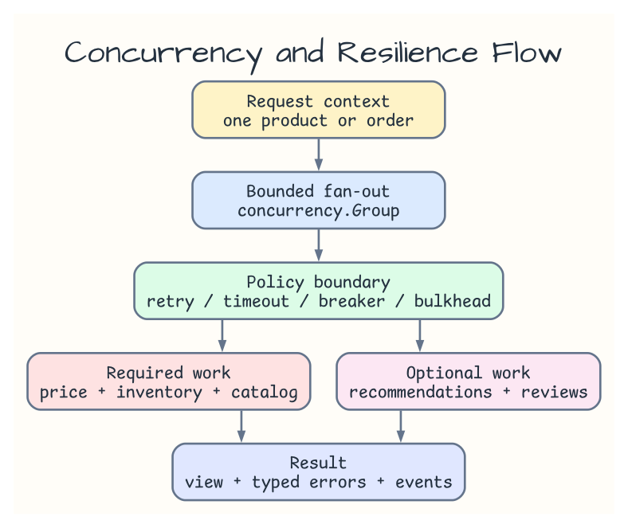

# product-enrichment-fanout

[한국어](README.ko.md)

Product detail enrichment example for `concurrency` and
`testing/concurrency`.

The example fans out pricing, inventory, recommendation, and review-summary
lookups under one request context. Required-provider failure cancels remaining
work; optional-provider failure is recorded without failing the request.

## Scenario



Use this example when one request must call several downstream providers with a
bounded concurrency budget. Price and inventory are required. Recommendations
and review summaries are optional, so their failures are captured in the result
without failing the whole product view.

## What It Demonstrates

- `concurrency.Group` with a fixed worker limit.
- Required provider failure that cancels the remaining work.
- Optional provider failure captured as result metadata.
- Panic capture through `concurrency.Go`.
- Stress validation with `testing/concurrency`.

## Run

```bash
go test -count=1 ./examples/product-enrichment-fanout/...
```
