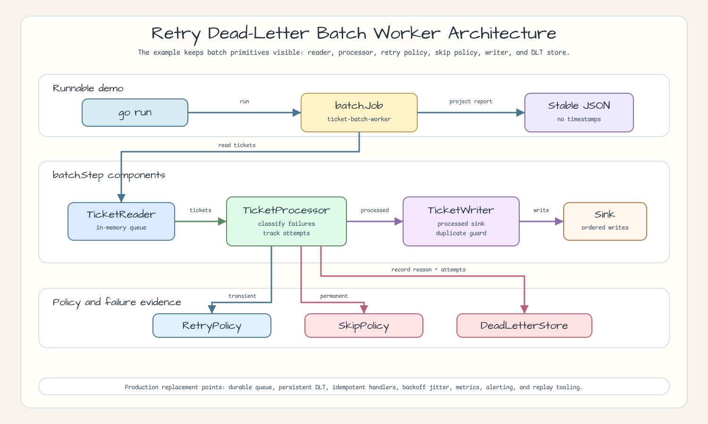
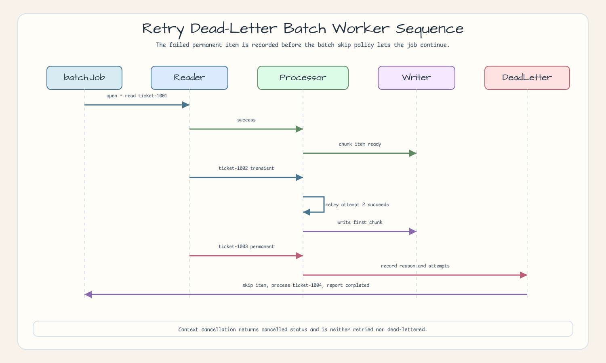
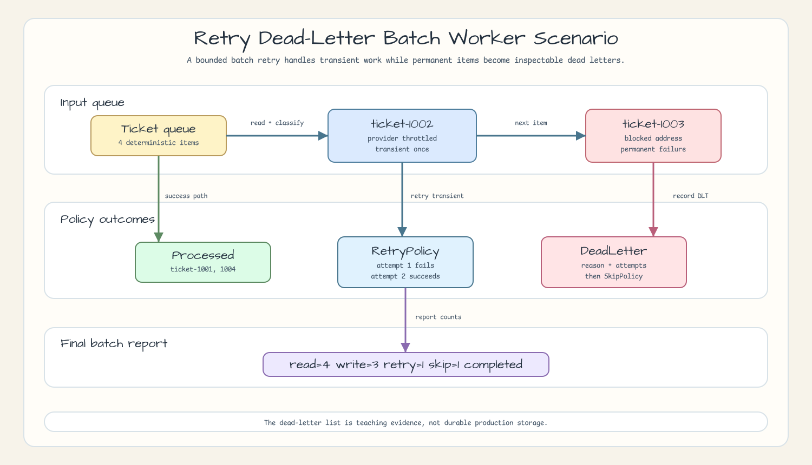

# Retry Dead-Letter Batch Worker

[English](README.md) | [한국어](README.ko.md)

This example demonstrates bounded retry and dead-letter handling with
`bluetape-go/batch`. It keeps the queue, retry policy, skip policy, processed
sink, and dead-letter list visible instead of hiding them behind a larger
worker framework.

## Example Scenario

A support operations batch worker reads four queued ticket notifications:

| Ticket | Scenario | Outcome |
|---|---|---|
| `ticket-1001` | succeeds immediately | written to the processed sink |
| `ticket-1002` | transient provider throttling | retried once, then written |
| `ticket-1003` | blocked delivery address | recorded in the dead-letter list, then skipped |
| `ticket-1004` | succeeds immediately | written to the processed sink |

`batch.RetryPolicy` handles only `ErrTransientTicket`.
`batch.SkipPolicy` handles only `ErrPermanentTicket`. The domain processor
records the dead-letter entry before returning the permanent error, so the
batch report and the domain evidence stay aligned.

## Run

```bash
go run ./examples/retry-dead-letter-batch-worker
```

The output is deterministic and omits runtime timestamps:

```json
{
  "job_name": "ticket-batch-worker",
  "step_name": "ticket-retry-dead-letter-worker",
  "chunk_size": 2,
  "status": "completed",
  "read_count": 4,
  "write_count": 3,
  "retry_count": 1,
  "skip_count": 1
}
```

The full JSON also includes the processed ticket order, the dead-letter record,
and a timestamp-free `batch.Report` projection.

## Retry and Dead-Letter Policy

| Boundary | Local rule |
|---|---|
| Retry | `batch.RetryErrors(3, errors.Is(err, ErrTransientTicket))` |
| Skip | `batch.SkipErrors(2, errors.Is(err, ErrPermanentTicket))` |
| Dead letter | processor records ticket ID, reason, and attempts before returning the permanent error |
| Writer error | duplicate processed ticket IDs fail the batch and are not converted into dead letters |
| Cancellation | caller cancellation returns `batch.StatusCancelled` and is not retried or dead-lettered |

## Architecture



## Sequence Diagram



## Scenario Diagram



## Tests

```bash
go test -count=1 ./examples/retry-dead-letter-batch-worker/...
go test -race -count=1 ./examples/retry-dead-letter-batch-worker/...
```

The tests cover transient success after retry, permanent dead-letter capture,
skip budget exhaustion, writer duplicate failure, caller cancellation,
timestamp-free report projection, concurrent run isolation, and concurrent
store access under the race detector.

## Related Examples

- [`operations-report-policy`](../operations-report-policy) shows how failure
  policies shape `workreport.Report` output.
- [`chunked-csv-import-checkpoint`](../chunked-csv-import-checkpoint) shows
  checkpoint/restart behavior for chunked batch imports.

## Production Hardening

This example uses in-memory state on purpose. Production workers need a durable
queue, persistent dead-letter table or topic, idempotent handlers, backoff with
jitter, metrics for attempts and DLT growth, alerting for repeated failures, and
safe replay tooling.
