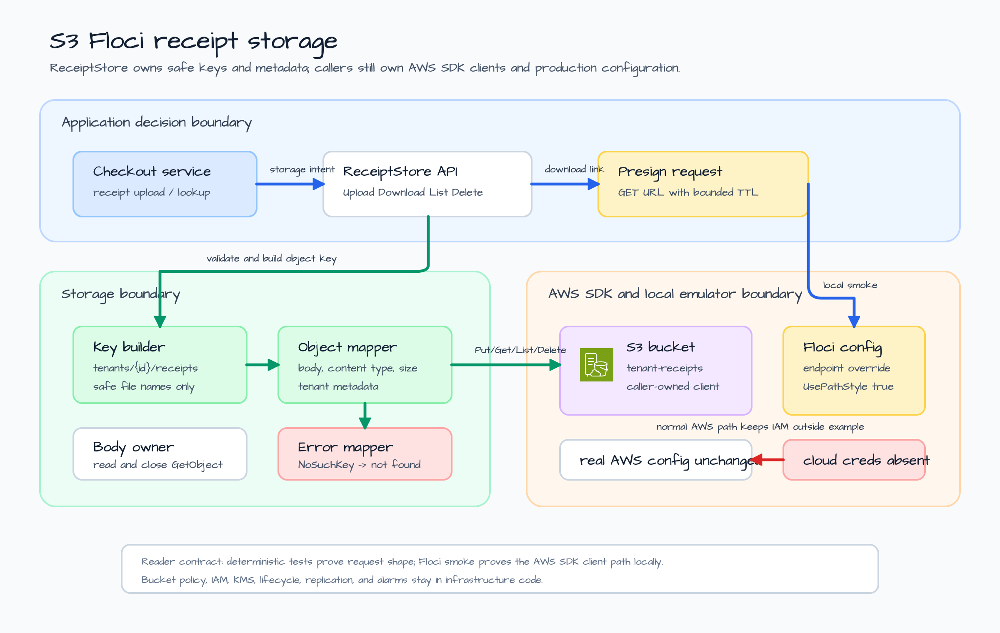
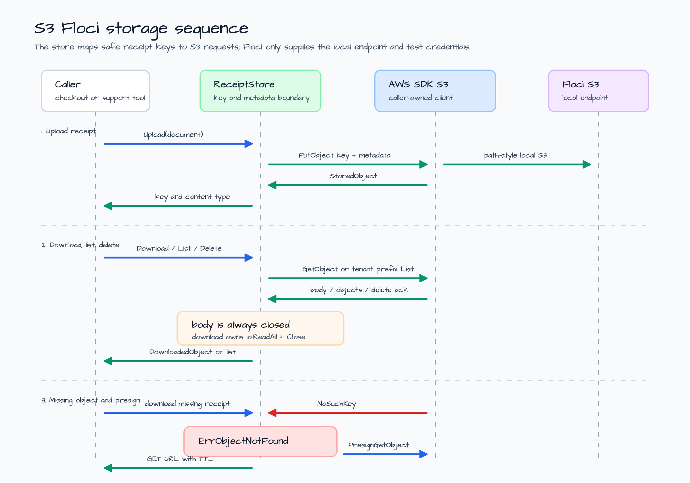

# s3-floci-storage

[English](README.md) | [한국어](README.ko.md)

Local S3 storage example using the AWS SDK for Go v2 and a Floci-backed smoke
test.

This example models a small receipt storage boundary. Application code still
owns the business command, but the storage component owns the S3 object key
convention, metadata contract, body closing rule, missing-object mapping, and
presigned download URL shape.

The example covers five operations:

- `Upload` stores a receipt object with content type, size, and metadata.
- `Download` reads the object body and closes the S3 response body.
- `ListTenantReceipts` lists one tenant prefix.
- `Delete` removes one receipt object.
- `PresignDownload` creates a caller-facing GET URL with a bounded TTL.

No real cloud credentials are required. Normal tests use deterministic fakes,
and the optional smoke test starts Floci through bluetape-go's
`testcontainers/floci` fixture.

## Scenario

A checkout service writes generated receipt documents to object storage. Later,
support tools need to list all receipts for one tenant, download a selected
receipt, delete a corrected receipt, or hand a short-lived download URL to a
trusted caller.

The store uses one bucket and a tenant-shaped object key:

| Field | Example | Reason |
|---|---|---|
| Bucket | `tenant-receipts` | Deployment-owned storage location. |
| Tenant prefix | `tenants/tenant-alpha/receipts/` | Keeps list operations tenant-scoped. |
| Object key | `tenants/tenant-alpha/receipts/receipt-1001/invoice-1001.txt` | Makes tenant, receipt, and file name visible in S3. |
| Metadata | `tenant_id`, `receipt_id`, `source` | Keeps diagnostic metadata near the object. |
| Content type | `text/plain; charset=utf-8` | Uses extension first, then payload sniffing. |
| Presign TTL | `15m` by default | Keeps download links intentionally short-lived. |

## Architecture



The architecture keeps ownership boundaries narrow:

1. The application decides which receipt operation is needed.
2. `ReceiptStore` builds safe object keys and S3 requests.
3. AWS SDK v2 stays caller-owned, so production code can use the same request
   and response types as the local example.
4. Floci supplies the local endpoint, test credentials, and path-style S3
   behavior for smoke tests.

## Operation Sequence



The runtime contract is intentionally small.

| Operation | S3 request | Example responsibility |
|---|---|---|
| Upload | `PutObject` | Set key, body, content type, content length, and metadata. |
| Download | `GetObject` | Read and close the response body. |
| List | `ListObjectsV2` | Use tenant prefix, not a bucket-wide scan. |
| Delete | `DeleteObject` | Delete exactly one safe object key. |
| Presign | `PresignGetObject` | Produce a caller-owned GET URL with TTL. |

`NoSuchKey` is translated to `ErrObjectNotFound` so application code can
separate a missing receipt from network, credential, endpoint, or permission
failures.

## Local Floci vs Real AWS

| Concern | Local Floci smoke test | Real AWS deployment |
|---|---|---|
| Endpoint | Loaded from `testcontainers/floci` details. | Loaded from normal AWS SDK config. |
| Credentials | Static test credentials from the Floci container. | IAM role, profile, or workload identity. |
| Addressing | `UsePathStyle = true`. | Usually virtual-hosted style unless an endpoint requires path style. |
| Bucket lifecycle | Test creates and deletes a throwaway bucket. | Infrastructure owns bucket creation, policies, encryption, and lifecycle rules. |
| Scope | Upload/download/list/delete/presign behavior. | Monitoring, KMS, replication, object lock, and access policies are separate concerns. |

## What It Demonstrates

- A small S3 storage abstraction without wrapping the whole AWS SDK.
- Safe tenant-shaped object keys.
- Metadata and content-type assignment on upload.
- Response-body closing on download.
- Tenant-prefix listing.
- Missing-object error mapping.
- Presigned GET URLs with bounded TTL.
- Deterministic fake-client tests plus an opt-in Floci S3 smoke test.

## Run

Print the local preview:

```bash
go run ./examples/s3-floci-storage
```

The output is JSON and does not contact S3:

```json
{
  "bucket": "tenant-receipts",
  "object_prefix": "tenants/<tenant_id>/receipts/<receipt_id>/<file_name>"
}
```

The real output also lists the supported operations, local contract, and smoke
test command.

## Test

Run the deterministic tests:

```bash
go test -count=1 ./examples/s3-floci-storage/...
go test -race -count=1 ./examples/s3-floci-storage/...
```

The targeted tests prove:

- upload maps safe keys, metadata, content length, and content type;
- download reads and closes the response body;
- `NoSuchKey` becomes `ErrObjectNotFound`;
- list uses the tenant prefix;
- delete targets one object key;
- presign uses GET and the configured TTL;
- canceled contexts return before S3 is called.

## Optional Floci Smoke Test

The Floci-backed smoke test is opt-in because it starts Docker-backed AWS
service emulation and should run serially with other container-backed suites.

```bash
BLUETAPE_S3_FLOCI_STORAGE_SMOKE=1 go test -run TestFlociSmoke -count=1 ./examples/s3-floci-storage/...
```

The smoke test starts Floci with S3 enabled, creates a temporary bucket, uploads
one receipt, downloads it, lists the tenant prefix, presigns a download URL,
deletes the object, and verifies that a later download maps to
`ErrObjectNotFound`.

## Boundary Notes

- Keep bucket provisioning, IAM, encryption, lifecycle policy, and alarms in
  infrastructure code.
- Keep SQS/DynamoDB document workflow orchestration out of this example; it
  belongs in the later integration issue.
- Use path-style S3 addressing for Floci and other local endpoints. Do not copy
  that setting blindly to real AWS unless the endpoint requires it.
