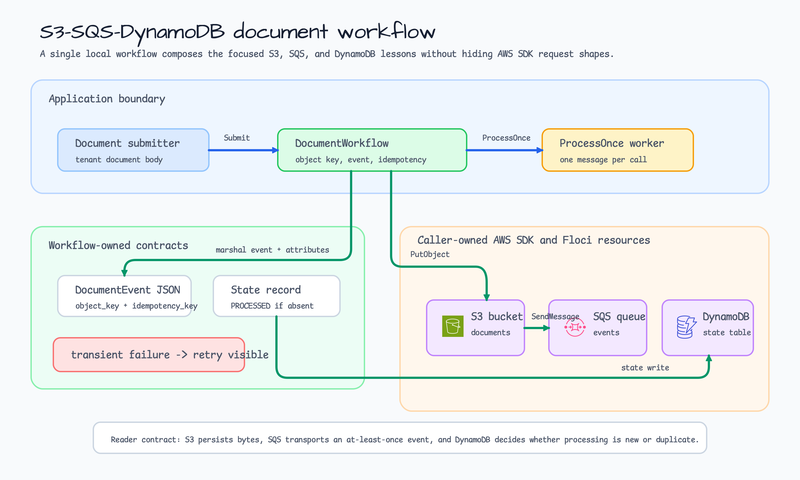
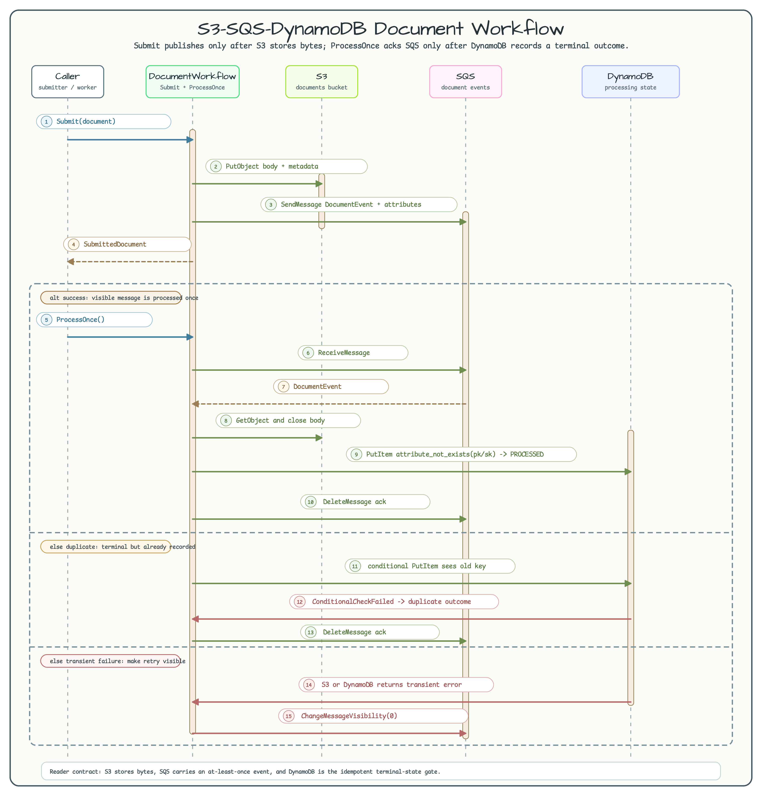

# s3-sqs-dynamodb-document-workflow

[English](README.md) | [한국어](README.ko.md)

Local document ingestion workflow example for AWS SDK v2, S3, SQS, DynamoDB,
and `testcontainers/floci`.

This is the integration step after the focused AWS/Floci examples:

- [`s3-floci-storage`](../s3-floci-storage/README.md) shows safe S3 object
  keys, metadata, downloads, and body closing.
- [`sqs-floci-worker`](../sqs-floci-worker/README.md) shows SQS at-least-once
  delivery, delete acknowledgement, and retry visibility.
- [`dynamodb-conditional-repository`](../dynamodb-conditional-repository/README.md)
  shows DynamoDB conditional writes and typed conflict handling.

This example composes those lessons into one workflow without creating a broad
AWS wrapper. The application owns the document key convention, the event shape,
and the idempotency rule. The AWS SDK clients and infrastructure remain
caller-owned.

## Scenario

A tenant uploads a document. The workflow must:

1. Store the document body in S3.
2. Publish a JSON document event to SQS.
3. Let a worker receive one event, download the S3 object, and record processing
   state in DynamoDB.
4. Acknowledge the SQS message only when processing is terminal: either the
   state row was created or DynamoDB reports that it already exists.
5. Keep transient S3, SQS, or DynamoDB failures retryable by changing message
   visibility instead of deleting the message.

The DynamoDB item uses this shape:

| Attribute | Example | Reason |
|---|---|---|
| `pk` | `TENANT#tenant-alpha` | Groups document state by tenant. |
| `sk` | `DOCUMENT#doc-1001#PROCESSING` | Stores one processing record per document. |
| `object_key` | `tenants/tenant-alpha/documents/doc-1001/contract-1001.txt` | Links state back to the S3 object. |
| `idempotency_key` | `tenant-alpha/doc-1001/process` | Makes duplicate work visible to readers and logs. |
| `status` | `PROCESSED` | Shows that the event reached a terminal success state. |
| `bytes_read` | `14` | Proves the worker read the S3 object body before recording state. |

## Architecture



The important split is ownership:

1. `DocumentWorkflow` owns only the application contract: object key, SQS event,
   DynamoDB state key, condition expression, and ack/retry decision.
2. S3, SQS, and DynamoDB clients are caller-owned AWS SDK v2 clients. Local smoke
   tests load those clients from `testcontainers/floci`.
3. Floci supplies a local endpoint and test credentials. Production IAM,
   encryption, alarms, DLQ/redrive policy, and deployment topology stay outside
   the workshop code.

## Processing Sequence



`ProcessOnce` handles exactly one visible SQS message. That keeps the example
small enough to inspect while still showing the real delivery rule.

| Result | Worker behavior | SQS acknowledgement |
|---|---|---|
| New document | Downloads S3 object and creates the DynamoDB processing row with `attribute_not_exists(pk) AND attribute_not_exists(sk)`. | Deletes the SQS message. |
| Duplicate event | DynamoDB returns `ConditionalCheckFailedException`, wrapped as `ErrConditionalConflict`. | Deletes the SQS message because the work is already terminal. |
| Transient S3/DynamoDB failure | Does not write terminal state. | Calls `ChangeMessageVisibility` so the same message can retry. |
| Invalid message body | Does not call the worker state path. | Makes the message visible again for inspection/retry policy. |

## What It Demonstrates

- Safe tenant/document S3 object keys and metadata.
- SQS `DocumentEvent` JSON body plus `content-type`, `event-type`, and
  `idempotency-key` message attributes.
- S3 `GetObject` body closing inside the worker path.
- DynamoDB conditional `PutItem` as the idempotent processing gate.
- Duplicate processing as a terminal acknowledgement, not a retry storm.
- Deterministic fake-client tests and an opt-in multi-service Floci smoke test.

## Run

Print the local preview:

```bash
go run ./examples/s3-sqs-dynamodb-document-workflow
```

The output is JSON and does not contact AWS services:

```json
{
  "bucket": "documents",
  "queue_name": "document-events",
  "table": "document_processing",
  "object_prefix": "tenants/<tenant_id>/documents/<document_id>/<file_name>",
  "state_key": "pk=TENANT#<tenant_id>, sk=DOCUMENT#<document_id>#PROCESSING"
}
```

The full preview also lists the operations, idempotency rules, prerequisite
examples, and the smoke-test command.

## Test

Run the deterministic tests:

```bash
go test -count=1 ./examples/s3-sqs-dynamodb-document-workflow/...
go test -race -count=1 ./examples/s3-sqs-dynamodb-document-workflow/...
```

The targeted tests prove:

- `Submit` stores the document in S3 before sending the SQS event;
- the SQS event contains the object key, content type, and idempotency key;
- `ProcessOnce` downloads the S3 object and closes the response body;
- DynamoDB `PutItem` uses `attribute_not_exists(pk) AND attribute_not_exists(sk)`;
- duplicate conditional conflicts are acknowledged as already-processed work;
- transient DynamoDB errors change visibility and do not delete the message;
- forged SQS event bodies cannot redirect object keys or idempotency keys;
- canceled contexts stop before external client calls.

## Optional Floci Smoke Test

The Floci-backed smoke test starts one Docker-backed local AWS-compatible
container with S3, SQS, and DynamoDB enabled. Run it serially when Docker is
available:

```bash
BLUETAPE_DOCUMENT_WORKFLOW_SMOKE=1 go test -run TestFlociSmoke -count=1 ./examples/s3-sqs-dynamodb-document-workflow/...
```

The smoke test creates a bucket, queue, and DynamoDB table, submits a sample
document, processes the message successfully, then submits the same document
again to prove the DynamoDB conditional write turns the duplicate event into a
safe acknowledgement.

No real AWS credentials are used. Real deployments still need IAM, encryption,
DLQ/redrive policy, observability, and cleanup automation outside this example.
