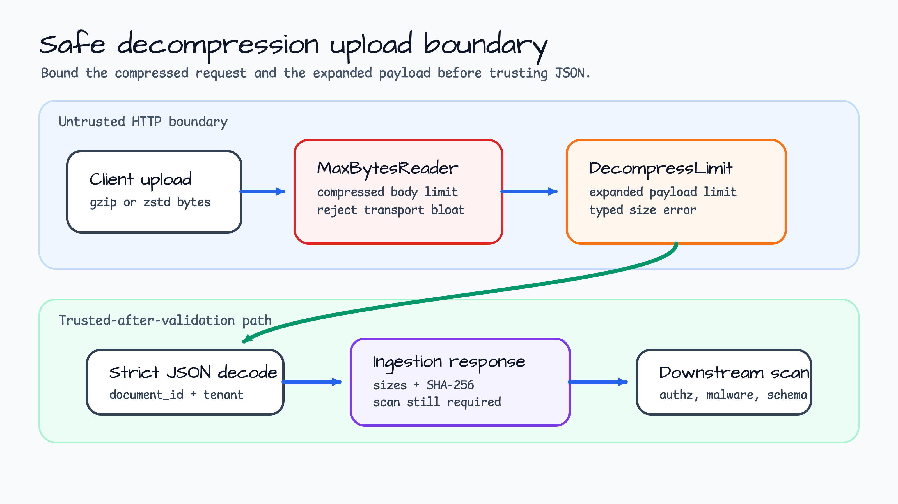
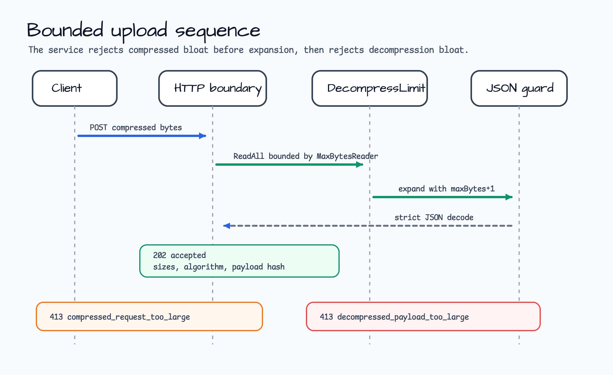
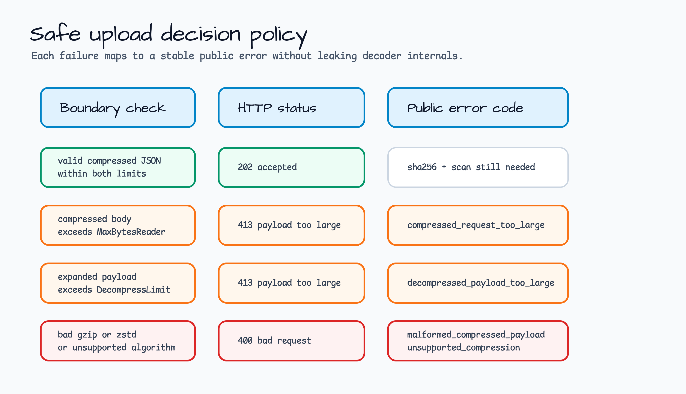

# safe-decompression-upload

[English](README.md) | [한국어](README.ko.md)

`compression.DecompressLimit`를 사용하는 Gin upload ingestion 예제입니다.

이 예제는 compressed HTTP request body를 untrusted input으로 취급합니다. 두 가지
limit을 독립적으로 적용합니다. HTTP layer는 `http.MaxBytesReader`로 compressed byte
크기를 제한하고, service layer는 `compression.DecompressLimit`로 expanded payload
크기를 제한합니다. 작은 compressed request가 큰 in-memory payload로 확장되는 상황을
application boundary에서 막는 방법을 보여주는 것이 목표입니다.

## 시나리오

Ingestion API가 partner로부터 JSON document를 받습니다. Partner는 bandwidth를 줄이기
위해 `gzip` 또는 `zstd` byte를 보낼 수 있습니다. 하지만 compression은 위험 지점을
바꿉니다. 작은 compressed body가 훨씬 큰 document로 expand될 수 있기 때문입니다.
따라서 service는 두 boundary를 모두 방어해야 합니다.

- HTTP에서 compressed request body를 읽는 transport boundary.
- Trusted application code가 expanded byte를 처음 보는 decompression boundary.

이 예제는 두 boundary를 모두 통과한 뒤에만 strict JSON document를 받습니다. Response는
algorithm, compressed size, decompressed size, expanded payload의 SHA-256을 반환하지만,
`authoritative_scan_still_needed=true`를 유지합니다. Decompression은 authorization,
malware scanning, schema governance가 아닙니다.

## Architecture



HTTP layer는 compressed request-size 방어를 소유합니다. Service layer는 decompression과
JSON validation을 소유합니다. 책임을 분리하면 실패도 명확해집니다. 큰 compressed body는
`compressed_request_too_large`, 작은 body가 너무 크게 expand되는 경우는
`decompressed_payload_too_large`로 매핑됩니다.

## Request Flow



1. Client가 raw compressed byte를 `/uploads/compressed`로 보냅니다.
2. Router는 `io.ReadAll` 전에 body를 `http.MaxBytesReader`로 감쌉니다.
3. Service는 `X-Compression-Algorithm` 또는 `Content-Encoding`에서 `gzip`/`zstd`를
   선택합니다.
4. `compression.DecompressLimit`는 expanded byte를 최대 `maxBytes+1`까지만 읽고,
   limit을 넘으면 `compression.ErrDecompressedSizeExceeded`를 반환합니다.
5. Expanded byte는 unknown field를 거부하는 decoder로 읽고, `document_id`, `tenant`,
   `body` 필드를 검증합니다.

## Error Policy



| Boundary | Status | Error code |
|---|---|---|
| Compressed request가 `MaxBytesReader`를 초과 | `413` | `compressed_request_too_large` |
| Expanded payload가 `DecompressLimit`를 초과 | `413` | `decompressed_payload_too_large` |
| 깨진 gzip/zstd byte | `400` | `malformed_compressed_payload` |
| Missing 또는 unsupported compression algorithm | `400` | `unsupported_compression` |
| Invalid expanded JSON | `400` | `invalid_upload_payload` |
| Ingestion 완료 전 request context canceled | `408` | `request_cancelled` |

Service는 `compression.ErrDecompressedSizeExceeded`를 wrap합니다. 따라서 test나 상위
layer는 `errors.Is(err, compression.ErrDecompressedSizeExceeded)`를 계속 사용할 수
있고, HTTP response는 stable public error로 유지됩니다.

## 보여주는 것

- Untrusted compressed upload byte에 적용하는 `compression.DecompressLimit`.
- `errors.Is`로 확인 가능한 typed error 보존.
- Compressed request-size 방어를 위한 `http.MaxBytesReader`.
- Decompression 이후 strict JSON decoding.
- Stable HTTP status와 public error code mapping.
- Valid payload, malformed compressed data, decompressed-size overflow,
  compressed request overflow, unsupported algorithm, invalid payload,
  cancellation test.

## 실행

Local upload guard API를 실행합니다.

```bash
go run ./examples/safe-decompression-upload
```

Service는 기본적으로 `127.0.0.1:8103`에서 실행됩니다.

```bash
curl http://127.0.0.1:8103/healthz
curl http://127.0.0.1:8103/uploads/limits
```

작은 gzip upload를 만들고 raw byte로 전송합니다.

```bash
printf '%s' '{"document_id":"doc-1001","tenant":"checkout","body":"invoice upload"}' \
  | gzip -c \
  | curl -s -X POST http://127.0.0.1:8103/uploads/compressed \
      -H 'X-Compression-Algorithm: gzip' \
      --data-binary @- | jq
```

예상 response는 `202 Accepted`, `decision=accepted`, compressed/decompressed byte count입니다.

주요 환경 변수:

| 변수 | 기본값 | 용도 |
|---|---|---|
| `HTTP_ADDR` | `127.0.0.1:8103` | Loopback HTTP bind address입니다. Non-loopback bind는 거부합니다. |
| `COMPRESSED_BODY_LIMIT_BYTES` | `32768` | Compressed HTTP request body에서 읽을 최대 byte입니다. |
| `DECOMPRESSED_BODY_LIMIT_BYTES` | `262144` | Decompression 이후 보관할 최대 byte입니다. |

## Endpoints

| Method | Path | Purpose |
|---|---|---|
| `GET` | `/healthz` | Process liveness only. |
| `GET` | `/uploads/limits` | Compressed/decompressed upload limit을 조회합니다. |
| `POST` | `/uploads/compressed` | Raw `gzip` 또는 `zstd` byte를 bounded decompression으로 업로드합니다. |

## Boundary Notes

- HTTP body를 memory로 읽기 전에 compressed byte를 항상 제한합니다.
- Decompressed payload를 신뢰하기 전에 expanded byte를 항상 제한합니다.
- 성공적인 decompression은 byte가 limit 안에 있고 예상 JSON으로 decode됐다는 뜻입니다.
  Authorization, content safety, malware scanning, durable ingestion을 의미하지 않습니다.
- Public error는 안정적으로 유지합니다. Decoder 내부 detail은 server-side diagnostic으로만
  둡니다.
- Compressed limit과 decompressed limit은 별도로 조정합니다. 서로 다른 resource를
  보호하기 때문입니다.

## 테스트

```bash
go test -count=1 ./examples/safe-decompression-upload/...
go test -race -count=1 ./examples/safe-decompression-upload/...
```
