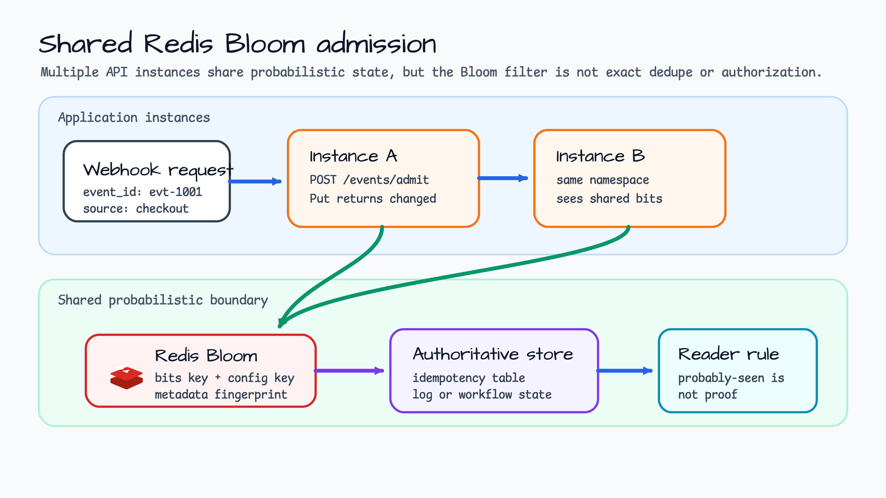
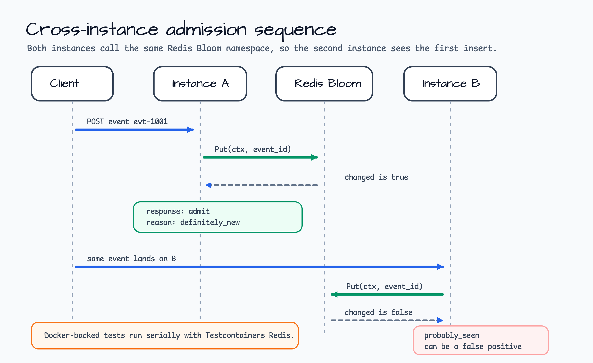
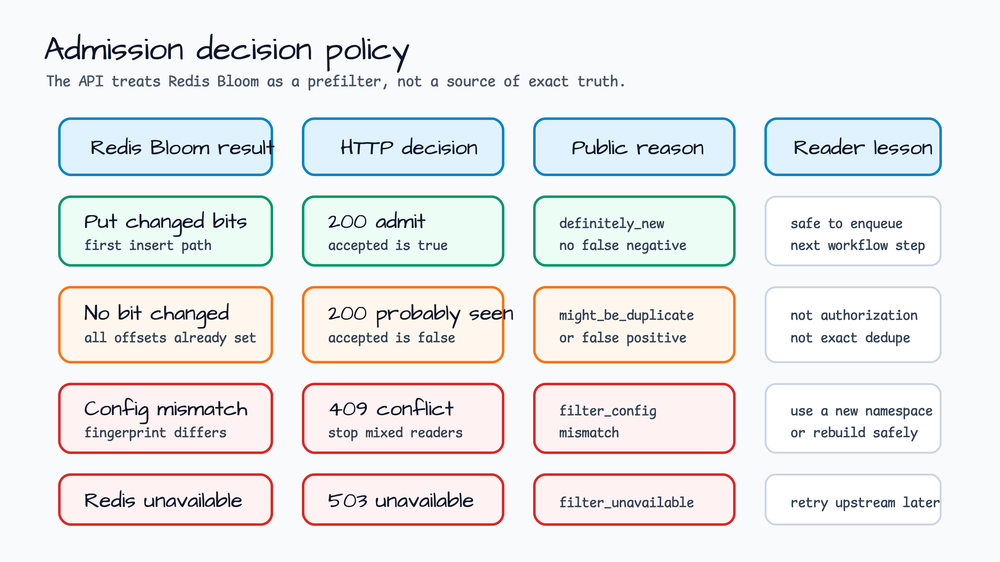

# shared-redis-bloom-admission

[English](README.md) | [한국어](README.ko.md)

Gin webhook admission example for `probabilistic/redis`.

This example uses Redis-backed Bloom filters from `bluetape-go/probabilistic/redis`
to share a cheap admission signal across API instances. It builds on the
in-memory `probabilistic-dedupe-admission` example and adds the distributed
parts that matter in production-shaped systems: a shared Redis namespace,
metadata fingerprint checks, Docker-backed integration tests, and explicit
reader guidance for false positives.

## Scenario

A checkout platform receives the same webhook stream on multiple API instances.
Instance A may see `evt-1001` first, while a retry or load-balanced repeat lands
on Instance B. If every process keeps its own in-memory Bloom filter, the second
process cannot see the first insert. A Redis-backed Bloom filter moves the bits
and metadata into Redis so every instance that uses the same namespace reads the
same probabilistic boundary.

The important word is probabilistic. When `Put(ctx, eventID)` changes at least
one bit, the event is definitely new to that Bloom filter because inserted values
do not later produce false negatives. When no bit changes, the result is only
`probably_seen`: it may be a real duplicate, or it may be a false positive caused
by Bloom filter saturation and hash collisions. This service makes that boundary
visible, but a production workflow still needs an authoritative idempotency
table, log, or state store before dropping important work.

## Architecture



The HTTP service is intentionally small. Each instance receives a webhook-shaped
request, calls the same Redis Bloom namespace, and returns a stable admission
projection. Redis owns the Bloom bits and configuration metadata. The diagram
keeps an authoritative store next to Redis to show the production rule: use the
Bloom filter as a front-door prefilter, not as the final truth.

## Admission Flow



1. The client posts `evt-1001` to Instance A.
2. Instance A calls `Put(ctx, "evt-1001")` on the Redis-backed filter.
3. Redis changes one or more bits, so the service returns `admit`,
   `definitely_new`, and `accepted=true`.
4. The same event later lands on Instance B.
5. Instance B calls the same Redis namespace. No bit changes, so the service
   returns `probably_seen`, `might_be_duplicate_or_false_positive`, and
   `accepted=false`.

The second response proves only that all Bloom offsets were already set. It does
not prove the caller is unauthorized, and it does not prove the event is a
duplicate.

## Decision Policy



| Redis Bloom result | HTTP decision | Reader lesson |
|---|---|---|
| `Put` changed bits | `200 admit`, `accepted=true` | Safe to enqueue the next workflow step. |
| No bit changed | `200 probably_seen`, `accepted=false` | Treat as duplicate-or-false-positive, not exact dedupe. |
| Config fingerprint differs | `409 filter_config_mismatch` | Do not mix readers with different Bloom sizing in one namespace. |
| Redis unavailable or request canceled | `503 filter_unavailable` | Retry upstream later; the prefilter could not answer. |

The Redis package stores a metadata fingerprint beside the bits. If one instance
creates a namespace for 10,000 expected insertions and another tries to reuse the
same namespace with a different size or false-positive target, the example maps
that mismatch to `409 filter_config_mismatch`. Use a new namespace or rebuild
the filter deliberately when changing Bloom sizing.

## What It Demonstrates

- `redisbloom.NewStringBloomFilter` inside a Gin HTTP service.
- Shared state across multiple Redis clients and service instances.
- First insert, repeated value, cross-instance visibility, config mismatch,
  Redis failure, cancellation, and invalid request tests.
- Approximate stats for bit count, approximate element count, expected current
  false-positive probability, bit size, hash count, and hasher key.
- Docker-backed Redis integration tests using repository Testcontainers
  fixtures.
- Stable public HTTP errors without treating Bloom hits as authorization or
  exact dedupe.

## Run

Start Redis locally first. Docker is enough for a quick manual run:

```bash
docker run --rm -p 6379:6379 redis:7-alpine
```

Then run the service:

```bash
export REDIS_ADDR=127.0.0.1:6379
go run ./examples/shared-redis-bloom-admission
```

The service listens on `127.0.0.1:8102` by default.

```bash
curl http://127.0.0.1:8102/healthz
```

Admit a new event:

```bash
curl -s -X POST http://127.0.0.1:8102/events/admit \
  -H 'Content-Type: application/json' \
  -d '{"event_id":"evt-1001","source":"checkout"}' | jq
```

Expected decision: `admit`, reason: `definitely_new`, accepted: `true`.

Submit the same event again:

```bash
curl -s -X POST http://127.0.0.1:8102/events/admit \
  -H 'Content-Type: application/json' \
  -d '{"event_id":"evt-1001","source":"checkout"}' | jq
```

Expected decision: `probably_seen`, reason:
`might_be_duplicate_or_false_positive`, accepted: `false`.

Inspect the shared filter:

```bash
curl -s http://127.0.0.1:8102/filters/current | jq
```

Useful environment variables:

| Variable | Default | Purpose |
|---|---|---|
| `HTTP_ADDR` | `127.0.0.1:8102` | Loopback HTTP bind address. Non-loopback binds are rejected. |
| `REDIS_ADDR` | `127.0.0.1:6379` | Redis address used by the Bloom filter. |
| `BLOOM_NAMESPACE` | `shared-redis-bloom-admission:webhooks` | Shared Redis Bloom namespace. |
| `INSTANCE_ID` | `api-instance-local` | Instance label included in responses. |
| `BLOOM_EXPECTED_INSERTIONS` | `10000` | Expected insertions used to size the Bloom filter. |
| `BLOOM_FALSE_POSITIVE_PROBABILITY` | `0.01` | Target false-positive probability. |

## Endpoints

| Method | Path | Purpose |
|---|---|---|
| `GET` | `/healthz` | Process liveness only. |
| `POST` | `/events/admit` | Admit one event ID through the shared Redis Bloom prefilter. |
| `GET` | `/filters/current` | Inspect approximate shared Bloom filter stats. |

## Boundary Notes

- `probably_seen` is not proof of duplication. It can be a false positive.
- A Bloom filter hit is not an authorization decision.
- Redis shares the probabilistic boundary, but it is still not the durable source
  of truth for workflow completion.
- Keep one Bloom sizing configuration per namespace. A changed size or
  false-positive target should use a new namespace or a deliberate rebuild.
- Bloom filters do not delete individual entries. Use time-windowed namespaces,
  rotation, rebuilds, or another data structure when deletions matter.
- The demo key is the trimmed `event_id`; `source` is scenario metadata only.

## Test

These tests start Redis through Testcontainers. Run them serially so
container-backed examples do not contend for shared Docker resources.

```bash
go test -p 1 -count=1 ./examples/shared-redis-bloom-admission/...
go test -p 1 -race -count=1 ./examples/shared-redis-bloom-admission/...
```
