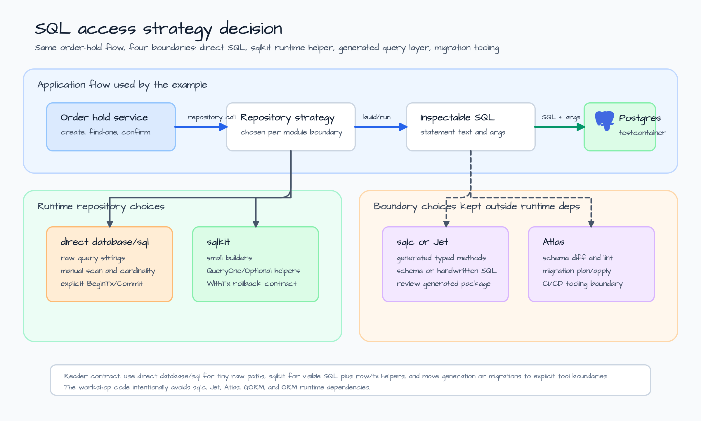
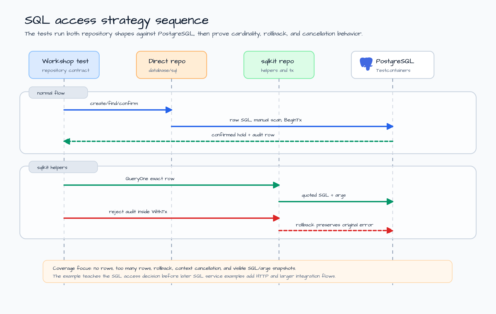

# sql-access-strategy-decision

[English](README.md) | [한국어](README.ko.md)

Local SQL access strategy example for `sqlkit`.

This example is deliberately smaller than a web service. Before a team adds
handlers, request DTOs, background jobs, or a migration pipeline, it needs one
boring decision: which part of the application owns SQL strings, row
cardinality, transaction ceremony, generated query code, and schema migration
tooling?

The code runs the same order-hold flow with two runtime repository shapes:

- direct `database/sql`, where the application owns raw SQL strings, scanning,
  cardinality checks, and `BeginTx` / `Commit` ceremony;
- `sqlkit`, where the application still sees SQL text and args, but delegates
  small statement builders, `QueryOne` / `QueryOptional`, and `WithTx` rollback
  behavior to bluetape-go.

It also explains where `sqlc`, Jet, and Atlas belong without adding any of them
as runtime dependencies.

## Scenario

An order service creates a short-lived customer hold before inventory and
payment checks finish. The service must:

1. insert a hold row;
2. read exactly one hold by ID;
3. detect no-row and too-many-row cases;
4. confirm the hold and append an audit event in one transaction;
5. keep the SQL shape inspectable enough for code review.

The example keeps the schema tiny on purpose: `sql_strategy_holds` stores the
hold, and `sql_strategy_hold_events` stores the audit trail. The point is not
schema design. The point is deciding how much SQL machinery the module needs.

## Architecture



The application flow stays the same no matter which repository shape is used:
create the hold, read it with one-row cardinality, and confirm it with an audit
event. The architecture diagram separates runtime choices from tool boundaries:

- direct `database/sql` is best when the query surface is tiny or driver
  behavior matters more than helper reuse;
- `sqlkit` is best when the team wants visible SQL plus shared helpers for
  statements, row cardinality, and transaction rollback;
- `sqlc` or Jet are generated-query boundaries, not bluetape-go runtime
  dependencies;
- Atlas is a migration planning, linting, and apply boundary.

## Repository Sequence



The tests exercise both repository shapes against a PostgreSQL Testcontainer.
The normal flow proves both paths can create, read, and confirm a hold. The
`sqlkit`-focused tests then prove the behavior that is easy to lose in ad hoc
repository code:

1. `QueryOne` reports `sqlkit.ErrNoRows` when no row exists.
2. `QueryOptional` reports `sqlkit.ErrTooManyRows` when a supposedly singular
   business key returns multiple rows.
3. `WithTx` rolls the status update back when the audit insert path returns
   `ErrAuditRejected`.
4. A canceled context reaches the driver instead of being swallowed by the
   repository.
5. Statement snapshots keep SQL and args visible in tests and `go run` output.

## Decision Table

| Choice | Good fit | Keep out of scope |
|---|---|---|
| direct `database/sql` | One or two raw queries, driver-specific behavior, explicit transaction teaching. | Shared row cardinality helpers, generated models, migration planning. |
| `sqlkit` | Visible SQL plus small builders, `QueryOne`, `QueryOptional`, and `WithTx`. | Schema metadata, ORM state, migration execution, generated packages. |
| `sqlc` or Jet | Larger stable SQL surfaces that deserve generated typed methods. | Hidden runtime dependency inside bluetape-go; review generated code in the app. |
| Atlas | Schema diff, migration linting, migration plan/apply workflows. | Repository runtime behavior and request handling. |
| GORM, Bun, ent, goqu | Product-specific ORM/query-builder decisions after the data model grows. | This workshop example; adding them would hide the v0.7.0 `sqlkit` lesson. |

## What It Demonstrates

- `sqlkit.InsertInto`, `SelectFrom`, and `Update` for small PostgreSQL-first
  statement construction.
- `sqlkit.QueryOne` for exactly-one-row reads and `sqlkit.QueryOptional` for
  optional singular reads.
- `sqlkit.WithTx` preserving the original application error while rolling back.
- Direct `database/sql` contrast code so the helper boundary is visible, not
  magical.
- Statement snapshots that expose SQL text and argument order for tests,
  review, logging policy, and onboarding.
- Testcontainers PostgreSQL coverage without adding sqlc, Jet, Atlas, GORM,
  Bun, ent, or goqu runtime dependencies.

## Run

Print the strategy report:

```bash
go run ./examples/sql-access-strategy-decision
```

The output is JSON. It includes direct `database/sql` statements, `sqlkit`
statements, strategy choices, and production hardening notes:

```json
{
  "scenario": "Create a customer order hold, read it with one-row cardinality, and confirm it with an audit event in one transaction.",
  "direct_database_sql": [
    {
      "name": "direct.create_hold",
      "sql": "insert into sql_strategy_holds (id, customer, status) values ($1, $2, $3)"
    }
  ],
  "choices": [
    {
      "name": "sqlkit",
      "boundary": "runtime helper only; no schema metadata, migrations, generated models, or ORM state"
    }
  ]
}
```

The real output includes all statements and args. The snippet above is shortened
so the README keeps the decision visible.

## Test

These tests use Docker through the repository PostgreSQL Testcontainers fixture.
Run them serially with the rest of the Testcontainers-backed suites.

```bash
go test -count=1 ./examples/sql-access-strategy-decision/...
go test -race -count=1 ./examples/sql-access-strategy-decision/...
```

The targeted tests prove:

- no-row and too-many-row cardinality paths;
- transaction rollback when audit writing fails;
- context cancellation propagation;
- inspectable SQL and argument ordering.

## Boundary Notes

- Pick the migration owner first. A repository helper cannot compensate for an
  unclear schema-change process.
- Keep transaction ownership at the service boundary. Repositories may provide
  helpers, but the application should still decide which operations belong in
  one unit of work.
- Log SQL shape and decision metadata, not raw argument values that might carry
  customer data.
- Move to generated query code when the number of stable statements makes
  generated methods cheaper than hand-maintained scan code.
- Move to Atlas or another migration tool when schema evolution, review, and
  apply workflow are the problem.
