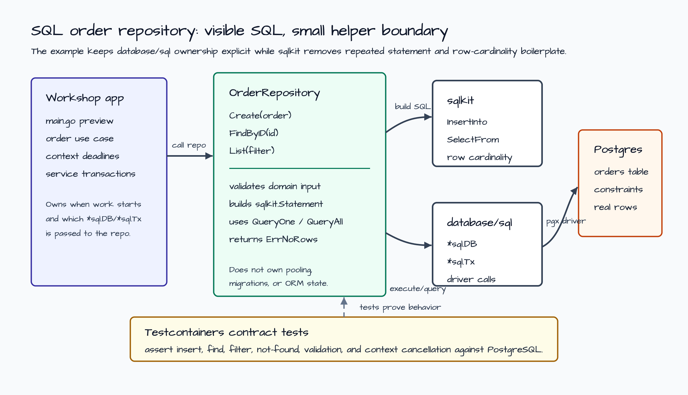
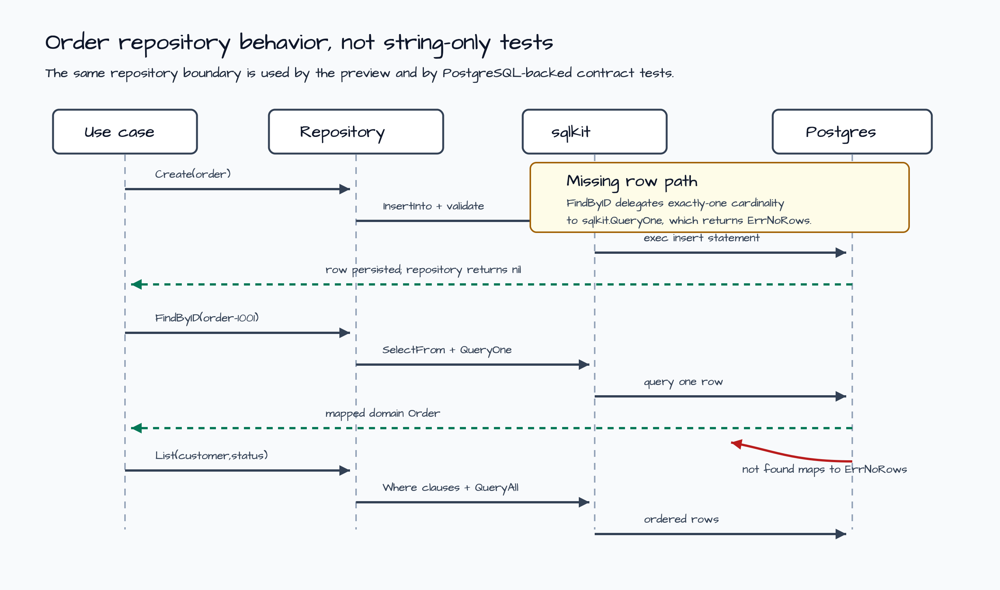

# SQL 주문 Repository 예제

이 예제는 SQL access strategy 예제를 실제 주문 repository로 확장합니다.
실제 데이터베이스 세션은 `database/sql`이 소유하고,
`github.com/bluetape4k/bluetape-go/sqlkit`은 반복 실수가 잦은 작은 부분만
돕습니다. 그 부분은 statement 생성, row mapping, one-row cardinality입니다.

목표는 SQL을 숨기는 것이 아닙니다. Repository는 SQL text와 정렬된 argument를
계속 보여줍니다. `sqlkit`은 기계적인 boilerplate만 줄이고, application은
context deadline, `*sql.DB`, `*sql.Tx`, migration, transaction boundary를 계속
소유합니다.



## 시나리오

이후 HTTP API와 transaction 예제가 재사용할 수 있는 durable order repository가
필요합니다. 이 예제는 service boundary를 작게 유지합니다.

1. `Create`는 주문을 검증하고 PostgreSQL에 insert합니다.
2. `FindByID`는 정확히 한 주문을 읽고, primary key가 없으면
   `sqlkit.ErrNoRows`를 반환합니다.
3. `List`는 customer와 status로 주문을 필터링하고 `created_at`, `id` 순서로
   반환합니다.

테스트는 Testcontainers 기반 PostgreSQL에서 실행됩니다. 깨지기 쉬운 SQL 문자열
snapshot만 보는 대신 repository 동작을 검증합니다.



## Repository Boundary

| Layer | 소유하는 것 | 소유하지 않는 것 |
| --- | --- | --- |
| Use case | Context, cancellation, service transaction 선택, 입력 시나리오. | SQL string assembly, row scan boilerplate. |
| `Repository` | Domain validation, table contract, `Create`, `FindByID`, `List`, row mapping. | Connection pooling, migration, HTTP routing, background worker. |
| `sqlkit` | Visible `Statement`, PostgreSQL placeholder rewrite, `QueryOne`, `QueryAll`. | ORM state, schema metadata, generated code, retry policy. |
| `database/sql` | Driver call, `*sql.DB`, `*sql.Tx`, pooling, cancellation propagation. | Domain semantics. |

## Direct `database/sql` 대비

순수 `database/sql`은 여전히 기준점입니다. 직접 구현하면 보통 다음을 직접
처리합니다.

- repository method 가까이에 handwritten `insert`, `select`, filter SQL string을
  둡니다.
- `QueryContext`, `rows.Next`, column scan, rows close, `rows.Err` 확인을 직접
  작성합니다.
- method마다 "0 rows"와 "2 rows 이상"의 의미를 직접 결정합니다.

이 예제는 SQL을 계속 보여주면서 반복되는 cardinality와 statement mechanics만
공유하기 위해 `sqlkit`을 선택합니다. Query가 driver-specific behavior에
의존하거나, generated typed accessor가 필요하거나, product 전체 schema workflow로
커진다면 그 결정은 이 작은 runtime helper 밖에서 내려야 합니다.

## 실행

Repository preview를 출력합니다.

```bash
go run ./examples/sql-order-repository
```

출력은 JSON입니다. Insert, find, filtered-list SQL shape, behavior contract,
production hardening note를 포함합니다.

```json
{
  "scenario": "Persist a customer order, read it by primary key, and list customer orders by status.",
  "repository": "Repository methods accept context plus caller-owned *sql.DB or *sql.Tx through sqlkit interfaces.",
  "behavior": [
    "Create validates the domain order and executes an inspectable INSERT.",
    "FindByID uses sqlkit.QueryOne, so missing rows return sqlkit.ErrNoRows.",
    "List uses sqlkit.QueryAll and returns domain rows ordered by created_at and id.",
    "The tests assert behavior through a real PostgreSQL database, not string-only snapshots."
  ]
}
```

PostgreSQL contract test를 실행합니다.

```bash
go test -count=1 ./examples/sql-order-repository/...
```

이 예제의 race gate를 실행합니다.

```bash
go test -race -count=1 ./examples/sql-order-repository/...
```

## 테스트가 증명하는 것

- Insert한 row를 같은 domain value로 다시 읽을 수 있습니다.
- Customer와 status filter가 기대한 주문 집합을 deterministic order로 반환합니다.
- 존재하지 않는 primary key는 `sqlkit.ErrNoRows`를 반환합니다.
- 유효하지 않은 주문과 빈 filter는 SQL 실행 전에 실패합니다.
- Context cancellation이 database call까지 전파됩니다.

## Production Notes

- Repository를 배포하기 전에 migration owner를 정해야 합니다. `sqlkit`은 schema를
  생성하거나 migration하지 않습니다.
- Transaction ownership은 service boundary에 둡니다. 다음 SQL transaction 예제는
  같은 repository를 `*sql.Tx`와 함께 호출할 수 있습니다.
- 동시 status update가 필요해지기 전에 optimistic versioning을 추가합니다.
- 이 list method를 public API로 노출하기 전에 pagination contract를 추가합니다.
- Customer identifier나 raw argument value를 로그에 남기지 말고 SQL shape와
  correlation ID 중심으로 기록합니다.
