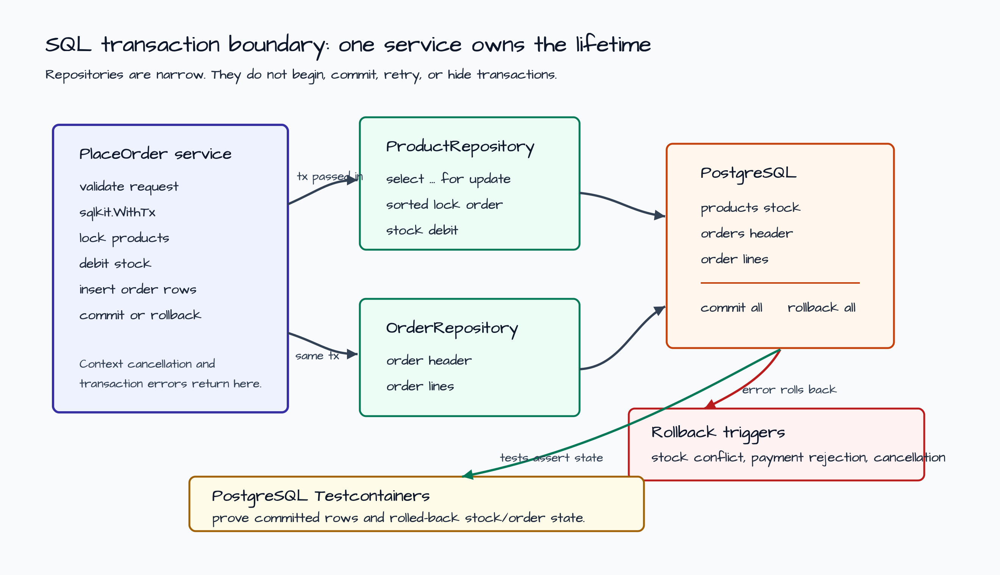
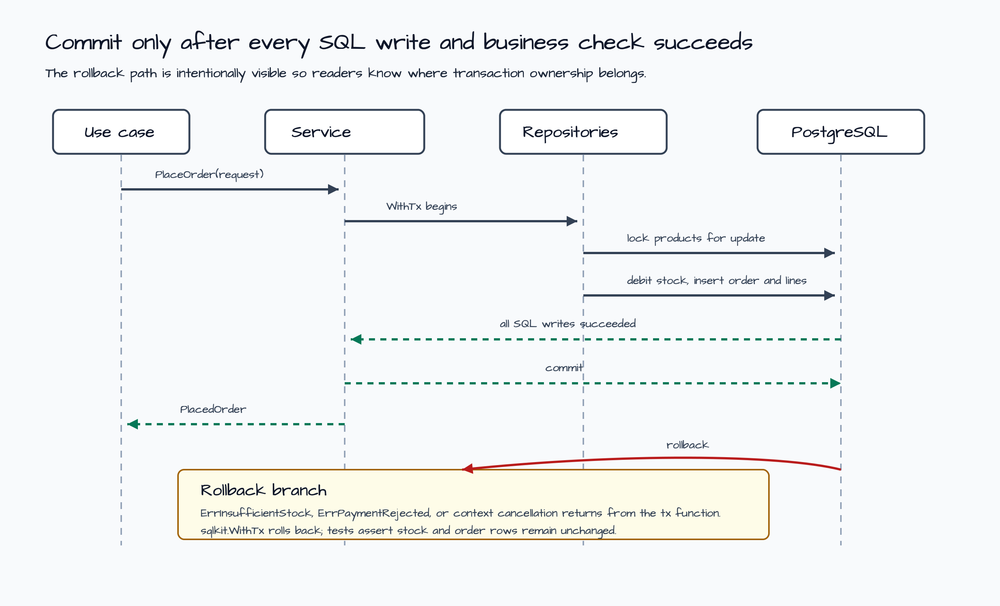

# SQL Transaction Boundary Example

This example shows where a SQL transaction should live. The service owns
`sqlkit.WithTx`; repositories receive the `*sql.Tx` and run narrow SQL
statements. No ORM, unit-of-work framework, or hidden transaction manager is
introduced.

The scenario places an order by locking product rows, debiting stock, inserting
an order header, and inserting order lines. If stock is missing, a later payment
check fails, or the context is canceled, every SQL change rolls back together.



## Scenario

`Service.PlaceOrder` is the boundary:

1. Validate request shape before opening a transaction.
2. Start `sqlkit.WithTx(ctx, db, nil, fn)` at the service layer.
3. Lock product rows in sorted `product_id` order with `select ... for update`.
4. Debit stock and insert order header plus order lines through repositories
   that only know about the `*sql.Tx` they receive.
5. Return nil from the transaction function to commit, or return an error to
   roll back.



## Why The Service Owns The Transaction

| Layer | Responsibility |
| --- | --- |
| Use case | Chooses when order placement starts and provides context cancellation. |
| Service | Opens `sqlkit.WithTx`, orders repository calls, decides commit or rollback. |
| Repositories | Build visible SQL and execute it through the provided `*sql.Tx`. |
| PostgreSQL | Locks rows, enforces constraints, commits or rolls back all writes. |

Repository methods stay reusable because they do not call `BeginTx`, `Commit`,
or `Rollback`. Later HTTP examples can call the same service, and later
repository examples can pass either `*sql.DB` or `*sql.Tx` depending on the
operation boundary.

## Run

Print the local transaction preview:

```bash
go run ./examples/sql-transaction-boundary
```

The output is JSON. It includes lock, debit, order insert, and line insert SQL
shapes plus commit and rollback notes:

```json
{
  "transaction_boundary": "Service.PlaceOrder owns sqlkit.WithTx; repositories only use the *sql.Tx they receive.",
  "commit_path": [
    "validate the order request before opening a transaction",
    "begin sqlkit.WithTx at the service boundary",
    "lock product rows in sorted product_id order",
    "debit stock and insert order header plus lines",
    "commit only after payment and all SQL writes succeed"
  ]
}
```

Run the PostgreSQL Testcontainers contract tests:

```bash
go test -count=1 ./examples/sql-transaction-boundary/...
```

Run the race gate for this example:

```bash
go test -race -count=1 ./examples/sql-transaction-boundary/...
```

## What The Tests Prove

- Commit path debits stock and inserts order rows together.
- Insufficient stock rolls back without creating an order or changing stock.
- Payment rejection after stock debit still rolls back the debit and inserts.
- Canceled context propagates through the transaction boundary.
- Preview SQL stays inspectable, but behavior is proven against PostgreSQL, not
  by string snapshots alone.

## Production Notes

- Keep retries outside the transaction body. Retrying while locks are held makes
  contention worse.
- Choose isolation level intentionally before adding concurrency tests.
- Avoid external network calls while holding row locks. This example simulates
  payment rejection with a flag to keep the transaction lesson deterministic.
- Record metrics for lock wait, rollback reason, and commit latency.
- Add outbox/event publication after the transaction boundary is clear; do not
  publish irreversible side effects before commit.
