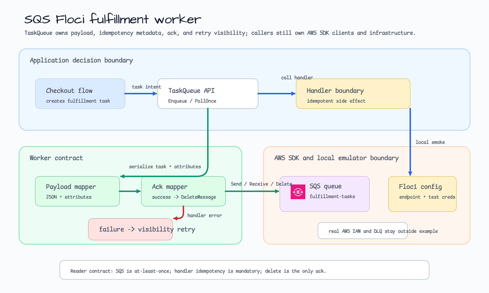
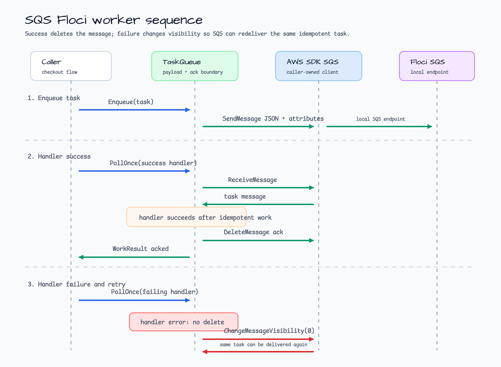

# SQS Floci Worker Example

This example shows a small SQS producer/consumer boundary for fulfillment work.
It keeps the AWS SDK v2 client caller-owned, so the application code owns only
payload shape, message attributes, acknowledgement rules, and retry visibility.
Floci supplies the local SQS endpoint and test credentials for smoke tests; it
does not change the production SQS delivery contract.



## Scenario

A checkout flow enqueues fulfillment tasks. A worker polls one message, decodes
the task, and calls an application handler. Handler success deletes the SQS
message. Handler failure does not delete the message; instead the worker changes
message visibility so the same task becomes visible for retry.

| Operation | What the example owns | Reader takeaway |
|---|---|---|
| `Enqueue` | JSON body, `content-type`, `event-type`, and `idempotency-key` attributes | SQS messages need enough metadata to process and dedupe safely. |
| `PollOnce` | long polling, one-message receive, handler call, ack or retry visibility | Delete is the acknowledgement boundary. |
| Handler success | `DeleteMessage` | Acknowledgement happens only after application work succeeds. |
| Handler failure | `ChangeMessageVisibility` | Retry is controlled by visibility timeout, not by a transaction. |



## Delivery Semantics

SQS is at-least-once. The same message can be delivered more than once, and a
handler can fail after completing part of its side effect. Production handlers
must therefore be idempotent. This example carries an `IdempotencyKey` in both
the JSON body and the SQS message attributes so a real handler can dedupe by a
domain key such as `tenant/order/step`.

The worker intentionally polls one message at a time. That keeps the example
focused on acknowledgement and retry behavior. Production workers can batch,
parallelize, extend visibility, route poison messages to a DLQ, and emit
metrics, but those are infrastructure concerns around the same boundary.

## Local Floci vs Real AWS

| Concern | Local Floci smoke | Real AWS deployment |
|---|---|---|
| Credentials | Test credentials from `testcontainers/floci` | IAM role or workload identity |
| Endpoint | Local endpoint override | Normal regional SQS endpoint |
| Queue | Created during opt-in smoke test | Provisioned by infrastructure code |
| Retry | `ChangeMessageVisibility` with short timeout | Visibility timeout, redrive policy, DLQ, alarms |
| Idempotency | Demonstrated as payload and attribute | Enforced by handler state or downstream idempotent APIs |

## Run

Print the local worker preview:

```bash
go run ./examples/sqs-floci-worker
```

Run deterministic worker tests:

```bash
go test -count=1 ./examples/sqs-floci-worker/...
```

Run the optional Docker-backed Floci SQS smoke test:

```bash
BLUETAPE_SQS_FLOCI_WORKER_SMOKE=1 go test -run TestFlociSmoke -count=1 ./examples/sqs-floci-worker/...
```

## Boundary Notes

- This example is not an SQS framework. It is a scenario-shaped reference for
  request shape, acknowledgement, and retry visibility.
- Real deployments should add DLQ redrive policy, handler idempotency storage,
  visibility extension for long work, structured logs, metrics, and alarms.
- Floci smoke tests prove local AWS SDK request compatibility without requiring
  real AWS credentials or account state.
