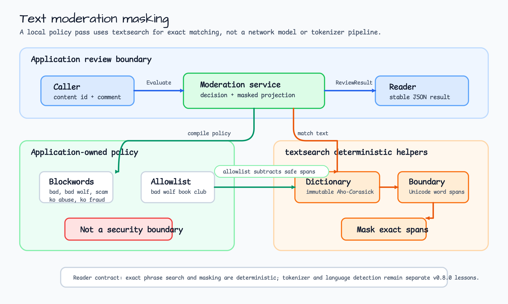
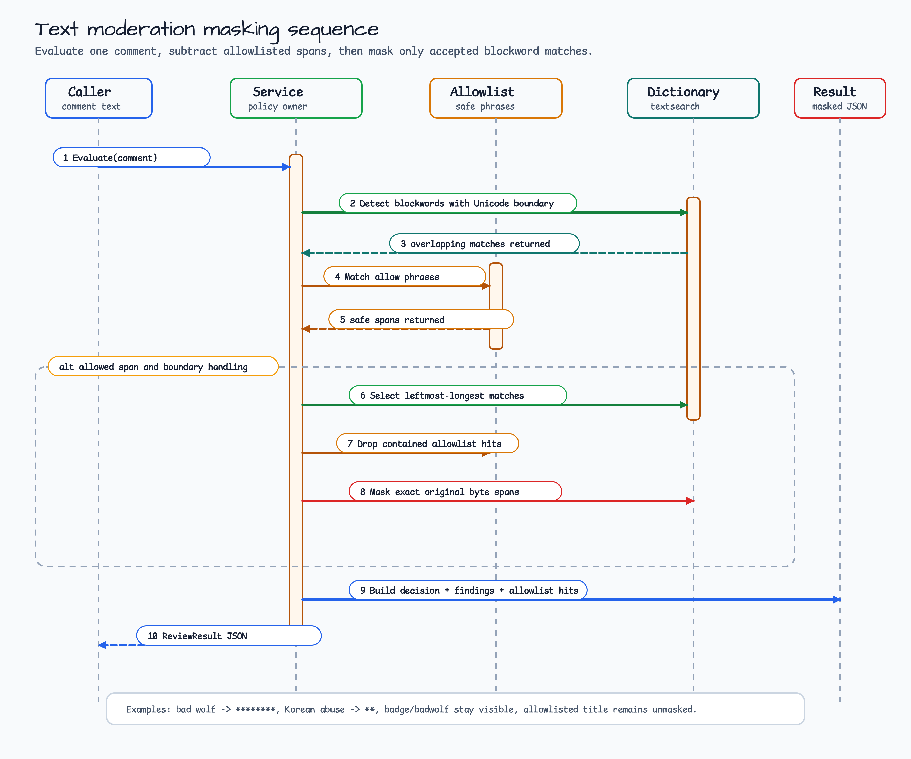

# text-moderation-masking

[English](README.md) | [한국어](README.ko.md)

`textsearch`를 사용하는 deterministic text moderation masking 예제입니다.

이 예제는 marketplace comment review pass를 모델링합니다. Model, network
service, 숨겨진 moderation backend를 호출하지 않습니다. Application이 policy
dictionary를 소유하고, bluetape-go `textsearch` helper가 deterministic
multi-pattern search, Unicode word-boundary filtering, NFC normalization,
masking을 담당합니다.

v0.8.0 workshop track의 첫 focused text 예제입니다. 이후 예제는 HTTP routing,
tokenizer 선택, language detection, 더 큰 content workflow를 추가할 수 있지만,
여기서는 기본 matching contract를 숨기지 않습니다.

## Scenario

Moderation pass는 user comment 하나를 받아 다음을 수행해야 합니다.

1. Static blockword policy를 immutable dictionary로 compile합니다.
2. English/Korean mixed text에서 blockword를 찾습니다.
3. Dictionary entry가 겹치면 leftmost-longest match를 선택합니다.
4. 알려진 allowlist phrase 안에 완전히 포함된 match는 제외합니다.
5. Accepted match span만 정확히 mask합니다.
6. 별도 provider나 model 없이 무엇을 mask했는지 보고합니다.

Sample policy는 `bad`, `bad wolf`, `scam`, `욕설`, `무료 돈`을 block합니다.
또한 `bad wolf book club` phrase를 allowlist로 두어, application policy가
안전한 title을 masking 전에 제거하는 방식을 보여줍니다.

## Architecture



Application은 content review contract를 소유합니다. `textsearch`는 deterministic
mechanics만 소유합니다.

| Layer | Owns | Does not own |
|---|---|---|
| Caller | Content ID, raw comment text, request cancellation. | Dictionary compilation이나 masking 내부 동작. |
| Moderation service | Policy loading, allowlist subtraction, public decision, masked projection. | Tokenizer model 선택, network moderation, storage. |
| `textsearch` | Immutable blockword dictionary, Unicode boundary check, NFC matching, deterministic match span. | Product policy, severity 의미, audit storage. |

## Processing Sequence



중요한 구분은 exact search와 tokenization입니다. 이 예제는 input을 language-specific
token으로 쪼개지 않습니다. 설정된 phrase를 검색하고 Unicode word-boundary filter를
적용합니다. 그래서 `badge`, `badwolf`는 `bad` rule 때문에 mask되지 않지만,
standalone `bad`와 `욕설` 같은 Korean entry는 mask됩니다.

## What It Demonstrates

- Overlapping entry는 leftmost-longest replacement span을 선택합니다.
- Korean blockword를 model dependency 없이 match하고 mask합니다.
- Allowlist phrase는 포함된 match를 masking 전에 제거할 수 있습니다.
- Unicode word boundary는 더 큰 단어 내부 substring replacement를 줄입니다.
- Context cancellation은 policy processing 전에 그대로 반환됩니다.
- Service는 masked finding과 allowlist hit를 분리해서 보고합니다.

## Run

Local preview를 출력합니다.

```bash
go run ./examples/text-moderation-masking
```

출력은 JSON입니다.

```json
{
  "scenario": "review marketplace comments with deterministic blockword masking",
  "policy": {
    "boundary": "Unicode word boundary",
    "normalization": "NFC",
    "mask": "*"
  }
}
```

전체 출력에는 세 개의 sample review result가 들어 있습니다.

- `bad wolf offer와 욕설 포함`은 `******** offer와 ** 포함`이 됩니다.
- `bad wolf book club discusses scam risk`는 allowlisted title을 보존하고
  `scam`만 mask합니다.
- `badge bad badwolf bad.`는 standalone `bad`만 mask합니다.

## Test

Deterministic test를 실행합니다.

```bash
go test -count=1 ./examples/text-moderation-masking/...
go test -race -count=1 ./examples/text-moderation-masking/...
```

Test는 overlapping pattern 처리, Korean text masking, allowlist subtraction,
Unicode replacement boundary, cancellation propagation, preview stability를
증명합니다.

## Boundary Notes

- Blockword masking은 helper transform이지 완전한 moderation system이 아닙니다.
- 이 예제는 의도적으로 network 또는 model dependency가 없습니다.
- `BoundaryUnicodeWord`는 false-positive를 줄이는 helper이며 security boundary가
  아닙니다.
- Tokenization과 language detection은 이후 v0.8.0 예제에서 별도로 다룹니다.
